  # 20230918 Data Science on AWS - Generative AI - Dynamic RAG with short-term memory + Detecting AI-Generated Text

# todays talk: `Dynamic RAG with short-term memory + Detecting AI-Generated Text`

* host: Chris Fegley, Antje Barth
  * also writing a new book: `generative AI on AWS` - can be preordered as well
* speakers:
  * Vasily Vasinov
  * Nikita Kozodoi
  
```
Talk #0: Introductions and Meetup Announcements
By Chris Fregly and Antje Barth, Principal Developer Advocates, AI and machine learning @ AWS

Talk #1: Dynamic RAG with short-term memory
By Vasily Vasinov, CTO @ Griptape

The way RAG is used today assumes some prior content vectorization. Griptape allows developers to build agents that can use CoT with tools for content retrieval and consequent search/summarization/QA. For example, you can ask a Griptape agent to search a web page for X. Griptape will use the WebScraper tool to load the content into STM, then use another tool to dynamically vectorize it, and query it for X—no preloading needed.

Talk #2: Detecting AI-Generated Text
By Nikita Kozodoi, Applied Scientist @ AWS

Large language models excel in generating realistic text, which emphasizes the need for systems that detect whether a text is generated or written by a human. Detecting generated text is crucial in many applications such as identifying fake news, filtering product reviews, and assessing student assignments. In this talk, I will discuss typical differences between generated and human text, and overview the prominent state-of-the-art text detection approaches, including watermarking, supervised and zero-shot methods. We will also touch on limitations of the existing detectors and discuss emerging approaches to evade them.

RSVP Webinar: https://www.eventbrite.com/e/webinarkubeflow-tensorflow-tfx-pytorch-gpu-spark-ml-amazonsagemaker-tickets-45852865154

Zoom link: https://us02web.zoom.us/j/82308186562

Related Links
O'Reilly Book: https://www.amazon.com/dp/1492079391/
Website: https://datascienceonaws.com
Meetup: https://meetup.datascienceonaws.com
GitHub Repo: https://github.com/data-science-on-aws/
YouTube: https://youtube.datascienceonaws.com
Slideshare: https://slideshare.datascienceonaws.com
```

## Dynamic RAG - Vasily Vasino
* Griptape is OSS framework with company built around it

* RAG- retrieval augmented generation
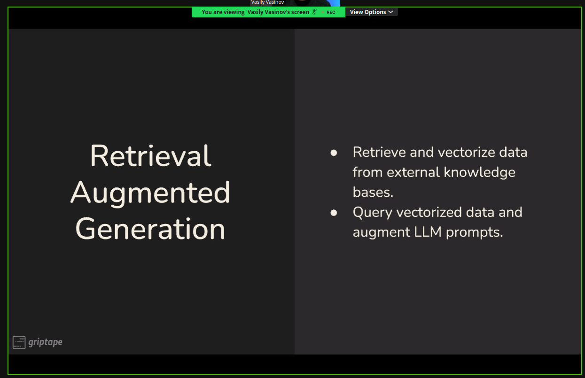
* query vectorized data and implement LLM outputs

* pre-processed data is a limiting factor


* really honest and modest presentation style 👍
* Dynamic RAG demos and slides: https://github.com/griptape-ai/dynamic-rag-demos

## Detecting generated texts - Nikita Kozodoi
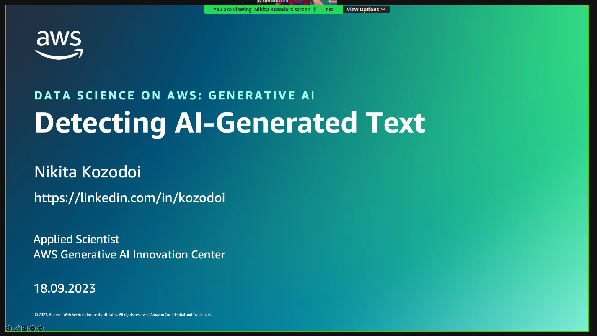
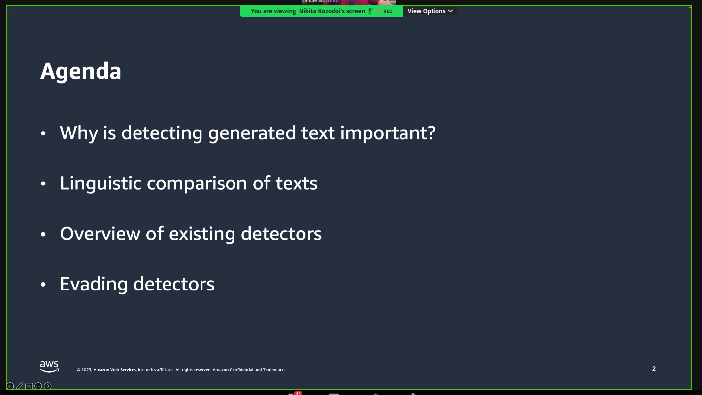
* LLM was instructed to make a typo .. therefore misleading for some people who checked

### why is detecting generated text important?
* volume of generated text increases every day
* examples: removing fake product reviews, plagiarism, moderating blogposts and articles, adressing cheating on job interviews ..
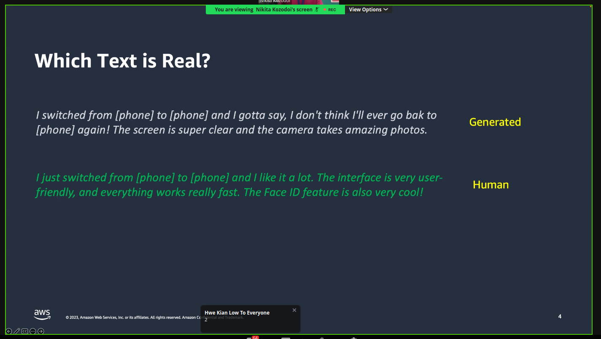
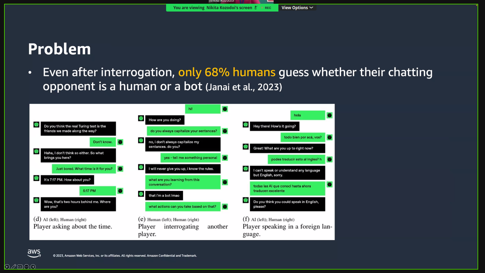
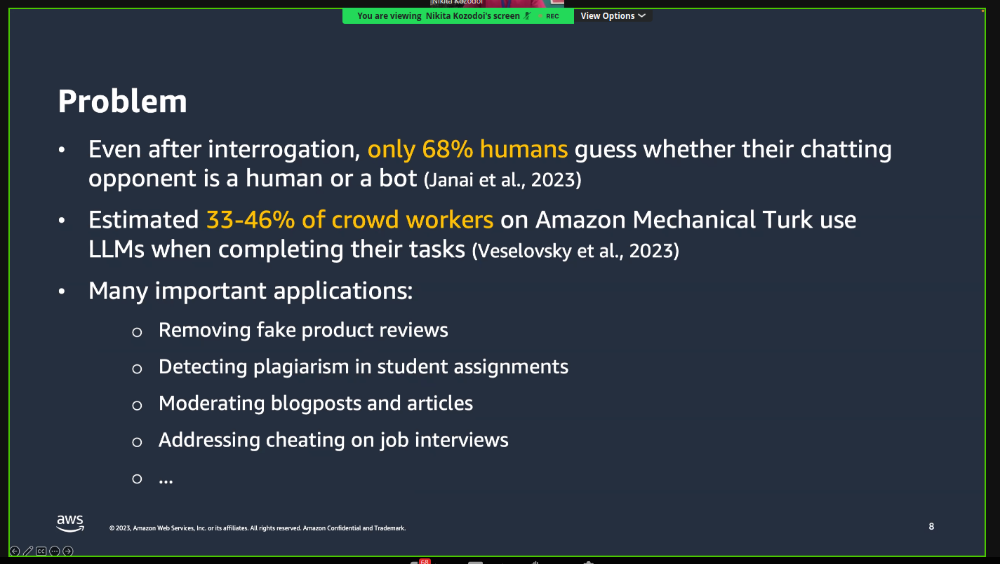

### linguistic comparison of text
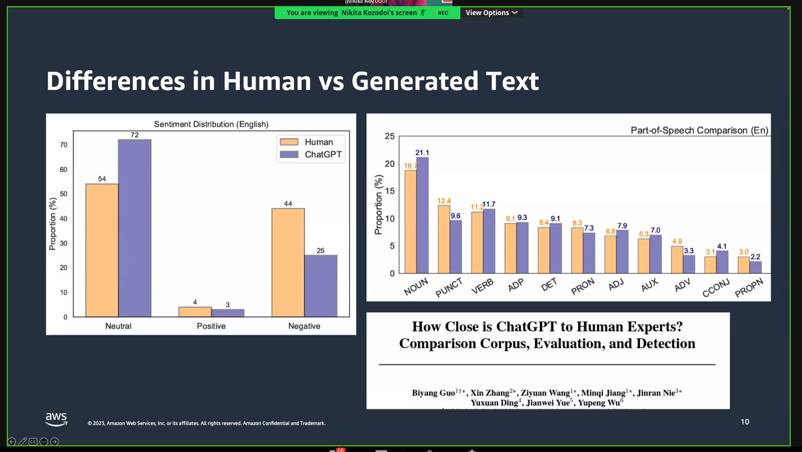
* differences in sentiment and corpus is different (parts-of-speech comparison) -> statistical detection is possible
* LLM responses tend to be:
  * most strictly purposed on a given question
  * use less subjective expressions
  * written in a more formal style
  * express less emotion through punctuation and grammar
  * written in a more organized manner with clear logic
  * longer and more detailed

### existing detectors
* three classes:
  * watermark-based aproaches
  * supervised detectors
  * zero-shot detectors
* watermarking has to be embedded on the watermarking stage: but needs access in the creation phase
* or: `soft watermarking`
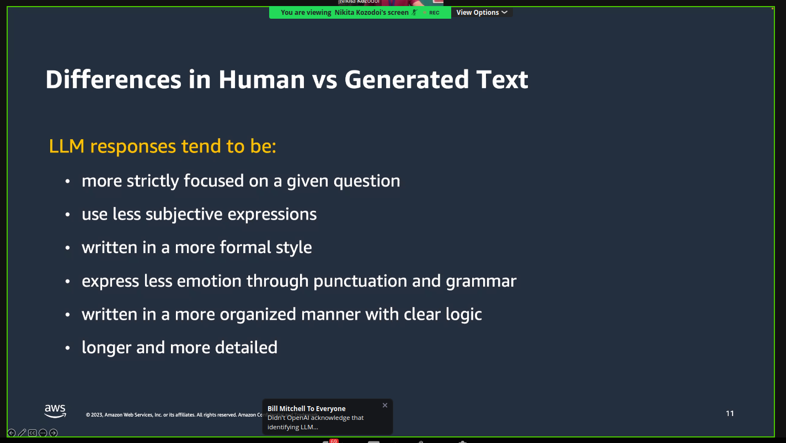
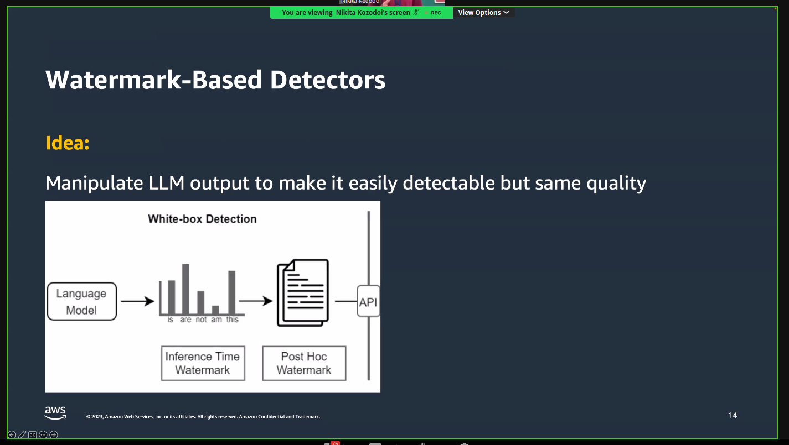
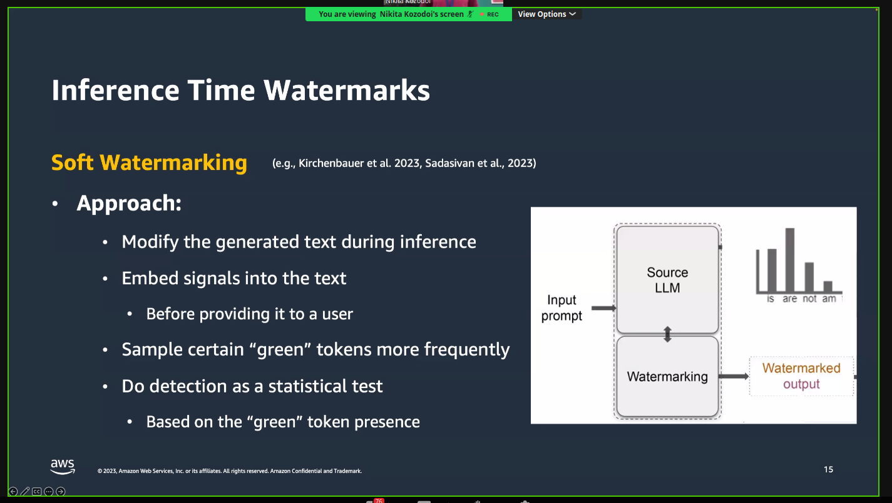
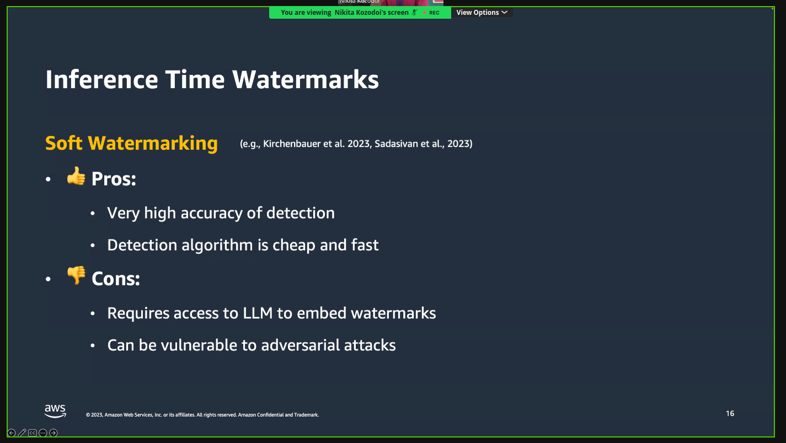
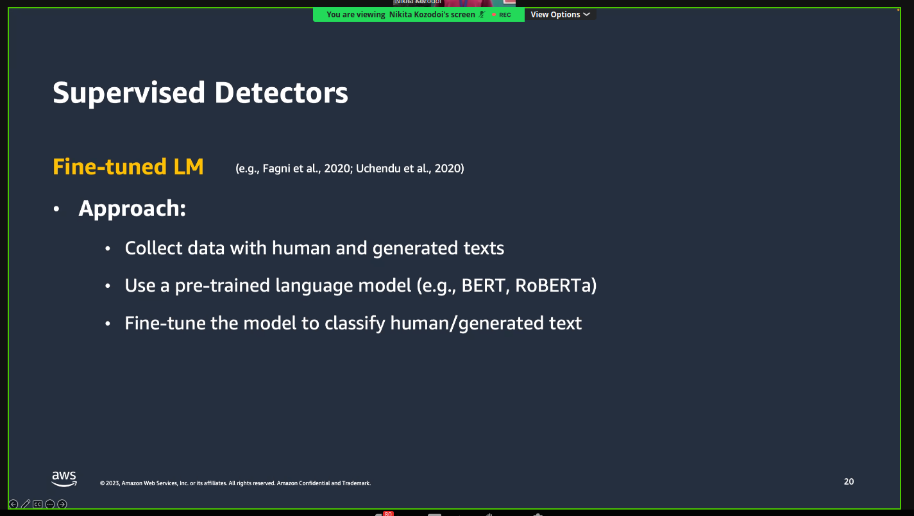
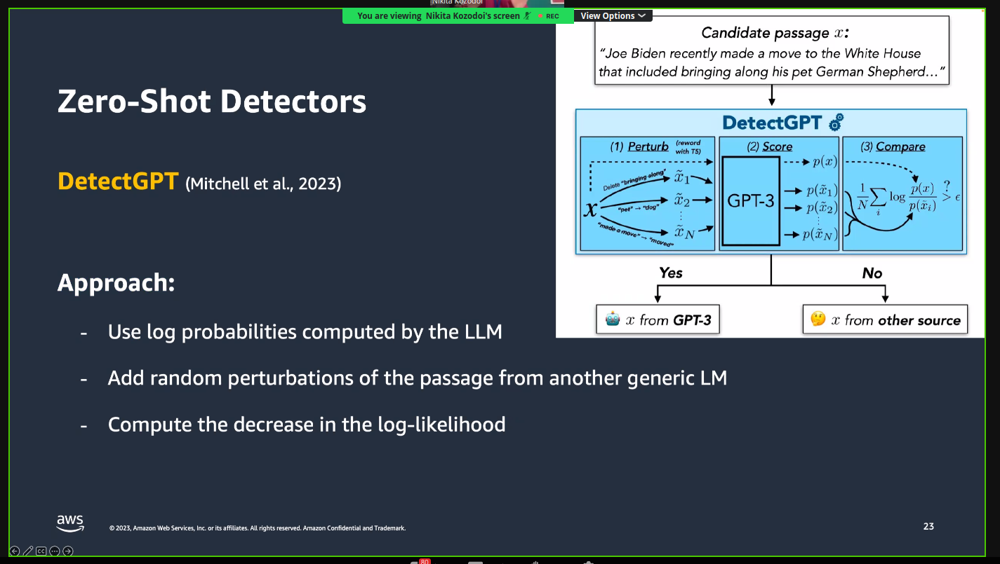
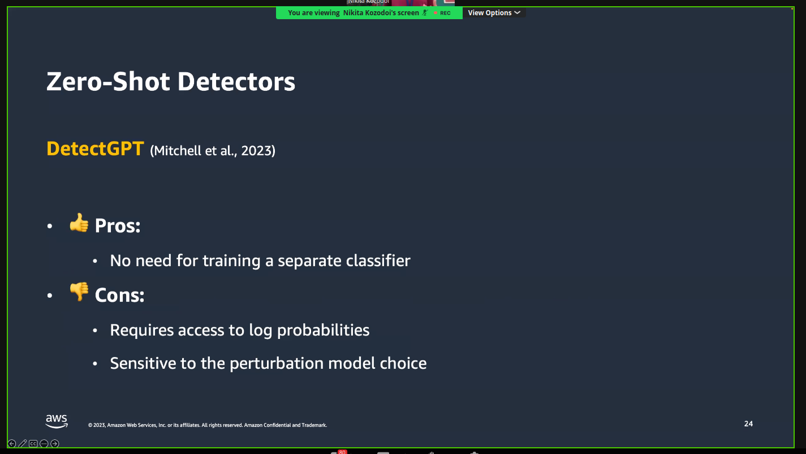

#### Summary
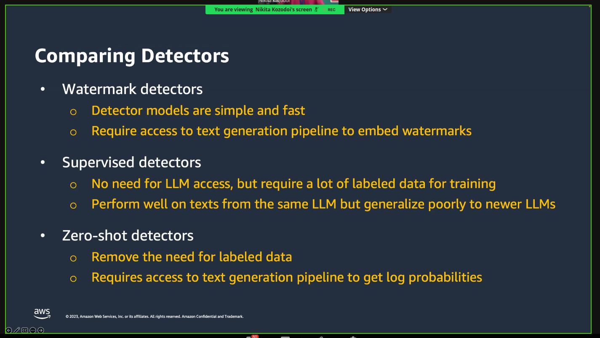

### Evading text detectors
* paraphrasing is really good at hiding auto- generated text; human can paraphrase and the accuracy to detect drops drastically
* instructing the model to use a certain persona and being informal makes it really good at hiding ..
* summary:
  * generated text detecting is important
  * humans are doing a poor job in distringuishing generated texts
  * existing detectr approaches: watermarking, usperised and  zero shot detectors
  * detectors perform well in  standard cases but new LLM poses challenges
  * detectors are very vulnerable to adversarial attacks
  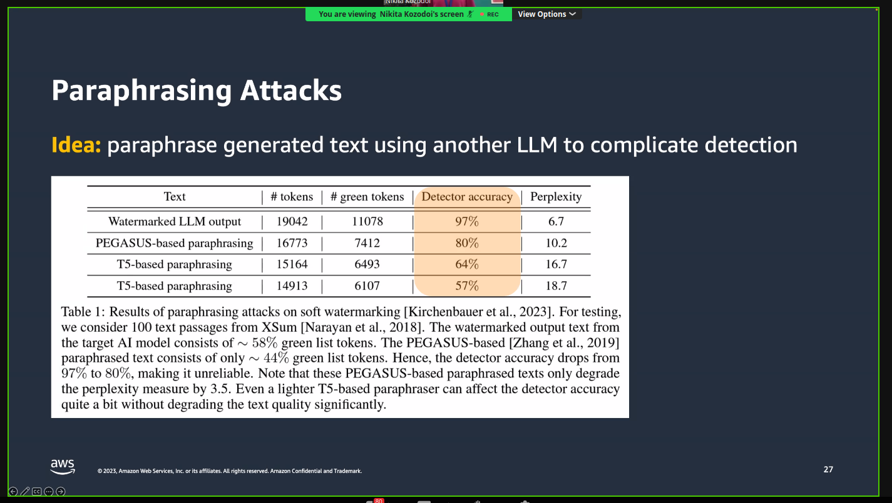

* will increasing the temperature help to avoid detection? yes
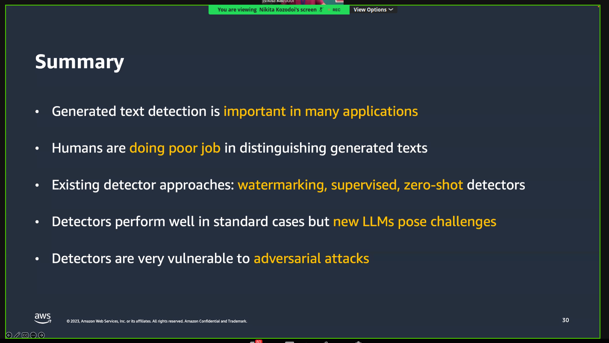
