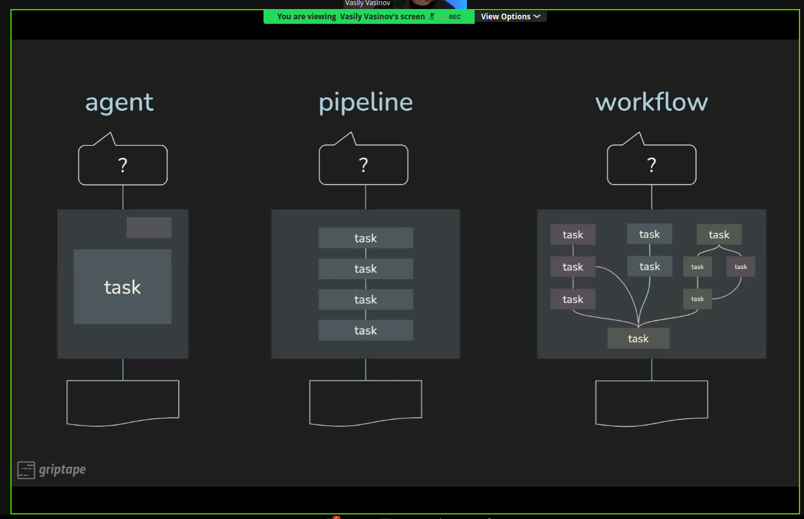
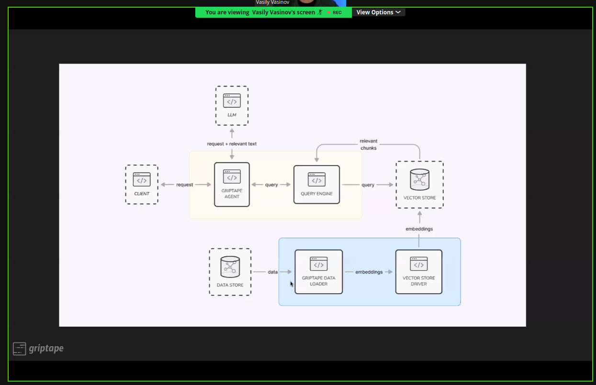
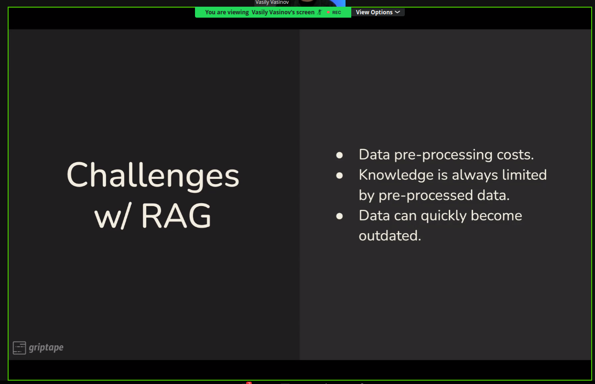
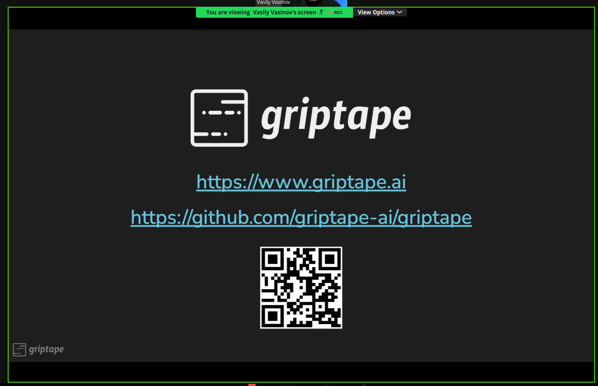

  # 20230918 Data Science on AWS - Generative AI - Dynamic RAG with short-term memory + Detecting AI-Generated Text

# todays talk: `Dynamic RAG with short-term memory + Detecting AI-Generated Text`

* host: Chris Fegley, Antje Barth
  * also writing a new book: `generative AI on AWS` - can be preordered as well
* speakers:
  * Vasily Vasinov
  * Nikita Kozodoi
  
```
Talk #0: Introductions and Meetup Announcements
By Chris Fregly and Antje Barth, Principal Developer Advocates, AI and machine learning @ AWS

Talk #1: Dynamic RAG with short-term memory
By Vasily Vasinov, CTO @ Griptape

The way RAG is used today assumes some prior content vectorization. Griptape allows developers to build agents that can use CoT with tools for content retrieval and consequent search/summarization/QA. For example, you can ask a Griptape agent to search a web page for X. Griptape will use the WebScraper tool to load the content into STM, then use another tool to dynamically vectorize it, and query it for X—no preloading needed.

Talk #2: Detecting AI-Generated Text
By Nikita Kozodoi, Applied Scientist @ AWS

Large language models excel in generating realistic text, which emphasizes the need for systems that detect whether a text is generated or written by a human. Detecting generated text is crucial in many applications such as identifying fake news, filtering product reviews, and assessing student assignments. In this talk, I will discuss typical differences between generated and human text, and overview the prominent state-of-the-art text detection approaches, including watermarking, supervised and zero-shot methods. We will also touch on limitations of the existing detectors and discuss emerging approaches to evade them.

RSVP Webinar: https://www.eventbrite.com/e/webinarkubeflow-tensorflow-tfx-pytorch-gpu-spark-ml-amazonsagemaker-tickets-45852865154

Zoom link: https://us02web.zoom.us/j/82308186562

Related Links
O'Reilly Book: https://www.amazon.com/dp/1492079391/
Website: https://datascienceonaws.com
Meetup: https://meetup.datascienceonaws.com
GitHub Repo: https://github.com/data-science-on-aws/
YouTube: https://youtube.datascienceonaws.com
Slideshare: https://slideshare.datascienceonaws.com
```

## Dynamic RAG - Vasily Vasino
* Griptape is OSS framework with company built around it

* RAG- retrieval augmented generation

* query vectorized data and implement LLM outputs

* pre-processed data is a limiting factor


* really honest and modest presentation style 👍


