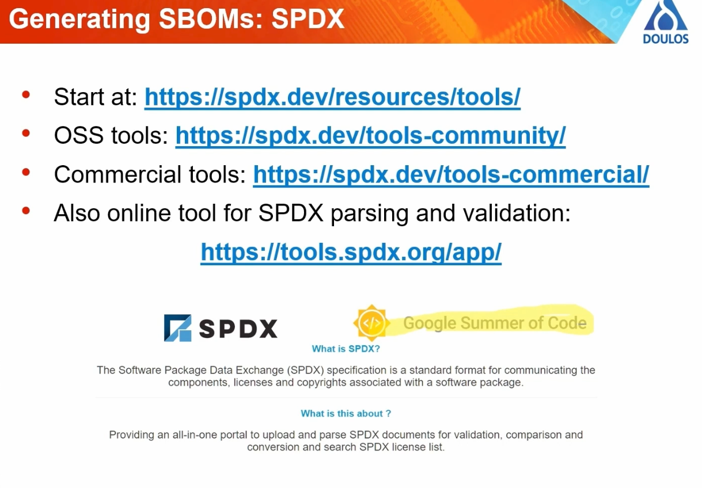

# 20230922 What is an SBOM and why should I care?
* presenter: Simon Goda

* data is written in a design to be machine-readable: for interpretation, usage, analysis
  * therefore XML

## Why are they needed?
* need to know which are on board, also which are secure, alsowhat licenses are being used?
* which dependencies are needed as well?

* triangle between regulator goernment <-< end user customer <-> vendor product developer
* greater level of trust and confidence in the device
* also needed an regulatory level

* US Executive Order 14028 from Biden administration
  * as well EU Cyber Resilience Act (CRA) Proposal, article 37
* NIST has specified different standard models: and three data formats

* three formats: CycloneDX, SWID, SPDX
### CycloneDX:
* Release in 2018 by OWASP (very relevant)
### SWID - Software identifications Tags
* backed by NIST
* used as unique ID tag but can contain enough information to be used in SBOMs
### SPDX - software package data exchange format
* backed by the Linux foundation
* open standard fpr SBOM information

* for SWID you have to pay for the format of the standard
* four types of tag: primary, patch, corpus, supplemental (good if you have not a self-contained installer)
* example: component name, version, license, supplier, unique id, hash value ..

* SPDX: originally designed for open-source compliance checking
* also allows to generate SBOM data

* data can be reprepsented in a range of formats
* support CPE and Purl ID formats
* there is also a more light version: SPDX lite

* CPE: common platform enumeration
  * only relevant fields are complete - else *

* Purl: package URL

## Tools to generate SBOMs
### CycloneDX
* a huge amount of tools which can generate those SBOMs (alone for CycloneDX more than 200)
* tools for:
  * generation
  * SBOM analysis (vulnerability tracking, license reporting)
  * SBOM file management
  * build integration ..

### SPDX
* not soo many tools

### SWID
* basic tools are from NIST, but not many tools out there

### Others
* Microsoft SBOM Tool: SPDX JSON SBOM: limited formatting control
* ScanCode is an open-source command line tool

* Yocto has a really complete support for SPDX - added in kirkstone release of Yocto
  * similar tools: meta-spdxscanner
  * similar tools: meta-dependencytrack

## SBOM Use Cases (important)
* Security: vuln. tracking, integrity checking, penettration testing, incident response
* product management: regulatory compliance, license & copyright tracking, platform migration
* user/customer assurance
--> take confidence from presence of SBOM data
* papaer from IoT Security foundation

## Vulnerability Management
* Generate SBOM -> Search Vulnerability Databases -> Filtering & Triage Issues -> Deploy Fixes

* other tool: Grype

* some projects/products: generate SBOMs themselves or provide them easily: 
## OSS versus Commercial is simlar to Make vs Buy
* shift from "best practice" to "hard requirement"

* certainity and trust; reproducibility of the build

* SBOMs will not solve problems on their own, but facilitate the solutions
* CycloneDX and SPDX are best options, SWID has limited flexibility

