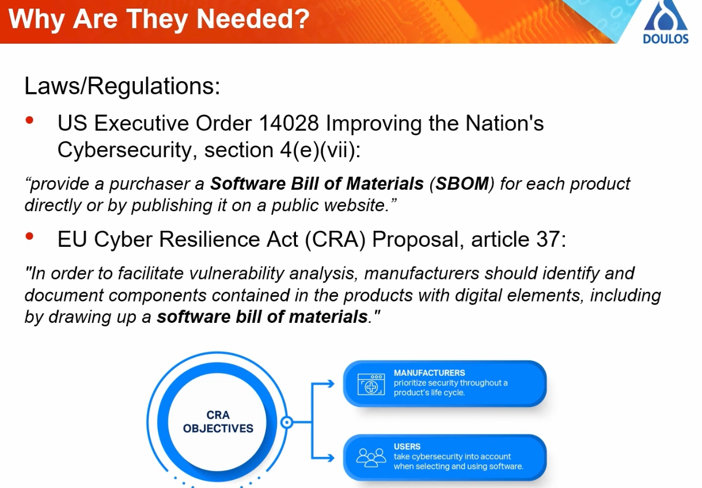

# 20230922 What is an SBOM and why should I care?
* Presenter: Simon Goda

* Data is written to be machine-readable: for interpretation, usage, analysis
  * Therefore, XML

## Why are they needed?
* Need to know which are on board, which are secure, and what licenses are being used.
* Which dependencies are needed as well?

* Triangle between regulator government ← end user customer ↔ vendor product developer
* Greater level of trust and confidence in the device
* Also needed at regulatory level

* US Executive Order 14028 from Biden administration
  * As well EU Cyber Resilience Act (CRA) Proposal, article 37
* NIST has specified different standard models and three data formats

* Three formats: CycloneDX, SWID, SPDX

### CycloneDX:
* Released in 2018 by OWASP (very relevant)

### SWID - Software Identification Tags
* Backed by NIST
* Used as a unique ID tag but can contain enough information to be used in SBOMs

### SPDX - Software Package Data Exchange format
* Backed by the Linux foundation
* Open standard for SBOM information

* For SWID, you have to pay for the format of the standard
* Four types of tags: primary, patch, corpus, supplemental (good if you don't have a self-contained installer)
* Example: component name, version, license, supplier, unique id, hash value ..

* SPDX: originally designed for open-source compliance checking
* Also allows generating SBOM data

* Data can be represented in a range of formats
* Supports CPE and Purl ID formats
* There is also a lighter version: SPDX lite

* CPE: Common Platform Enumeration
  * Only relevant fields are complete - else *

* Purl: Package URL

## Tools to generate SBOMs
### CycloneDX
* A huge amount of tools which can generate these SBOMs (alone for CycloneDX more than 200)
* Tools for:
  * Generation
  * SBOM analysis (vulnerability tracking, license reporting)
  * SBOM file management
  * Build integration ..

### SPDX
* Not so many tools

### SWID
* Basic tools are from NIST, but not many tools out there

### Others
* Microsoft SBOM Tool: SPDX JSON SBOM: limited formatting control
* ScanCode is an open-source command line tool

* Yocto has comprehensive support for SPDX - added in Kirkstone release of Yocto
  * Similar tools: meta-spdxscanner
  * Similar tools: meta-dependencytrack

## SBOM Use Cases (important)
* Security: vulnerability tracking, integrity checking, penetration testing, incident response
* Product management: regulatory compliance, license & copyright tracking, platform migration
* User/customer assurance
  → Gain confidence from the presence of SBOM data
* Paper from IoT Security foundation

## Vulnerability Management
* Generate SBOM → Search Vulnerability Databases → Filtering & Triage Issues → Deploy Fixes

* Another tool: Grype

* Some projects/products generate SBOMs themselves or provide them easily:
## OSS versus Commercial is similar to Make vs Buy
* Shift from "best practice" to "hard requirement"

* Certainty and trust; reproducibility of the build

* SBOMs will not solve problems on their own, but facilitate the solutions
* CycloneDX and SPDX are best options; SWID has limited flexibility

