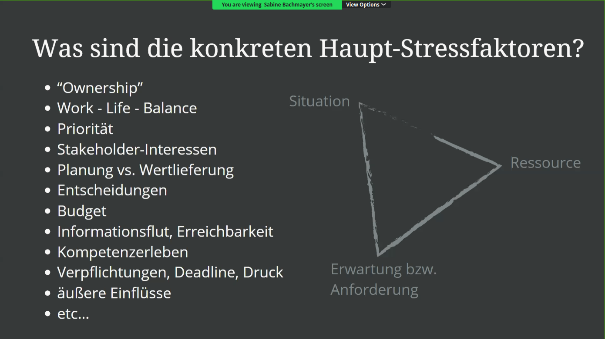
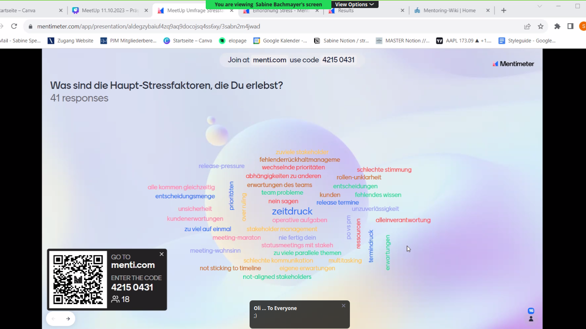
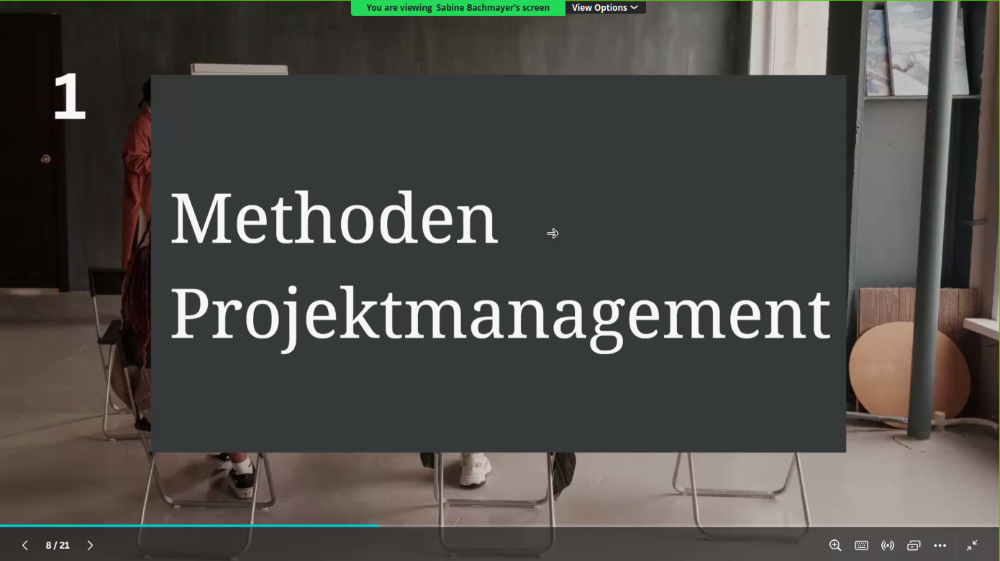
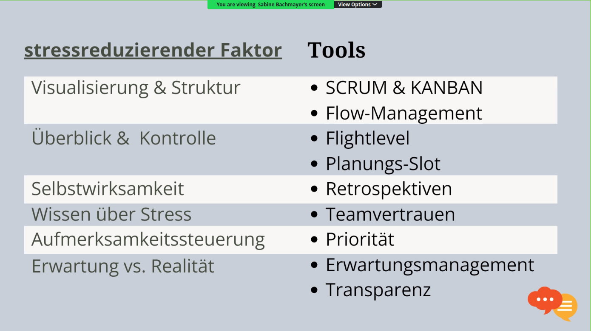
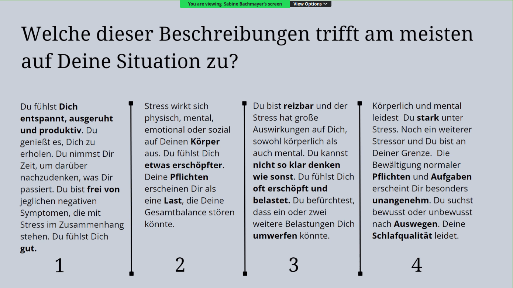
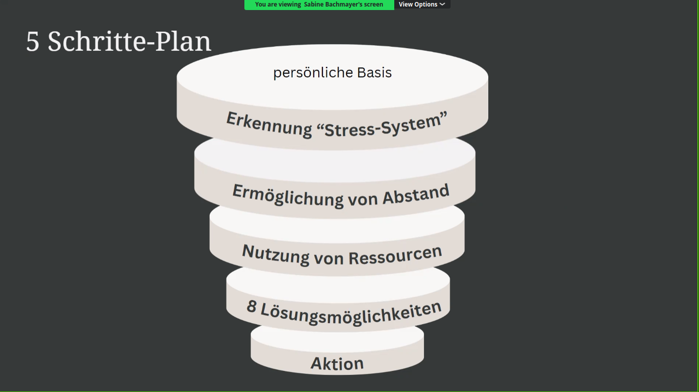
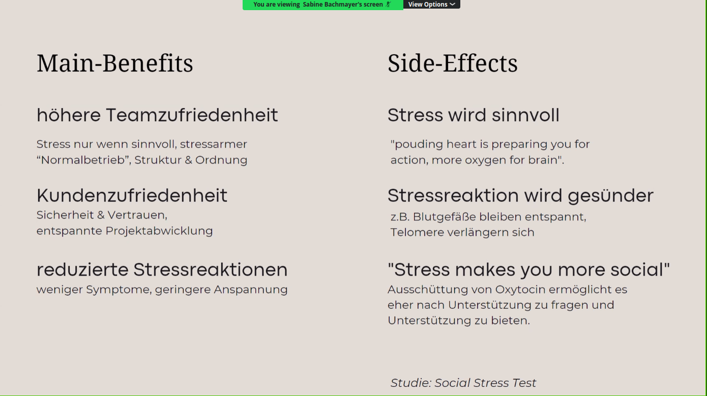
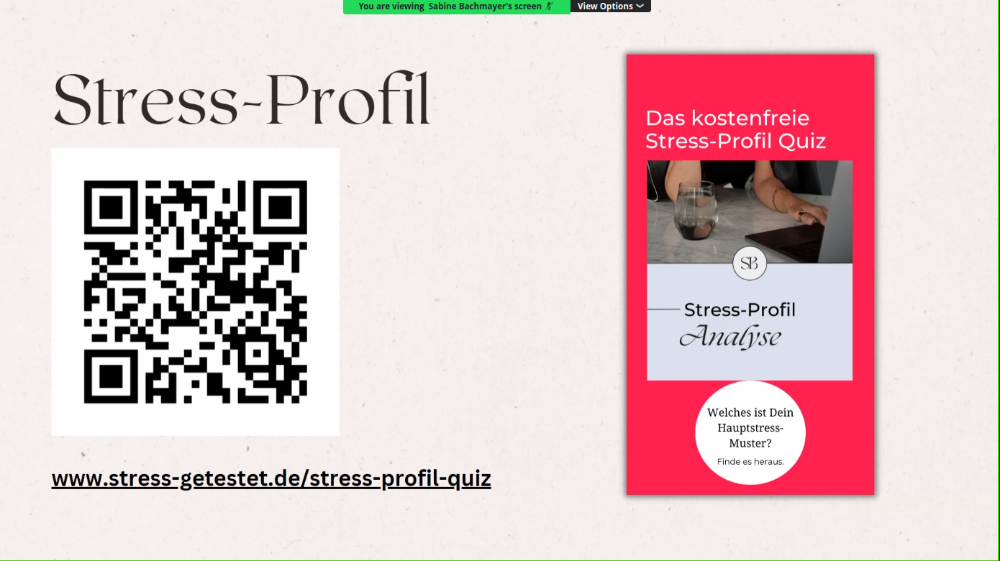

# 20231011 Hauptstressoren in der agilen Produktentwicklung & wie man sie am besten umgeht

* organizer: Martin Ruprecht

```
Details

Als Product Owner:in schätzen wir die Zusammenarbeit mit unseren Stakeholdern und erfüllen ihnen gerne Feature-Wünsche und achten auf beste Qualität. Bei oft gegebenen Termindruck, hohen Erwartungen und der realisierten Liefergeschwindigkeit, ist es manchmal gar nicht so leicht, sich nicht unterkriegen zu lassen. Muss man ja niemanden erzählen, dass der Job auch mal schnell stressig sein kann :-)

In diesem Meetup sehen wir uns die Haupt-Stressfaktoren in der agilen Produktentwicklung sowie im Projektmanagement an und
wie man diese am Besten und ganz konkret umgehen kann. Das Ziel: 100% Ergebnis bei 50% des bisherigen Stress.

Vorgestellt wird das Ganze von Sabine Bachmayer. Selbst Product Ownerin und nebenher Beraterin zum Thema Stresskompetenz. Am Ende des Vortrags können Teilnehmende im Nachgang und losgelöst vom offiziellen Meetup noch ein kostenfreies Stress-Profi-Quiz machen, um so zu sehen, wo die ganz persönliche Achillesferse liegt.

Das Treffen ist daher ideal für alle, die nach dem Sommerurlaub wieder zurück in die Büros kommen und sich langfristig noch etwas Gelassenheit mitnehmen wollen, statt gleich wieder im Alltags-Trubel zu versinken.
```
## Zusammensetzung von Stress


* Ownership: Der PO ist als Einzelperson verantwortlich.
* Entwicklern sollte nur eine Priorität gegeben werden, nicht mehrere.
* Informationsflut.

* Mentimeter dient als Tool zur Sammlung von Feedback: Vielleicht mit einer Word Cloud? Tolle Idee! Es ist auch möglich, eine Bubble Cloud aus verschiedenen Optionen zu erstellen.


## Methoden, welche im Projektmanagement helfen können



* Visualisierung und Strukturierung als Mittel zur Reduktion.
* Flow-Management: Abhängigkeiten reduzieren.
* Flight-level-concept: Mit Kanban/Jira umsetzbar?
* Wissen über Stress: Je besser es dem PO gelingt, Wichtiges von Unwichtigem zu trennen, desto stärker wird das Vertrauen des Teams.
* Das Überstundenlevel in den Teams gibt einfach Auskunft über die Teamzufriedenheit.
* Aufmerksamkeitssteuerung.
* Erwartungsmanagement.


* Es sieht so aus, als ob die Wahl von allem außer Option 1 bereits ein Desaster ist.

## Methoden für Stresskompetenz

* Default mode network: Persönliches Stress-System. Als Ruhemodus ist dauerhaft der Stressmodus aktiv.
  * Mit MRT kann man den Fortschritt sichtbar machen.
* 5 Schritte Plan: Stress-Transformation. Dieser Plan muss individuell angepasst werden.
* Persönlicher Zeitaufwand ist erforderlich:

* Manchmal besteht das Problem darin, unnötig Zeit auf IG oder LinkedIn zu verbringen.
  * Durch bewusste Fragmentierung steigt die Wahrscheinlichkeit, dass man damit interagiert, besonders in Bezug auf Dopamin.
* Sich maximal 5 Minuten über etwas aufregen.
* Crazy 8-Brainstorming-Ideen (Google?).

## Hauptvorteile

* Stress nur zielgerichtet einsetzen.

* pounding heart is preparing you for more action, more oxygen for your brain
* mehr Stresskompetenz macht sozialer: mehr nach Hilfe fragen oder Hilfe anbieten
* .. und andere Vorteile
* Stress-Profil als Test: siehe QR-Code oder URL

