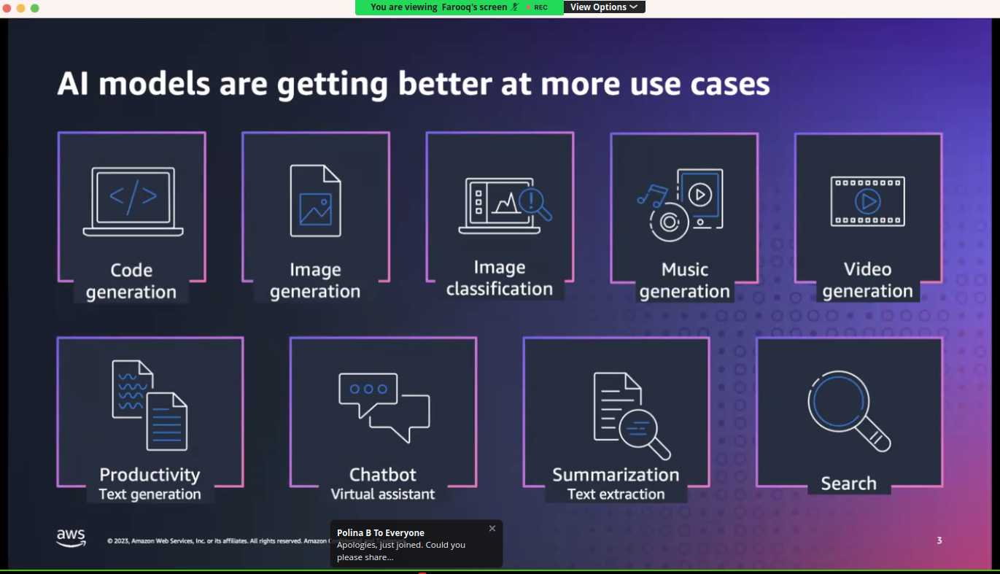
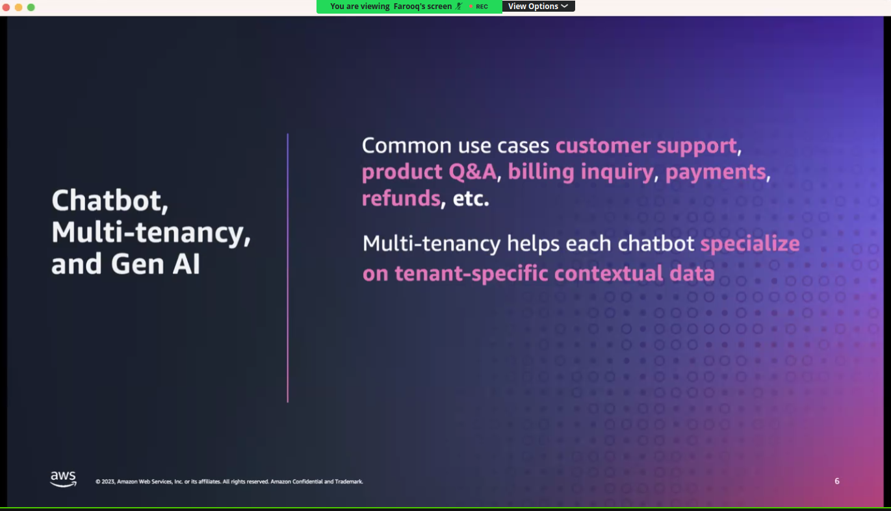
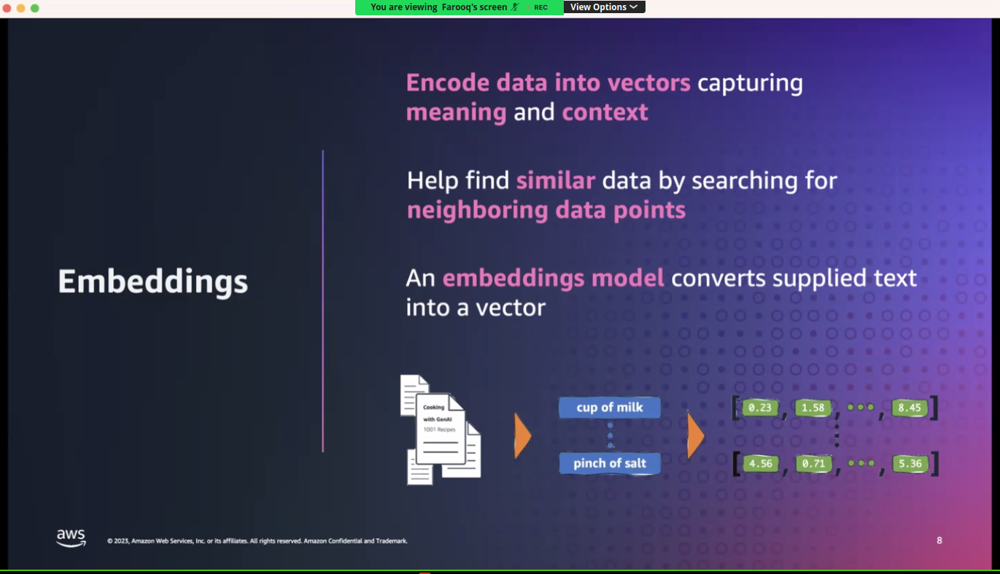
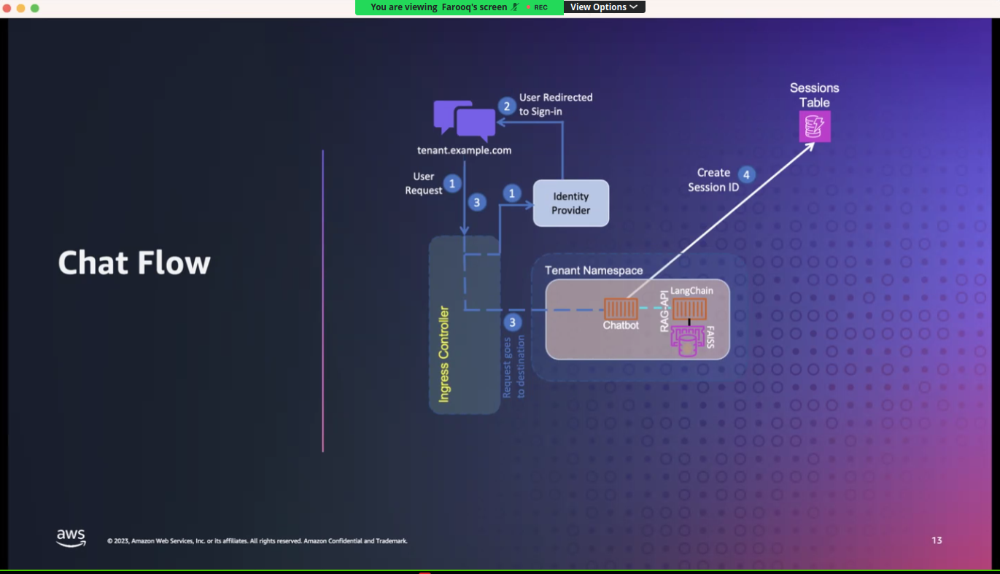

# 20231016 LangChain + Amazon Bedrock + Kubernetes = RAG-based SaaS

## Multi-tenant Chatboot with RAG using Amazon Bedrock

* ML is at an inflection point
* why amazon EKS for AI/ML?
* increased resiliency, automated scaling, resource isolation, cost effective solution
* chat bot; multi-tenancy and gen ai: common cases are customer support, product Q&A, billing inquiry, payments, refunds, etc.

* GitHub repo that Farooq/Ravi will be discussing soon:  https://github.com/aws-samples/multi-tenant-chatbot-using-rag-with-amazon-bedrock

