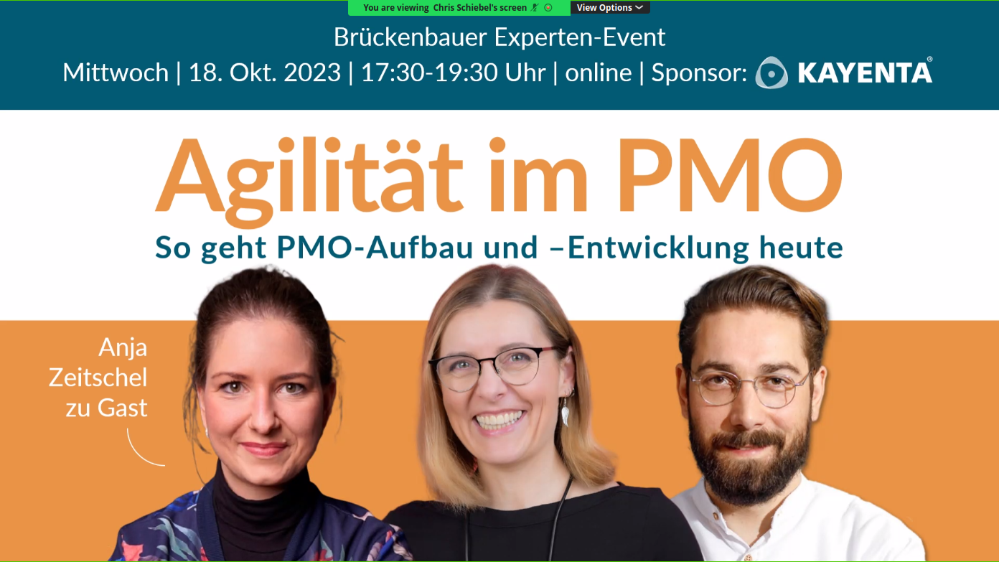
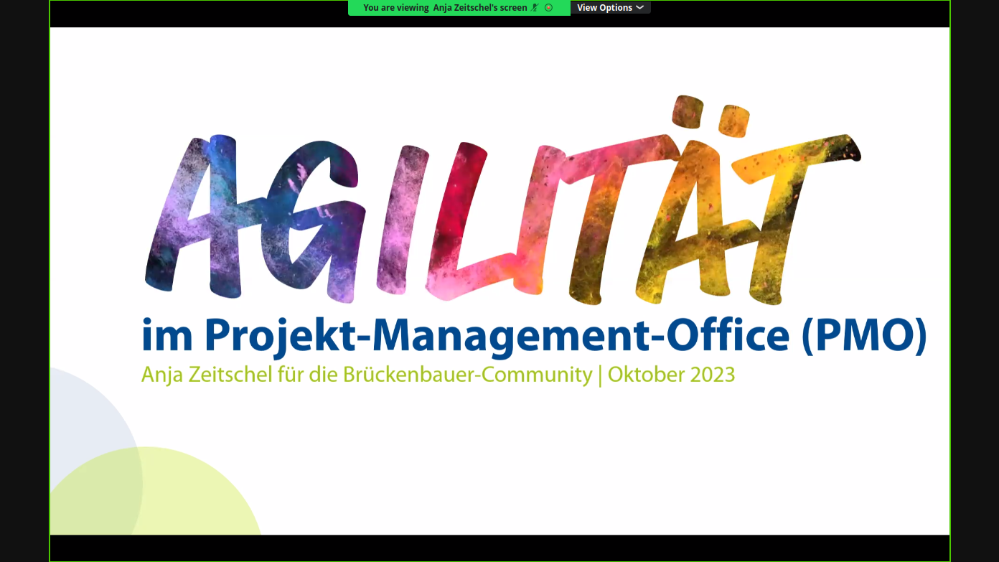

 # 20231018 Agilität im PMO: So geht PMO-Aufbau und –Entwicklung heute

# Brücken bauen im Projekt
* speakers and hosts: Anja Zeitschel; Chris Schiebel, Antje Lehmann-Benz, Werner (?)

```
Agilität im PMO: So geht PMO-Aufbau und –Entwicklung heute

Details

#Projektmanagement mit #Agilität verbinden. Dafür steht das Expertennetzwerk der Brückenbauer:innen. Am 18.10. treffen wir uns wieder online zum Praxis-Austausch. Das Thema dieses Mal: "Agilität im PMO". Denn ...

... PMO kann so viel mehr 🙌:

Wahrscheinlich beginnen wir alle ähnlich:

- In die Projektlandschaft soll Transparenz #Status #Budget 👩‍🏫
- Projekte sollen nicht irgendwie, sondern qualitativ hochwertig gemanagt werden #Effektivität #Effizienz 📈

Doch das ist nur Schritt 1️⃣

Als integrativer Ansatz kann ein PMO die #Organisationsentwicklung ergänzen. Insbesondere, wenn es um Führungskräfteentwicklung + Coaching von Projektleitenden und Projektteams geht.

Klar, ohne die passende Haltung + gemeinsame Werte geht da nix. Das haben wir zuletzt mit Axel Straschil schon schön beleuchten können. Und so schlägt das vorangegangene Event (Zusammenfassung + Aufzeichnung gibt es hier: https://lnkd.in/e-3pdcNX) die perfekte Brücke zum Thema Agilität im PMO am 18. Oktober.

Dort unterhalten wir uns mit Anja Zeitschel, PMP® insbesondere über Schritt 2️⃣. Konkret:
👍 Akzeptanz des PMO
👨‍👨‍👦‍👦 Den Stellenwert einer PMO-Community
🐍 Agile Weiterentwicklung als Organisationseinheit
🤳 Employer Branding
🤝 Coaching-Angebote für PLs/Projektteams und damit auch über
🤴 Karriereentwicklung/Weiterbildung im Umfeld PMO

⚠️ Wenn euer PMO „nur“ verwalten soll und/oder eine hohe Fluktuation in den PL-Positionen okay ist, unbedingt aufhören zu lesen.
Wenn ihr nachhaltig erfolgreiche Projekte und ein starkes PMO wollt, dann wird’s in dem Event spannend für dich und deine Organisation.

(Dabei ist egal, ob ihr das PMO nennt oder überhaupt eines habt - die Grundprinzipien gelten so oder so.)

🛠 Und zwar absolut hands-on, praxisnah, pragmatisch, gespickt mit Beispielen aus der Industrie. 2h gefüllt mit Anja’s Impuls, Story und Knowhow sowie viel Raum zum Austausch unter Expert:innen auf Augenhöhe.

⚜️ Für das Event haben wir uns mit KAYENTA ® Training und Beratung und Werner Plewa zusammengetan. Warum? Um von ihrer/seiner Erfahrung zu profitieren. Um noch mehr Expert:innen auf dieses Expertennetzwerk aufmerksam zu machen. Und damit noch mehr herausragenden, professionellen Austausch zu bieten.🔆

Dabei?

#PMP Certification
#Project Management
#Software Development
#Scrum
#Agile Coaching
```

## Worum geht es hier eigentlich?


* Werner wurde empfohlen für PMP-Zertifizierung

## Klärung von Agilität
* Fähigkeit sich schnell, nachhaltig, wirksam (effektiv) an sich verändernde Umgebungsparameter anzupassen
* ein PMO soll diesen Gestaltungsspielraum schaffen
* 30 min Impuls, dann 90 min Q&A

## Anja Zeitschel übernimmt: Agilität im Projekt-Management-Office (PMO)
* Projekte menschenzentriert organisieren


* beispiel ist ein Unternehmen im Gesundheitswesen; viele Menschen, die in kleinen Teams arbeiten, aber Zusammenarbeit wenig gelernt haben
  * Org-Informationen:

* Challenges:
  * Überblick verloren über die Projekte im Unternehmen; aber nach oben begrenztes budget, weil Krankenkassen-finanziert
  * viele Ressourcenprobleme


