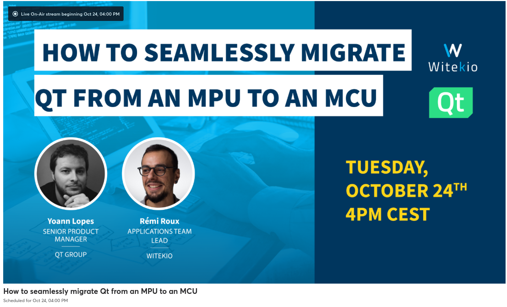
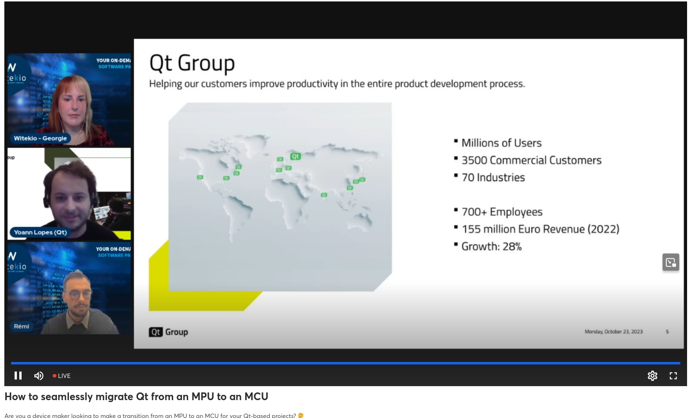
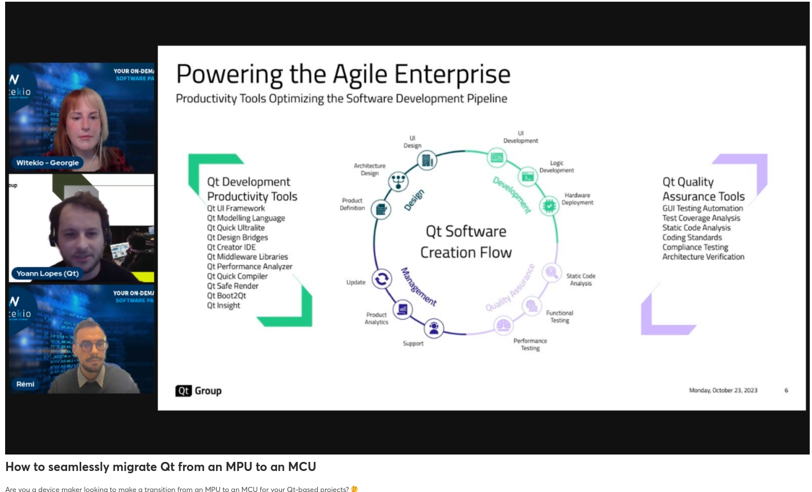
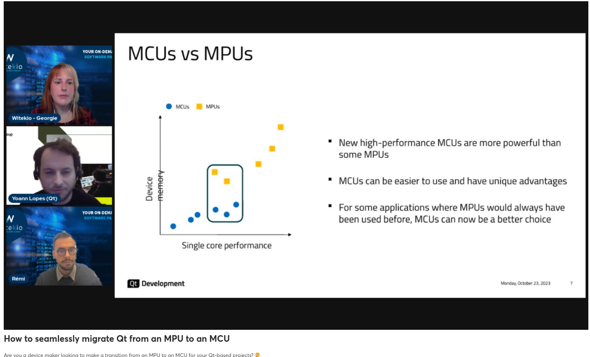
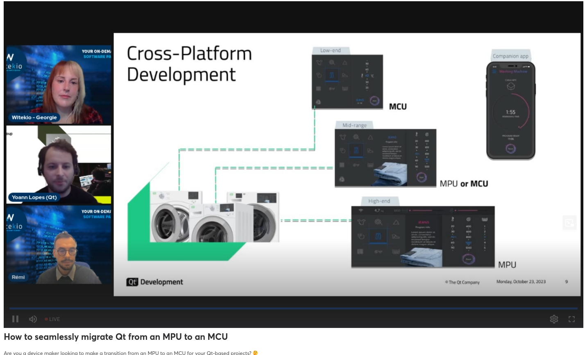
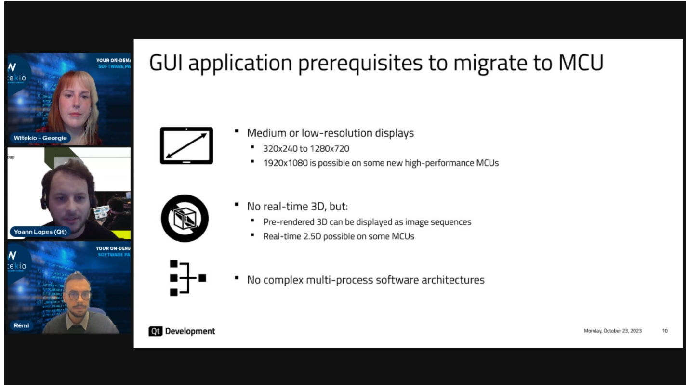

# 20231024 How to seamlessly migrate Qt from an MPU to a MCU

* host: Geogie
* yoann lopes (qt)
* remi roux


```
Are you a device maker looking to make a transition from an MPU to an MCU for your Qt-based projects? 🤔 Well you’re in luck! The combined knowledge of experts from Witekio and Qt Group have come together to guide you through this process. ⚡ Whether you’re looking to move to an MCU to save costs, lower power consumption or due to space constraints, we’ll advise you how to best optimize your GUI and application development by leveraging hardware, Qt's powerful platform, and expert application development insights from Witekio. Who Should Attend: •       Product Managers thinking of transitioning from MPU to MCU for GUI and applications. •       Engineers and Developers interested in optimizing their Qt-based projects. •       Anyone looking to enhance their understanding of hardware and software migration strategies. What You Will Learn: •       What Qt offers to address and speed up the design and development of UI applications for widely varying hardware platforms •       Real-life examples of successful transitions from MPU to MCU with Qt •       How to leverage Qt's platform for both MPU and MCU environments. •       Expectations and challenges when transitioning from MPU to MCU. •       Live demonstrations of Qml application porting. •       Expert tips and tricks for a successful migration. •       And more Don't miss this opportunity to gain valuable insights from leading tech companies on a trending subject and ask your questions to our experts.
```

---------------------------

* Remi is at the Qt WS in Berlin: has a sample
* Witekio is an AVNET company




* MCUs can be easier to use and have unique advantages
* currently more and more MCUs, which offer high performance; sometimes easier to integrate (simplicity)

## why choose an MCU over a MPU
* real-time processing!
* low power consumption
* simpler thermal management
* instant boot time
* low BOM cost

* why Qt? cross-platform development

* homogenous UX across the devices; maintaining this across devices can be costly -> reuse of code
* GUI application prerequisits to migrate to MCUs
  * medium to low-resolution displays: 320x240 to 1280x720; with really high performance MCUs even more possible, but rare
  * no real-time 3D; pre-rendered stuff possible, also realtime 2.5D on some MCUs (2d objects in 3d space ..)

* QML language adapted for MCUs and ressource constrained systems
  * like Cortex M, R or equivalent, low-end MPUs..
## Qt Quick Ultralite
* less code with QML declarative language
* low memory requirements (200 KB RAM minimum)
* rendered with Monotype Spark
* library of stylable UI controles and 2D shapes
* extensive image format support and HW-accelleration support

## reusing Qt code across MCUs and MPUs

* can run for MCUs directly on the drivers; RTOS not mandatory

## real life examples
* Yangfen Visteon: Automotive Tier 1 supplier from China; cost reduction by moving towards MCUs
* Hasselblad: 3 displays; one was already using a MPU, but wanted another one for the new third display

## Remi: migrating Qt from MPU to MCUs* 


  
