# 20231024 How to seamlessly migrate Qt from an MPU to a MCU

* host: Georgina Ryan-Casling (Witektio)
* speaker: Yoann Lopes (Qt)
* speaker: Remi Roux (Witektio)

```
Are you a device maker looking to make a transition from an MPU to an MCU for your Qt-based projects? 🤔 Well you’re in luck! The combined knowledge of experts from Witekio and Qt Group have come together to guide you through this process. ⚡ Whether you’re looking to move to an MCU to save costs, lower power consumption or due to space constraints, we’ll advise you how to best optimize your GUI and application development by leveraging hardware, Qt's powerful platform, and expert application development insights from Witekio. Who Should Attend:
•       Product Managers thinking of transitioning from MPU to MCU for GUI and applications.
•       Engineers and Developers interested in optimizing their Qt-based projects.
•       Anyone looking to enhance their understanding of hardware and software migration strategies. What You Will Learn:
•       What Qt offers to address and speed up the design and development of UI applications for widely varying hardware platforms
•       Real-life examples of successful transitions from MPU to MCU with Qt
•       How to leverage Qt's platform for both MPU and MCU environments.
•       Expectations and challenges when transitioning from MPU to MCU.
•       Live demonstrations of Qml application porting.
•       Expert tips and tricks for a successful migration.
•       And more Don't miss this opportunity to gain valuable insights from leading tech companies on a trending subject and ask your questions to our experts.
```

* Remi is at the Qt WS in Berlin: has a sample with him
* Witekio is an AVNET company


* MCUs can be easier to use and offer unique advantages.
* Currently, there are increasingly more MCUs which offer high performance; they are sometimes easier to integrate due to their simplicity.

## Why choose an MCU over an MPU
* Real-time processing
* Low power consumption
* Simpler thermal management
* Instant boot time
* Low BOM cost

* Why choose Qt? Cross-platform development

* Homogeneous UX across devices; maintaining this uniformity across devices can be costly -> hence the reuse of code.
* GUI application prerequisites to migrate to MCUs:
  * Medium to low-resolution displays: 320x240 to 1280x720; with high-performance MCUs even higher resolutions are possible, though rare.
  * No real-time 3D; pre-rendered graphics are possible, as well as real-time 2.5D on some MCUs (2D objects in a 3D space).

* QML language is adapted for MCUs and resource-constrained systems:
  * Like Cortex M, R, or equivalent, low-end MPUs.

## Qt Quick Ultralite
* Write less code with the QML declarative language.
* Low memory requirements (200 KB RAM minimum).
* Rendered with Monotype Spark.
* Library of stylable UI controls and 2D shapes.
* Extensive image format support and HW-acceleration support.

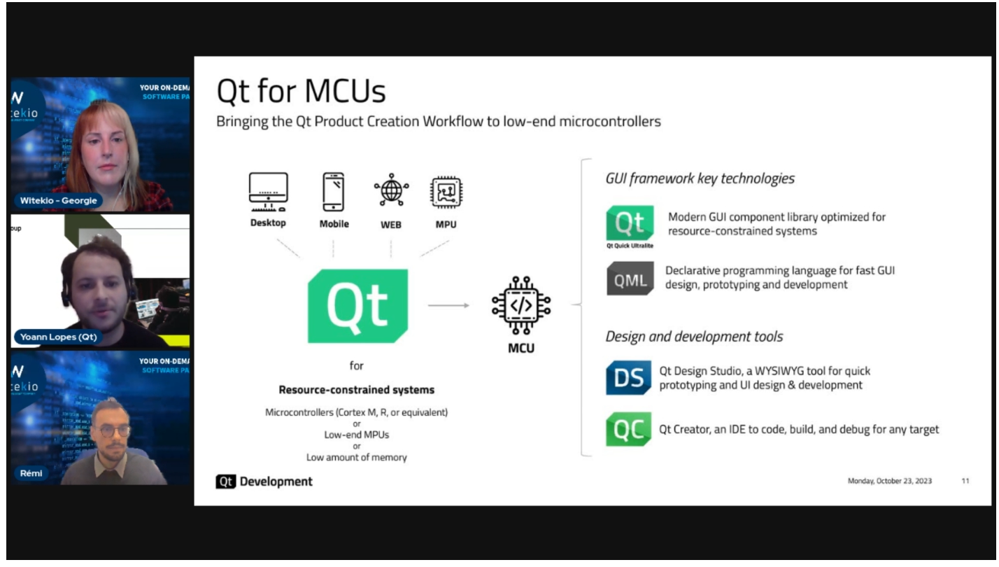

## Reusing Qt code across MCUs and MPUs
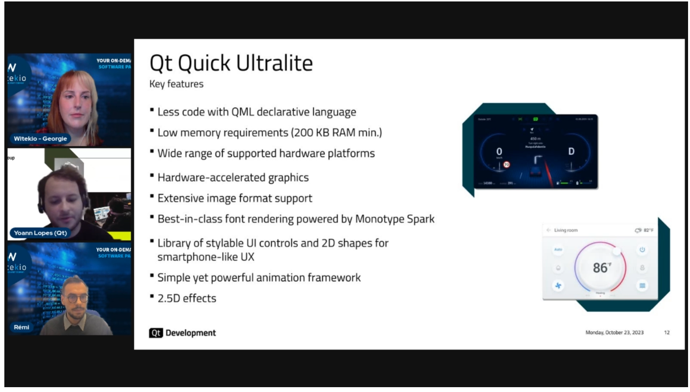
* Can run for MCUs directly on the drivers; RTOS not mandatory.

## Real-life examples
* Yangfen Visteon: Automotive Tier 1 supplier from China; achieved cost reduction by transitioning to MCUs.
* Hasselblad: 3 displays; one was already using an MPU, but a switch was made for the new third display.
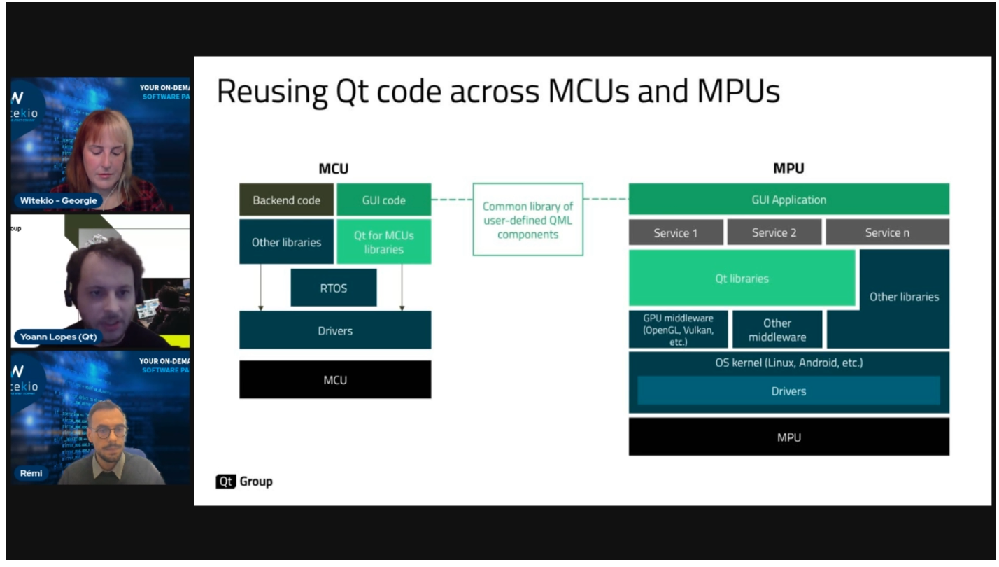
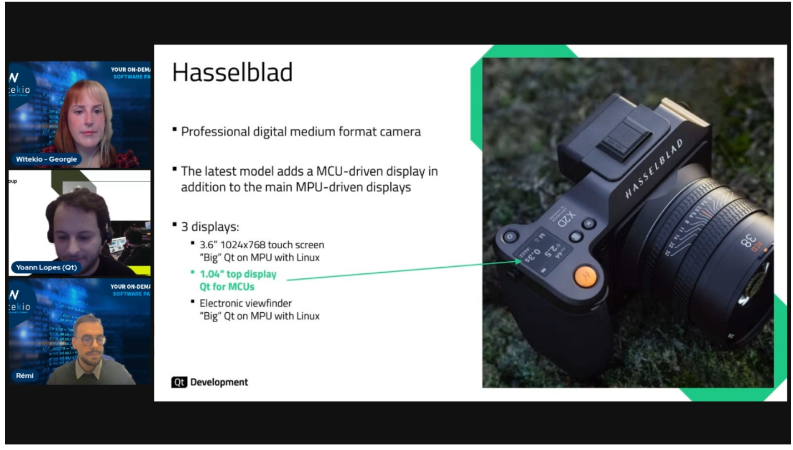

## Remi: Migrating Qt from MPU to MCUs
* Either you have someone familiar with the MPU world, but there's still much to learn about MCUs.
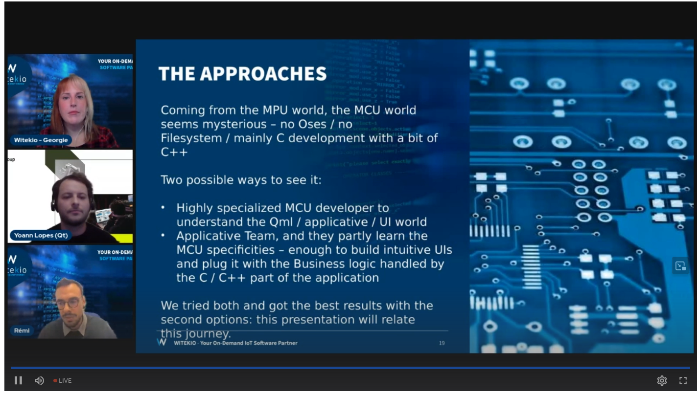
* PTSD from strange experiences.
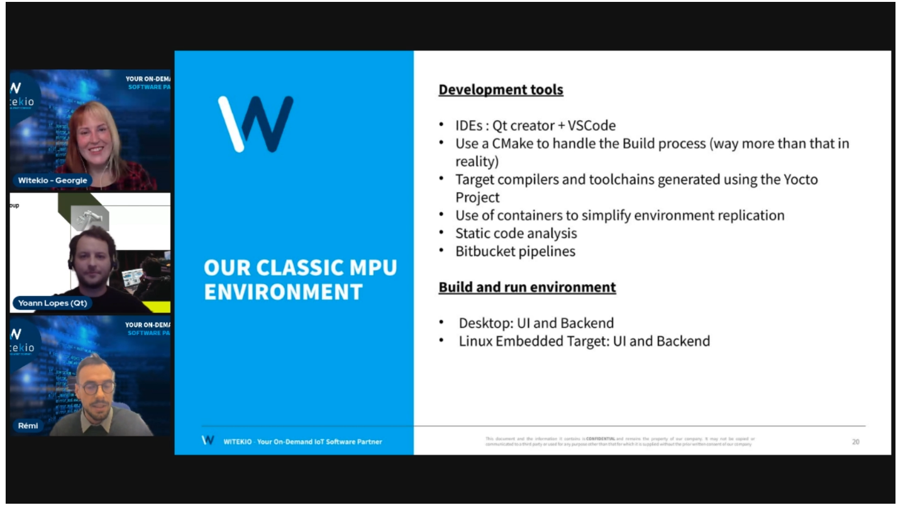
* The team had previously no knowledge about the MCU world; it was seen as outdated.
* The main question was: what can be transferred from the existing skills?
* Reused the coffee-machine-example from Qt 6.6 to QtForMcu 2.5: it's a simple QML based application without a C++ backend.
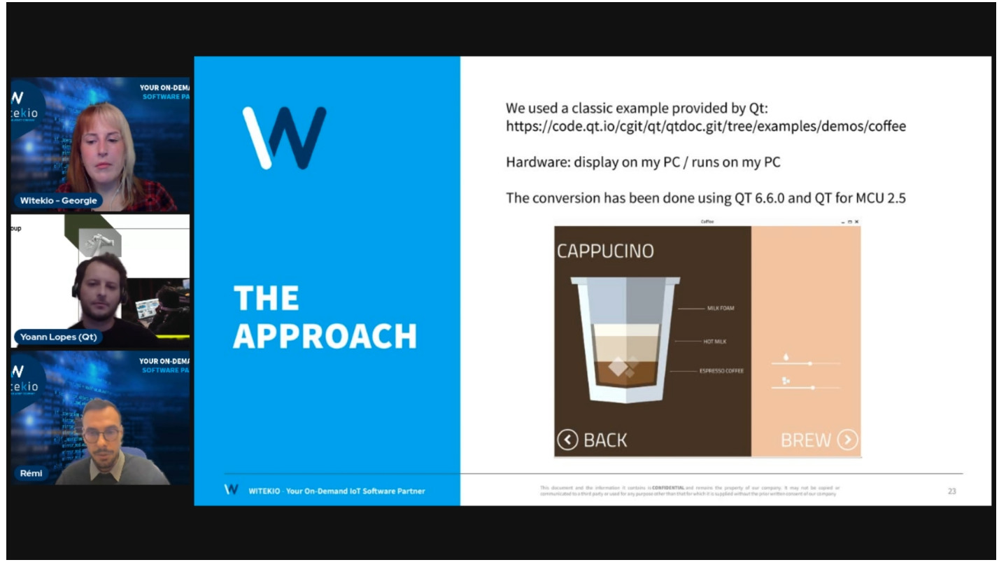
* Just a copy-paste of the QQuick application to the Qul app - with some adaptations. <-- check: Elaborate on what adaptations were made?
* Note: the sugar cube isn't rotated; the font is also different; sliders lack customization (new stylesheet needed).
* My question: `Regarding these styling issues, does the toolchain for Qul generate any warnings? Both during build and at runtime?`
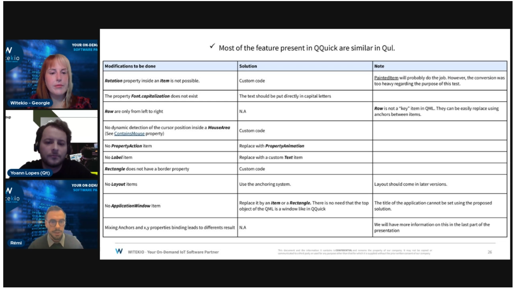
* Most features are present; if not, re-implementation didn't take much time.
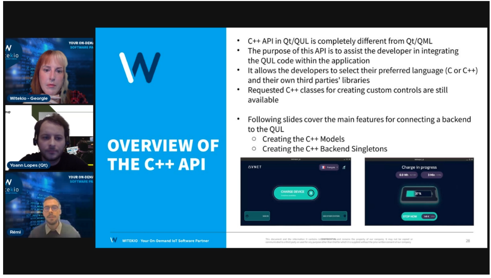
* The need for C++ singletons has been simplified: see the `charging station` example.
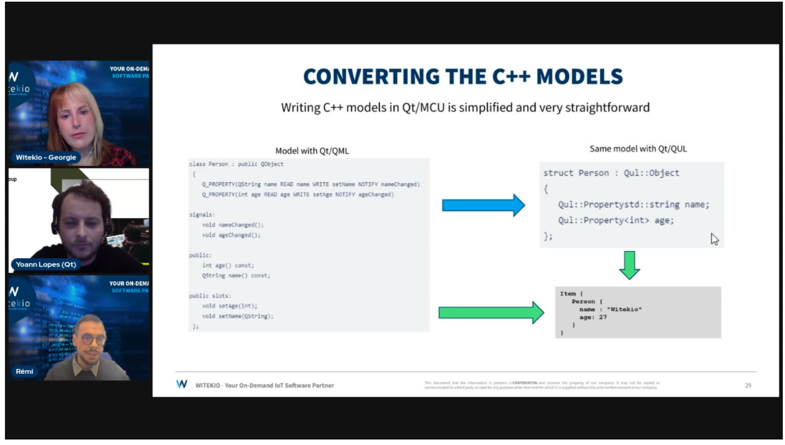
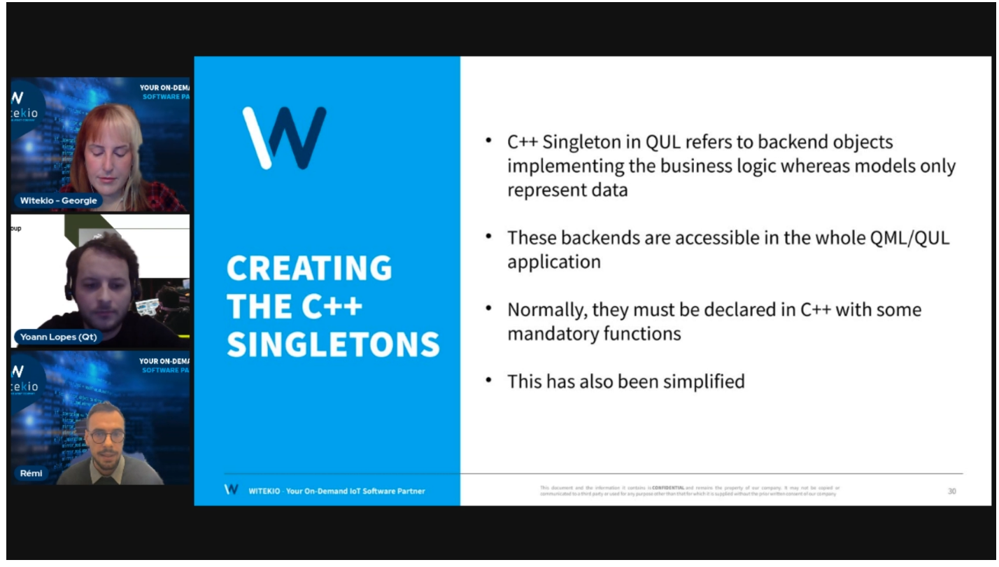
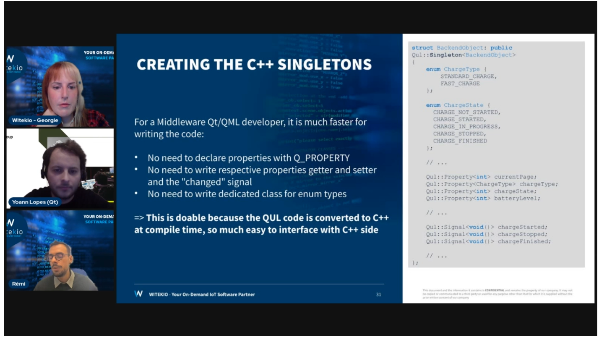

### Custom control creation
* The MPU uses a standard linear gradient, which is replicated in MCU using the Painted QUL Monotype.
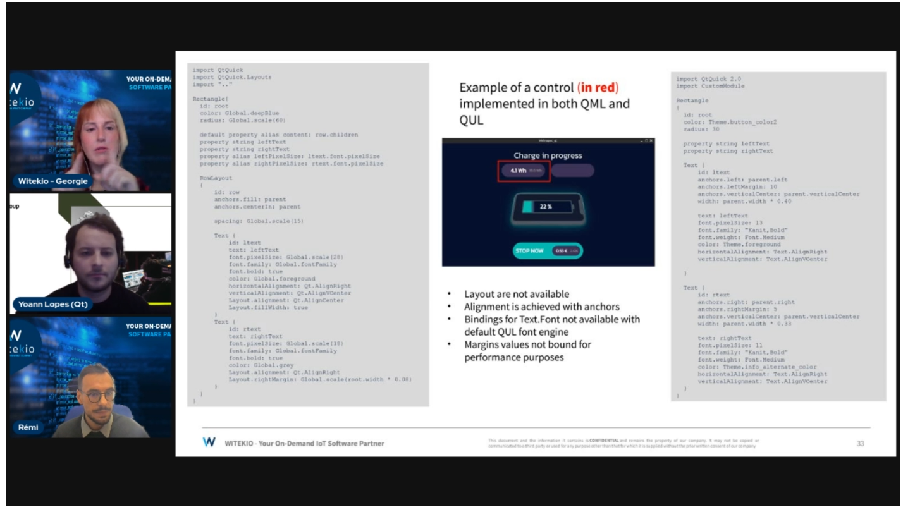

## How to write code for MCU?
* Most of the QUL types are available in QML.
* Transitioning from the MPU world and writing in QUL isn't straightforward.
* A mechanism for dynamic item creation must be established to prevent having dozens of views loaded simultaneously.
* Be cautious with image resources.
* Everything that was planned could be implemented, though some trial and error were necessary.
* The documentation is thorough.

* Using one codebase for both platforms is feasible nowadays, but it shouldn't be mixed with desktop deployments.
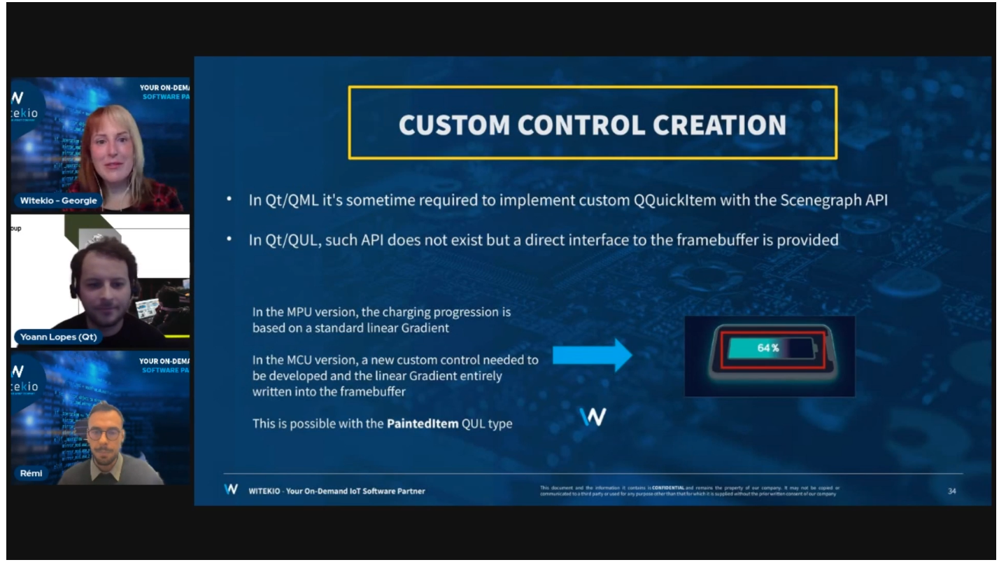
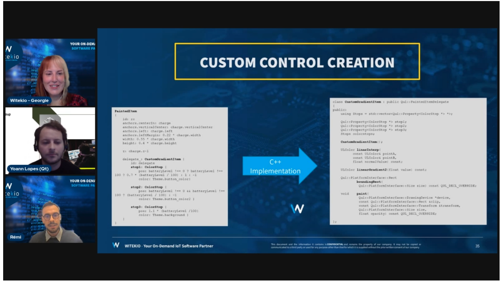
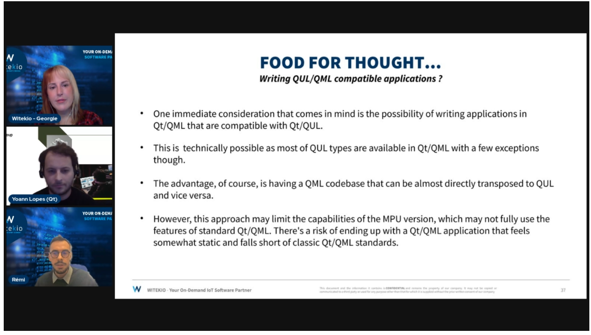
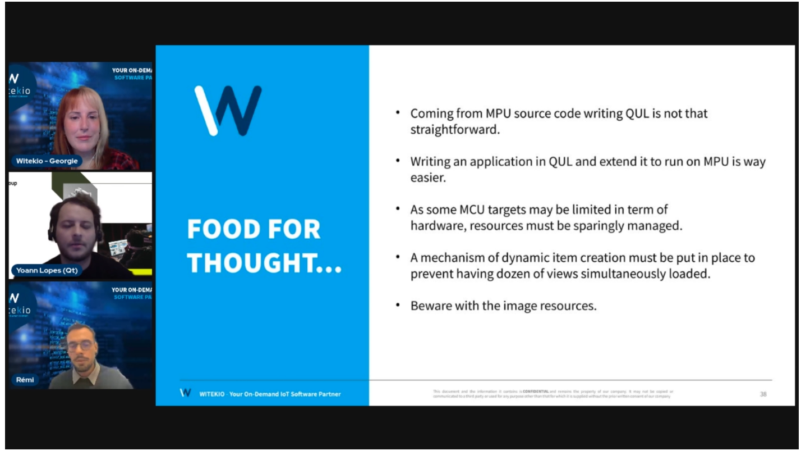
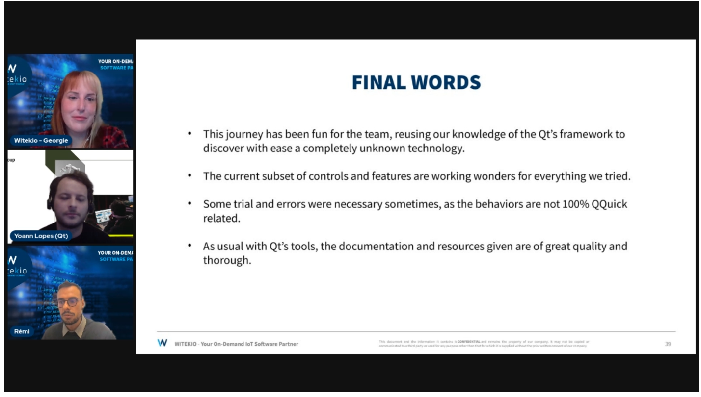
