# 20231115 Der Cloud-native Product Owner

* Hosted By Mick und Martin R.
+ Mick im net


```
# Die Rolle des Cloud-Native Product Owners und die Vorteile der Cloud-Nutzung

Du fragst dich, was ein Cloud-Native Product Owner ist und welche Herausforderungen du in einer agilen Entwicklungsumgebung meistern musst? Oder du bist neugierig auf die Vorteile der Nutzung von Cloud-Diensten für dein Unternehmen?
Johann-Peter Hartmann geht in seinem Vortrag auf das Konzept des Cloud-Native Product Owners ein, diskutiert seine Bedeutung in einem agilen Umfeld und hebt einige spezifische Herausforderungen hervor, denen du in der Cloud-Umgebung gegenüberstehst. Darüber hinaus werden auch die zahlreichen Vorteile untersucht, die Unternehmen durch den Einsatz von Cloud-Services erzielen können – von finanziellen Einsparungen über Effizienzsteigerungen bis hin zu verbesserter Flexibilität und Skalierbarkeit.
Diese Themen sind besonders relevant in unserer zunehmend digitalisierten Welt, wo Agilität, Kosteneffizienz und schnelle Anpassungsfähigkeit entscheidende Faktoren für den Geschäftserfolg sind.

Ablauf

    17:50: Wir öffnen den Zoom Konferenzraum
    18:00: Begrüßung
    18:05: Start des Vortrags von Johann (Q&A im Anschluss)
    ca 19:30: Ende & Ausklang der Veranstaltung

Wir freuen uns auf den Vortrag und viele Teilnehmende :-)
```
# Johann Hartmann - von Mayflower
* 48 Folien vorbereitet
* der PO macht alle relevanten Entscheidungen; aber bei "cloud" kann man alles fortlaufend entscheiden (weil elastisch)
* agiles Manifest auf dem Rücken tätowiert trägt
* beste Anforderungen und Entwürfe entstehen in agilen Teams: selbstorganisierend
  * wer hat den Hoster ausgesucht?
  * wer hat die Datenbank oder Sprache ausgesucht?
  * wer trifft die Make-or-buy-Entscheidung?
TODO image
* früher hatte das einen guten Grund, weil höhere Reichweite
* aber jetzt: cloud-basiert
* Beispiel AWS:
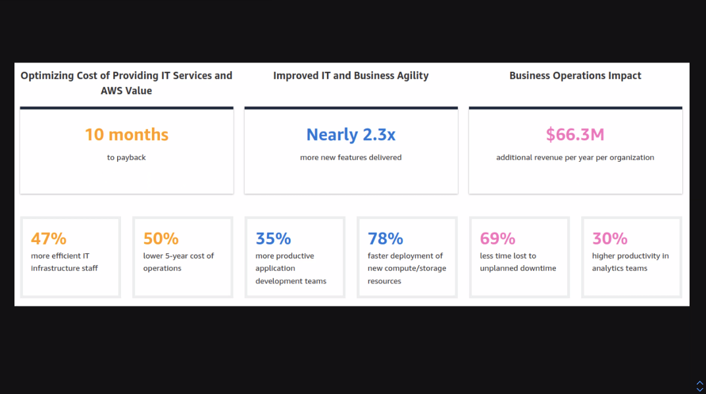
* mehr Effizienz, geringere Kosten, ... er merkt dies noch nicht
* von CapEx zu OpEx - Kernwechsel: BWL und technisches braucht gleiche Gehirnbereiche
* vor cloud: Capital Expenditures
  * ich bezahle alles, was wir mal brauchen könnten
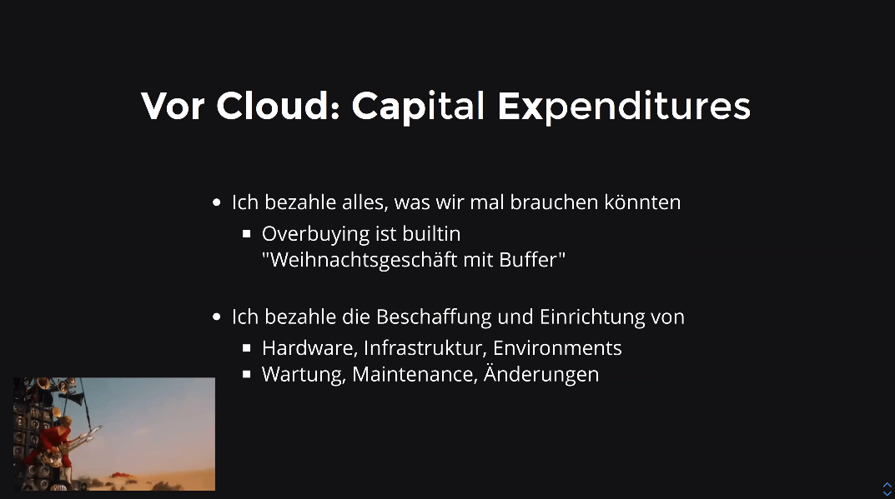
* nicht nur HW an sich, auch die Einrichtung, etc. kostet alles
* cloud: operational expenditures
  * ich bezahle nur, was ich gerade nutze; pay as you go; flexibel und direkt anpassbar; finanzielle Entwicklung nicht vorhersehbar
  * wenn der Container läuft während niemand etwas tut, dann ist das ein Server!
### Folgen:
* Budgets sind nicht mehr da: weil nicht vorher allokierbar
* warum sollte man dann noch in Budgets und Investments denken?
* die Architektur ist nicht mehr da: Technologieentscheidungen werden on demand getroffen; das gilt für Einführung, Beendigung, Wechsel von Technologien
* "die Applikation" ist nicht mehr da: dank SaaS, Lambda, MicroServices Verteilung bis auf Featureebene hinunter
* die Grenzen meiner Software sind nicht mehr da: alles ist integrierbar, alles ist eine API, dann SDK und DevEx: Integration geht schnell; weniger Reuse von Sourcecode, sondern von Softwareapplikationen
* non-funktionale Capabilities sind jetzt eh da: früher teuer, jetzt mit in der Tüte
  * skalieren, Security, Ausfallsicherheit, Backup -> wenn man skalieren will, tut man das einfach
* Cloudversprechen: zehnmal weniger SW-Kosten: einfach 90% der Arbeit weglassen
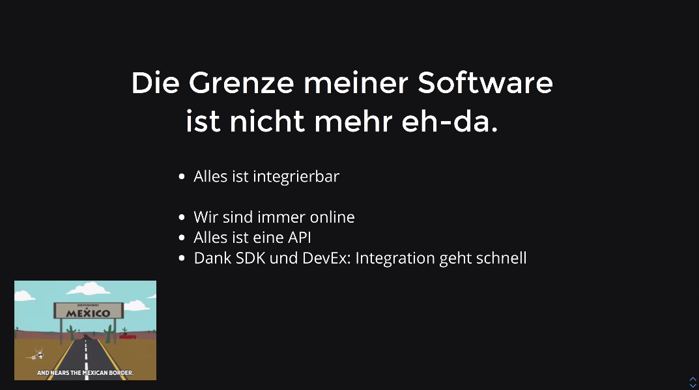
* Dinge, welche man nicht selber macht, sind eh Dinge, welche man sparen sollte
* Was sollte ich denn alles weglassen? Falls man sich entscheidet kostensparend zu arbeiten, dann kann ich das machen - aber wie trifft man diese Entscheidung
  * DDD - domain driven design-guys: either core, supporting oder generic
* 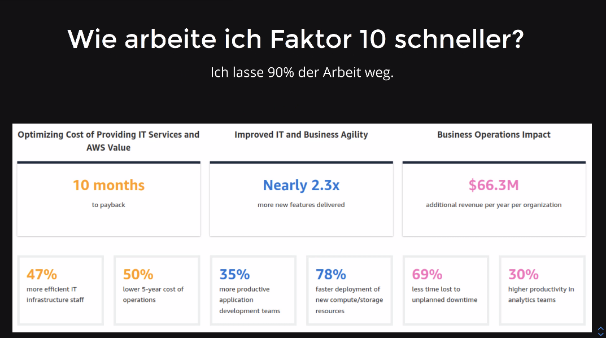
* falls es trivial ist, was man macht, was andere machen, dann ist man schnell ausgetauscht - siehe ganze AI-Startups
* supporting domain: unterstützt nur die core-domain; kann spezifische aber unkritische Lösungen enthalten (wie zum Beispiel: Reporting)
* reduziert die Komplexität der core-domain
* kann flexible off-the-shelf-Lösung sein
* User Management war früher Teil der Lösung: heute kein Sinn mehr; nur Einkauf-Lösung, off-the-shelf (aber anpassbar)
  * Beispiel: anpassbarer Meister: SAP
* general domain: standardisierte Lösungen, die Pflicht sind; Entwickler mögen es, aber keine Priorität
* Frage: welche Domains sollte ich selbst machen, welche nicht?
 * Core-Domain: selber machen; supporting aussuchbar (Services, SaaS), General Domain (SaaS) - auf gar keinen Fall selber machen
  * falls man kein Hoster ist, sollte man nicht selber hosten

## Was bedeutet das für mich als Product Owner?
* lohnt sich das Feature?
 * wenn ja: auf welcher Plattform am meisten?
 * Kosten pro Feature: on premises, cloud/container oder SaaS/Service
 * in Cloud für LLM-Dienste sehr viel einfacher verfügbar als wenn man erst die GPUs beschaffen muss
 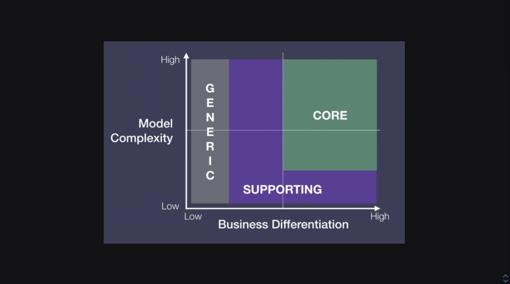
* operative Kosten versus Maintenance versus initiale Entwicklungskosten: definitiv entscheidende Punkte
* andere Formen von Kosten: Kosten pro Feature
* Opportunitätskosten für Leerlauf; cost of delay, skalieren, Feature wieder entfernen
  * Cloud gewinnt überall: alles sehr niedrig; auf Blech alles sehr teuer; bei Service auch niedrig
 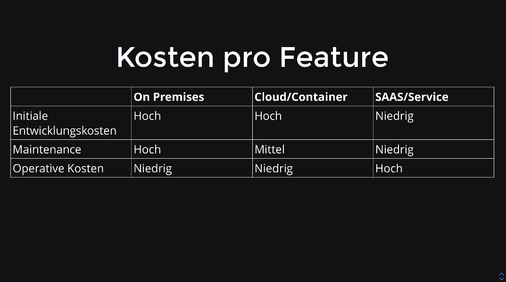
* größte Kosten entstehen aus Maintenance-Phase; also Anpassungen und Wartungen
* nur sieben Prozent die initialen Entwicklungskosten; Testing mit 15% auch teuer; Requirement Engineering auch recht preiswert
 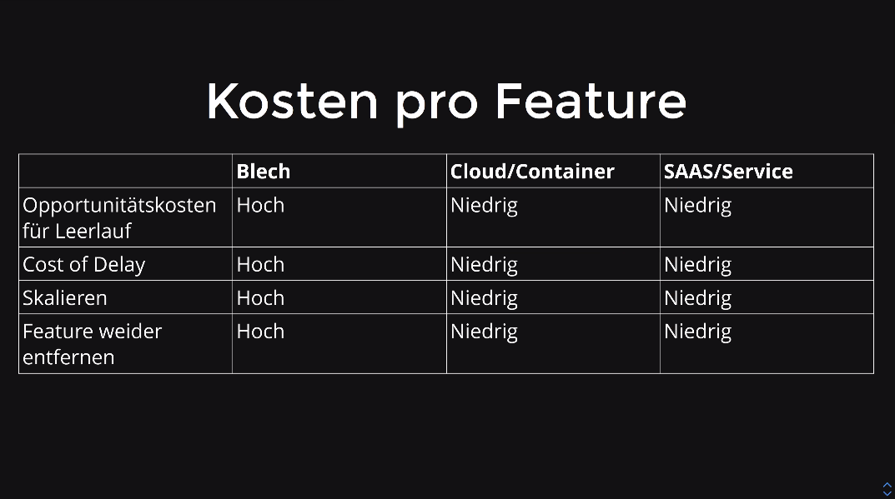
* Woher kommen die Maintenance-Kosten

### Konvergenzschritt:
* Case: wir brauchen ein User-Management. Optionen
 * selbstgebaut
 * Authentik als Container?
 * Cognito auf AWS? (hat Analogien auch bei Azure oder GCP)
 * Auth0 als Service?
* folgend: was sind die Entwicklungskosten, Anpassbarkeit, Betriebskosten pro Jahr, Skalierbarkeit, Security, cost of delay?
* wen muss ich dafür fragen? wer kennt den Bedarf?
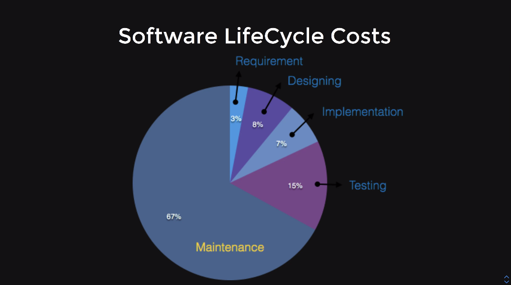
   * das sind Fragen, welche in klassischen agilen Teams keine Heimat finden
* Wer hat die Verantwortung, dass Value/TCO (total cost of ownership) stimmen?
  * eigentlich klassische Frage für den PO
* Solution: gewichtet; Trade-Off-Analyse: bei dem
 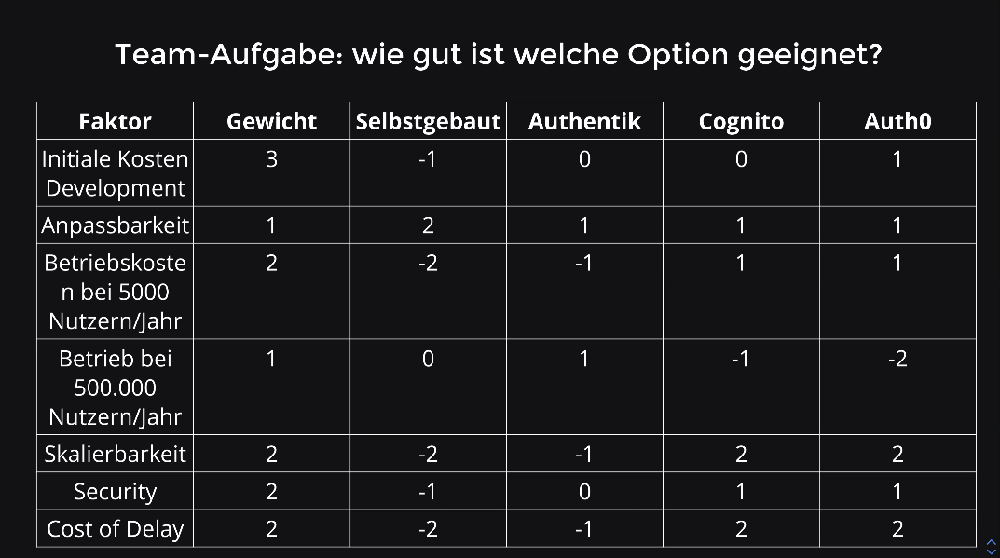
 * Entscheidungen treffen indem man die Informationsdichte erhöht und daraus Entscheidungen ableitet
   * Informationen zusammenbringen
* resultierende Empfehlung: wird wegen der Skalierbarkeit gewinnen; aber interne Leute werden eventuell sich übergangen fühlen
  * alle darunterliegenden Partikularinteressen gibt es noch - aber wenn man darauf hört, hätte man eine ganz furchtbare Lösung gehabt
 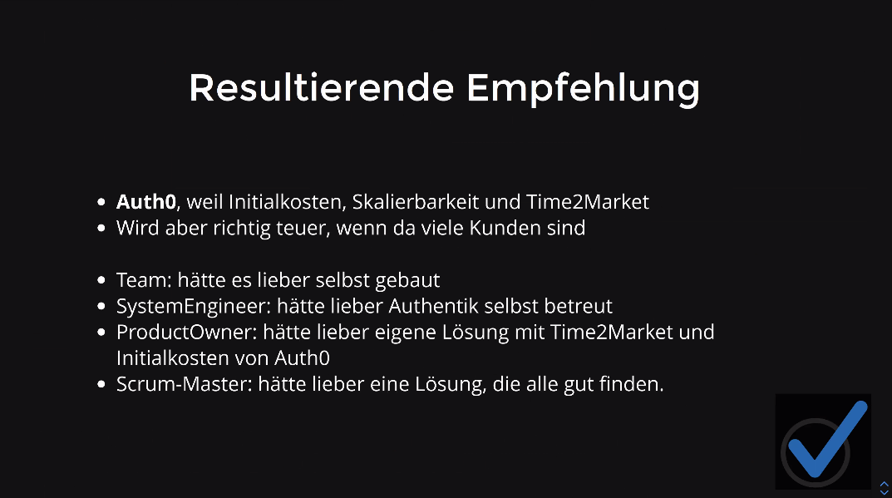
 * daher braucht man das Wissen von PO und Team um fundierte Entscheidung zu treffen

* ergo: Business-Agilität gibt es nur, wenn der PO und das Team sie machen darf
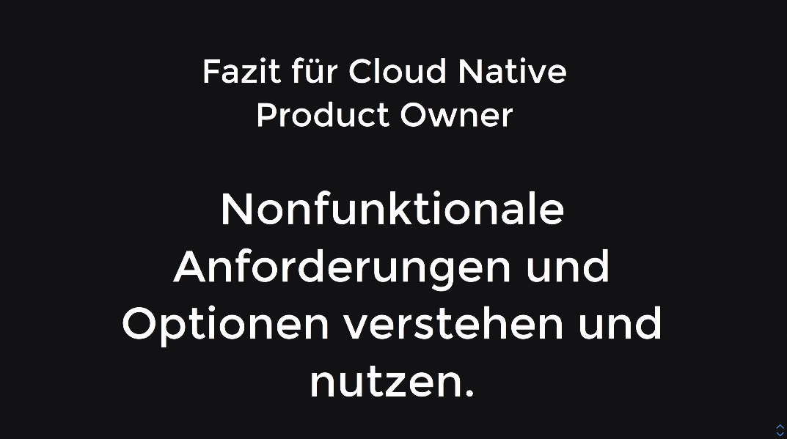
* Nonfunktionale Anforderungen und Optionen verstehen und nutzen: NFRs (als PO muss man sie nicht 100% verstehen, dafür gibt es Techniker)
* daher braucht man einen Mechanismus um solche Informationen in die eigene Bewertung einzubringen
* Architekturentscheidungen sollte man explizit machen und auf Basis von Businessvalue gemeinsam fällen: "Ich mache das weil..." eventuell zu kurz
  * daher ist das Team in der Pflicht auch in Bereichen des Business-Value zu denken; nicht mehr nur den "Programmcode machen"
* operative Kosten: FinOps etablieren und als Ticket-Quelle nutzen (Analyse von Reporting was die meisten Kosten verursacht) - ein Prozess, wo man als Team und PO weiß, was sich in welche Richtung bewegt - und dies als Ticketquelle nutzen
* Support für diese Themen bekommen, per Triade, Architekturgilde (teamübergreifend)
* Fazit: der PO und das Team können den Value wirklich steuern. Wenn sie Macht und Support bekommen.
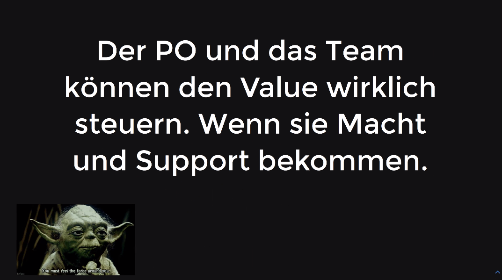

## Diskussion
* "Kickoff2" - danach Review
* Maintenance-Kosten: ISO25010
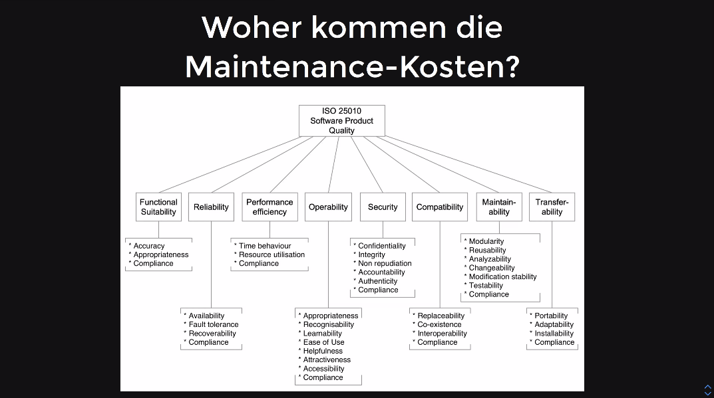


---

* Info: starke Gegenstimme als Zuschauer; elegant darauf eingegangen von Johann Hartmann und souverän die Ausführungen angepasst während des Vortrages


TODO: add all screenshots
