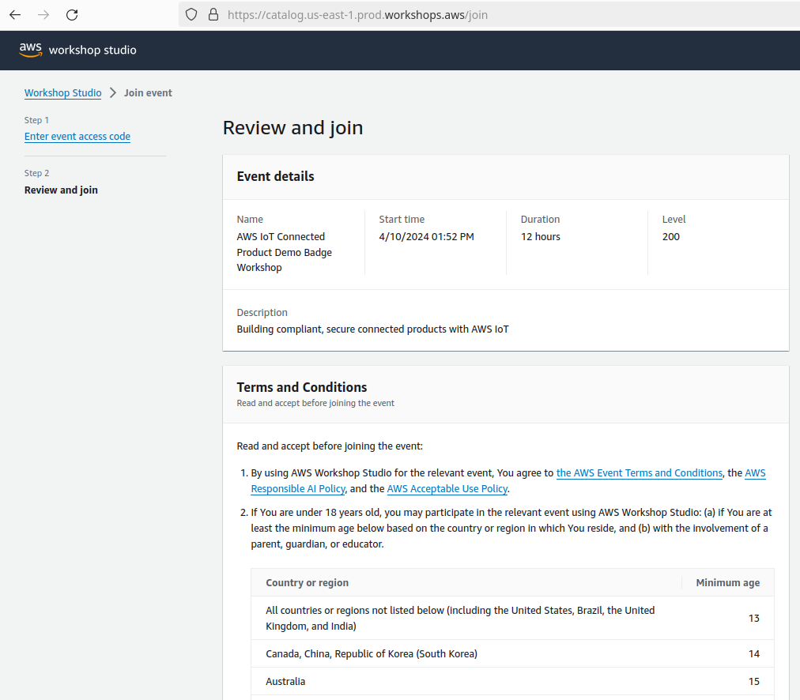
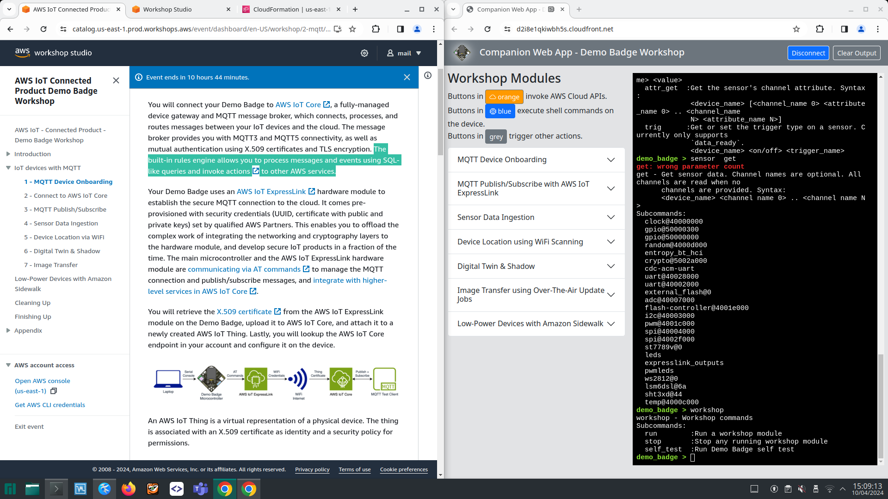

# 20240410 - Securely connect Demo Badge to the AWS cloud - Embedded World

```
Securely connect Demo Badge to the AWS cloud
EVENT OPENS IN
0d 14h 54m 23s
REGISTRATION CONFIRMED

    M
    Marcel Petrick
    Price
    $30.00
    Not Marcel Petrick ? Click here

EVENT DETAILS

    When
    Wednesday, April 10, 2024 · 2:00 p.m.
    Paris (GMT +2:00)

    Add to calendar
    About
    Date: Wednesday April 10, 2024
    Start Time: 2:00 PM local Germany time
    Where: Nuremberg Messe, NCC Mitte, Munchen 2
    Duration: Three hours

    Cost to attend: $30US (approximately 27 Euros)

    Are you looking to accelerate your IoT product development time and want to quickly build a connected solution in just few weeks?

    In this workshop, you will get hands-on experience and explore how to securely connect IoT products and manage them with AWS IoT services. Using a purpose-built educational device, the Demo Badge, you will learn about different AWS IoT connectivity options, including the MQTT protocol on AWS IoT Core and Bluetooth Low Energy on the Amazon Sidewalk network. This workshop also introduces you to use cases, such as, over-the-air updates, sensor data ingestion, geo-location lookup, digital twins and shadows, and low-power connectivity.

        Connecting IoT devices using MQTT to AWS Cloud
        Security, Certificates, device onboarding using AWS IoT ExpressLink
        OTA Updates
        Sensor Data Ingestion using Amazon Timestream and Grafana
        Device control and digital twins with mobile app integration

    Who should attend?
        Hardware and platform developers who need to enable ‘connectivity’ technologies in their design
        Firmware engineers who want to onboard a connected solution to the cloud with just few lines of code

    Giveaway
        The Demo device will be provided to each attendee to take with them and practice at your own pace
        The attendee will be able to reuse the Demo Badge for connecting to AWS IoT and conducting proofs-of-concept

    HW/SW requirements – what attendees will need to do prior to Workshop
        A laptop + power supply running Windows/macOS/Linux
        Google Chrome browser
        Administrator privileges to access USB devices on your laptop

    Agenda
        10 min - introduction
        20 min - presentation
        2 hour - self-paced working with support staff

    Speakers
        Thomas Kriechbaumer and Andrzej Mizerkiewicz -
        Senior IoT Solutions Architect at AWS
        Support staff - 3-4 IoT Solutions Architects

    Price
    $30.00
    Language
    English
    OPEN TO
    Open to developers on a first come, first served basis, up to 40 registrants. We have the right to refuse participation after registration and payment is received and a credit will be given.
    Dial-in available
    (listen only)
    Not available.

FEATURED PRESENTERS

    Webinar hosting presenter
    Thomas Kriechbaumer
    Senior IoT Solutions Architect at AWS
    Full Profile
    Webinar hosting presenter
    Andrzej Mizerkiewicz
    Senior IoT Solutions Architect at AWS
    Full Profile
```

## intro
* thomas kriechbaumer started
* help and educate the customer to build the next product or services
* agenda: presentation 30 min, uided walk through 2 hours, open discussion 30 minutes
* loud: it-ressources on demand
* things linke iot-services are cloud as well; lots of flexibility; and danymic allocation
* traditional: on premise stuff
*  by 2030 29 bio devices are expected
* common challenges of connected products:
  * turning data into value
  * deploying connected devices
  * managing and scaling large fleets
  * managing security and privacy
* a prototype is done in 5 minutes, but rolling out i hundreads ofthrousands needs more effort

## AW ressources
* AWS IoT Core; like an MQTT broker - fully compliant, MQTT 3 and 5; securely and privately wrapped
  * use publish and subscribe capabilities
* attach to the broker rules and actions
* if something matches a topic it should be routed and forwarded to a specific point
* AWS IoT Core is a fully managed server; not needed to write any specific code, already provided
* Amazon Sidewalk network: community aspect
* also: MAtter devices - local communication 8device to device)
* LoRaWAN
* DemoBade is purpose-built:
  * run through all typical aspects of the lifecycle
  * has microcontroller
  * has color TFT display, several sensors
  * AWS IoT ExpressLink module as link to the cloud with wifi-technology
  * expresslink is certified and qualified

## topics
* introduction to MQTT with publish/subscribe
* sensor data ingestion
* device location using wifi scanning
* digital twin and shadow
  * state information and state monitoring
* image transfer using over the air updates
  * also: how to install a new firmware?
* optional: low poer connectivitiy with amazon sidewalk

* amazon geolocation feature?can use for instance ssid/mac-adress to give some idea where you are
* our devices are in a "workshop" mode; can be turned off later
* the first module is the mandatory one!
* Instant gratification: never send a human to do a machine's job
* for the purpose of this workshop we get provided with an account and the necessary policies
  * only available for the duration of this workshop
  * all pre-provisioned infrastructure is deployed to a specific AWS region:
    * only use US East/us-east-1 region
  * review the terms and conditions of this event
* go to this url: https://s12d.com/iot


```
AWS IoT Connected Product Demo Badge Workshop
Event information
Start time
4/10/2024 01:52 PM
Duration
12 hours
Accessible regions
us-east-1
Description
Building compliant, secure connected products with AWS IoT
Workshop
Get started
Title
AWS IoT - Connected Product - Demo Badge
Complexity level
200
AWS services
Amazon Location Service, AWS IoT Core, AWS IoT Device Management
Topics
Internet of Things (IoT)
Description
You will get hands-on and explore how to securely connect IoT products and manage them with AWS IoT services. Using a purpose-built educational device, the Demo Badge, you will learn about different AWS IoT connectivity options, including MQTT on AWS IoT Core and Bluetooth Low Energy on the Amazon Sidewalk network. This workshop introduces you to use cases, such as, over-the-air updates, sensor data ingestion, geo-location lookup, digital twins and shadows, and low-power connectivity.
```

```
AWS IoT - Connected Product - Demo Badge Workshop
In this workshop, you will get hands-on and explore how to securely connect IoT products and manage them with AWS IoT services. Using a purpose-built educational device, the Demo Badge, you will learn about different AWS IoT connectivity options, including the MQTT protocol  on AWS IoT Core  and Bluetooth Low Energy on the Amazon Sidewalk network .

This workshop introduces you to use cases, such as, over-the-air updates, sensor data ingestion, geo-location lookup, digital twins and shadows, and low-power connectivity.

You must bring your laptop to participate.

The Demo Badge device will be provided to you.

An AWS account with pre-provisioned cloud infrastructure will be provided to you for this event.

Use the Next and Previous buttons below to navigate through this workshop.
```

```
Introduction
Audience
This workshop is "Level 200 - Intermediate" meaning the educational material requires only basic knowledge of IoT and embedded development. It is suitable for technical decision makers, software & hardware architects, cloud engineers, hardware engineers, and the broader maker/creator/tinkerer community. Basic AWS IoT and hardware fundamental knowledge is beneficial but not required. No programming or embedded development skill needed.

Duration
The expected self-paced workshop duration is approximately 1:45 h (105 min). If you finish all workshop modules early, feel free to stay around, tinker with the device, and show us what you built!

Estimated Costs
If you participate in this workshop during an AWS Event, you will be provided with an AWS account free of charge.

If you use your own AWS account for this workshop, you will be charged for individual service usage, which should be under $1 for the following workshop modules. Make sure to cleanup and de-provision resources you no longer need.

Supported Regions
All activities for this workshop take place in a single AWS region. Make sure to verify which region is selected in your AWS Console or CLI. Resources might not be found or access might be denied if you attempt to access a different region. This workshop currently supports only the US East N. Virginia (us-east-1) region.
```

```
3 - Provisioned Resources
Objectives
AWS CloudFormation  allows you to easily model, provision, and manage AWS resources.

For this workshop, the provided AWS account comes prepared with an existing AWS CloudFormation stack.

Discover provisioned resources
You can find the provisioned resources in the AWS console:

Navigate to the AWS CloudFormation console
Click on the DemoBadgeWorkshop stack.
You can ignore all stacks with a Nested tag.
Select the stack where the name matches exactly without suffix.
Select the Outputs tab or section.
Keep this page open, you will need it in the next workshop modules.
workshop cloudformation outputs

Outcomes
You discovered the Outputs of the DemoBadgeWorkshop CloudFormation stack in your AWS account.

You will need all values at a later point in time during this workhop.

Proceed to the next module.

Previous
Next

© 2008 - 2024, Amazon Web Services, Inc. or its affiliates. All rights reserved.
```

* what the hell ..
```
4 - Companion Web App
Objectives
The Companion Web App provides you with a control panel and text-based interface for your Demo Badge. It offers automation and one-click solutions for the following workshop modules. It connects and authenticates to your AWS account and can call AWS APIs on your behalf. The integration with your Demo Badge device requires a physical USB connection to monitor on control the device over a serial console.
```

* problem with my system and accessing serialport: added my user to group uucp (dialout for ubuntu-based systems); reboot!
```
<CONNECTED>

demo_badge > info
--------------------
This is the AWS IoT - Connected Product - Demo Badge, 2023 edition.
It was designed and built by:
  Thomas Kriechbaumer (https://linkedin.com/in/thomas-kriechbaumer)

This device and related workshop content serve as educational tool kit to explore AWS IoT services and features in the context of connected products.

All resources are open-source and available at:
  https://github.com/aws-samples/aws-iot-connected-product-demo-badge

Demo Badge firmware version: 2023-11-23T143000

Zephyr version: v3.4.99
nRF Connect NCS version: v2.5.0
Sidewalk:
  build time: 2023-11-23 22:26:05.005010+00:00
  nrf: v2.5.0
  zephyr: v3.4.99-ncs1
  sidewalk: v2.5.0-dirty
--------------------
demo_badge >
demo_badge >
```


## MQTT part:
* my endpoint: ah4uolofd639w-ats.iot.us-east-1.amazonaws.com
* my badge:
```
demo_badge > expresslink cmd AT+CONF? ThingName
OK 240a6dee-a13a-448c-89f1-4fedb0391f7d
demo_badge >
```

## data ingestion: sensor data
```
Transmitting Data with MQTT
Sensor and telemetry data is typically a one-way data ingestion from edge devices to the AWS Cloud. Other devices do not need to access or react to this data, so we reduce messaging costs by using the Basic Ingest feature of AWS IoT Core . Using Basic Ingest, you can send messages to reserved topics: $aws/rules/<rule_name>. These messages do not incur messaging costs, as would normal MQTT messages that flow through the full publish-subscribe broker.

JSON is the universal message format for AWS IoT Core. The built-in SQL rules engine allows you to query and transform JSON documents  or Protocol Buffers-formatted messages  natively, or process binary blobs using AWS Lambda functions.

With the Basic Ingest usage, the special topic is directly sending the data into into the AWS IoT rules engine. You cannot use the MQTT Test Client to subscribe to these topics because Basic Ingest is by-passing the MQTT publish-subscribe message broker of AWS IoT Core. If your Demo Badge is not reporting any errors and the AT+SEND1 commands return OK, you can assume that the sensor data is landing in the Basic Ingest rule. You will verify that in the next section.
```

## IoT devices with MQTT
DONE: 1 - MQTT Device Onboarding
DONE: 2 - Connect to AWS IoT Core
DONE: 3 - MQTT Publish/Subscribe
DONE: 4 - Sensor Data Ingestion
DONE: 5 - Device Location via WiFi
6 - Digital Twin & Shadow
DONE: 7 - Image Transfer

# Siehe:
* fs ls USB:/
* fs rm USB:/workshop_wifi_device_location_override.txt

```
demo_badge > expresslink cmd AT+DIAG WIFI SCAN workshop
 MacAddress Rss
OK {"WiFiAccessPoints":[{"MacAddress":"28:6F:7F:50:10:80","Rss":-45},{"MacAddress":"28:6F:7F:50:44:C2","Rss":-46},{"MacAddress":"28:6F:7F:50:44:C4","Rss":-47}]}
demo_badge > fs ls USB:/
pictures/
active_workshop_module.txt
VERSION.txt
.fseventsd/
transferred_image.bin
v2.5.0.bin
workshop_wifi_device_location_override.txt
expresslink_certificate_240a6dee-a13a-448c-89f1-4fedb0391f7d.pem
demo_badge > fs cat USB:/workshop_wifi_device_location_
override.txt
{"WiFiAccessPoints":[{"MacAddress":"28:6F:7F:50:10:80","Rss":-45},{"MacAddress":"28:6F:7F:50:44:C2","Rss":-46},{"MacAddress":"28:6F:7F:50:44:C4","Rss":-47}]}
demo_badge > fs mv USB:/workshop_wifi_device_location_o
verride.txt USB:/workshop_wifi_device_location_override
copy.txt
fs - File system commands
Subcommands:
  cd       :Change working directory
  ls       :List files in current directory
  mkdir    :Create directory
  mount    :<Mount fs, syntax:- fs mount <fs type>
            <mount-point>
  pwd      :Print current working directory
  read     :Read from file
  cat      :Concatenate files and print on the standard
            output
  rm       :Remove file
  statvfs  :Show file system state
  trunc    :Truncate file
  write    :Write file
demo_badge >
```

```
demo_badge > expresslink cmd AT+DIAG WIFI SCAN workshop
 MacAddress Rss
OK {"Timestamp":"1712758200","WiFiAccessPoints":[{"MacAddress":"e6:23:79:7a:8f:5a","Rss":-55},{"MacAddress":"d6:e1:8a:29:2f:b8","Rss":-57},{"MacAddress":"06:b5:10:50:b2:17","Rss":-58},{"MacAddress":"7a:8e:ca:84:23:69","Rss":-63},{"MacAddress":"48:4a:e9:9d:14:41","Rss":-64},{"MacAddress":"48:4a:e9:9d:14:42","Rss":-64},{"MacAddress":"d6:44:81:a8:28:2a","Rss":-65},{"MacAddress":"92:83:c4:22:3c:41","Rss":-69},{"MacAddress":"96:83:c4:22:3c:41","Rss":-69},{"MacAddress":"48:4a:e9:9e:30:21","Rss":-72},{"MacAddress":"48:4a:e9:9e:30:22","Rss":-72},{"MacAddress":"48:4a:e9:9d:73:c1","Rss":-73},{"MacAddress":"48:4a:e9:9d:73:c2","Rss":-74},{"MacAddress":"f4:2e:7f:74:29:60","Rss":-75},{"MacAddress":"48:4a:e9:9d:4d:01","Rss":-78},{"MacAddress":"48:4a:e9:9d:4d:02","Rss":-78}]}
demo_badge >
```


