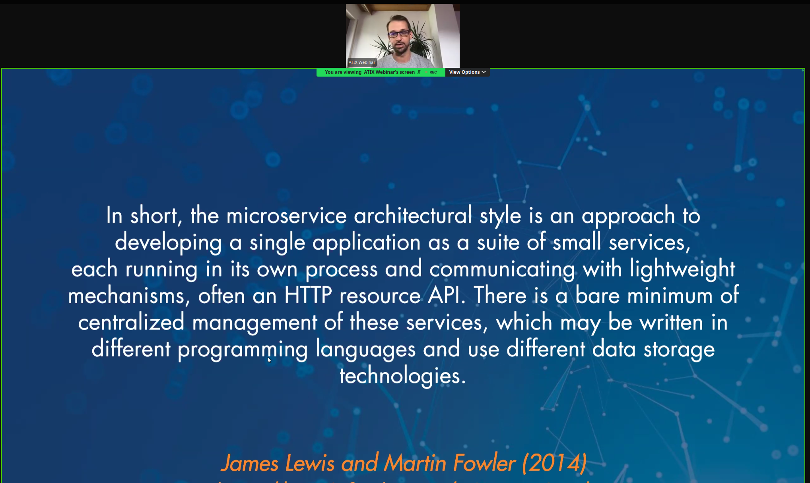
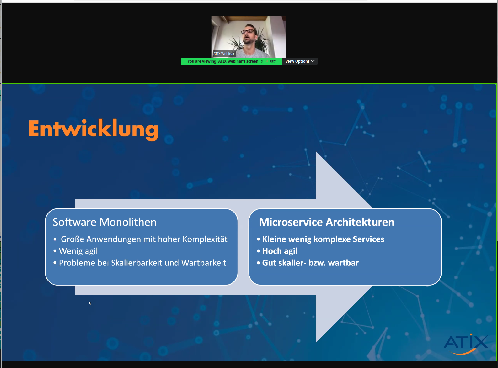
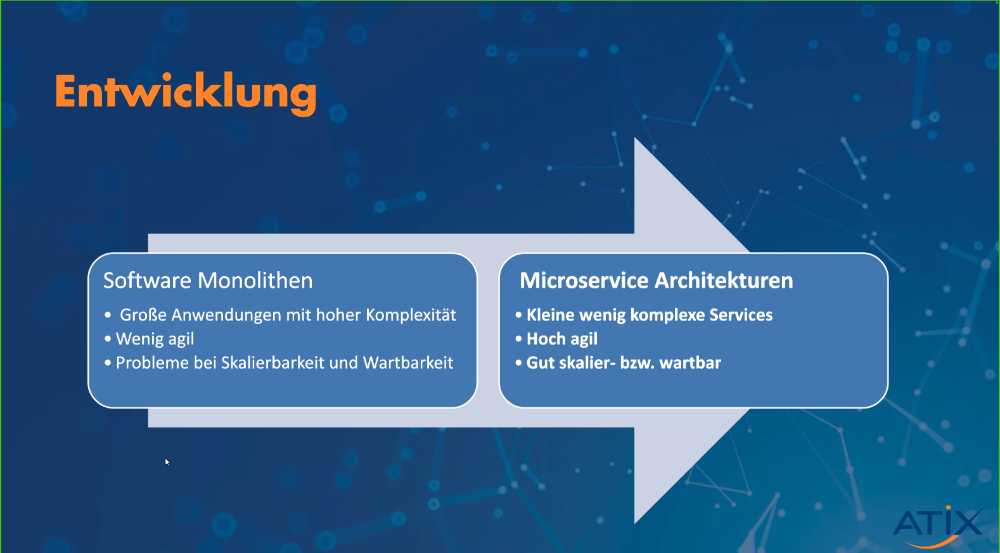
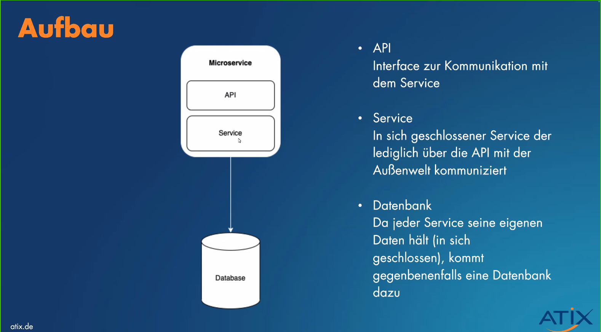
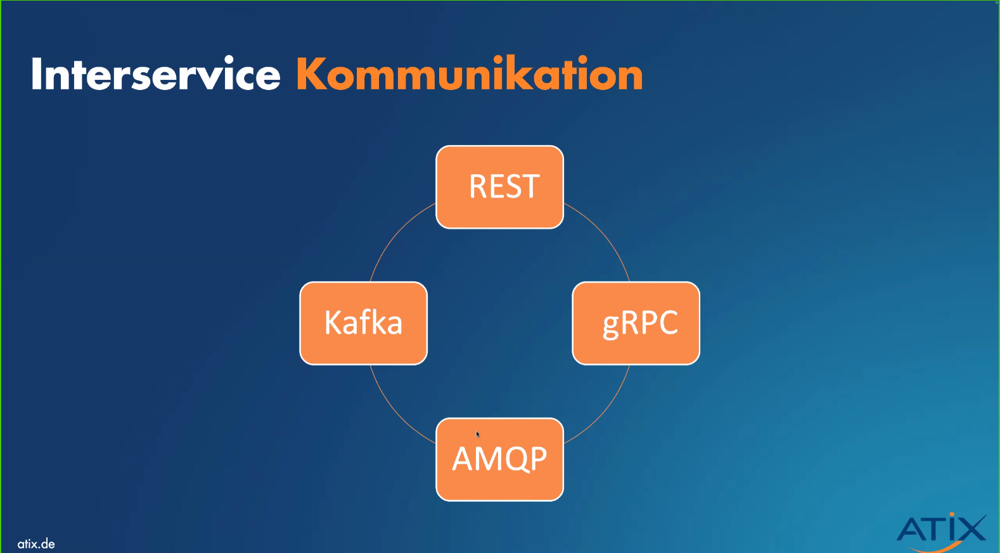
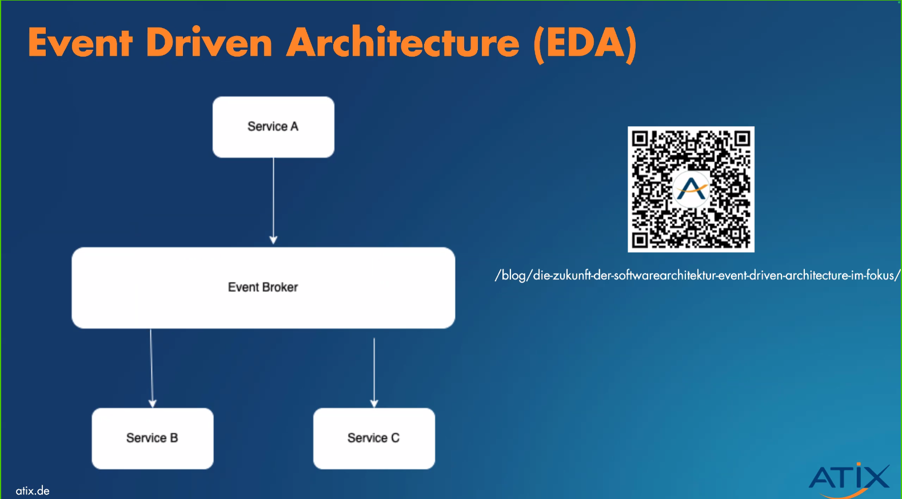
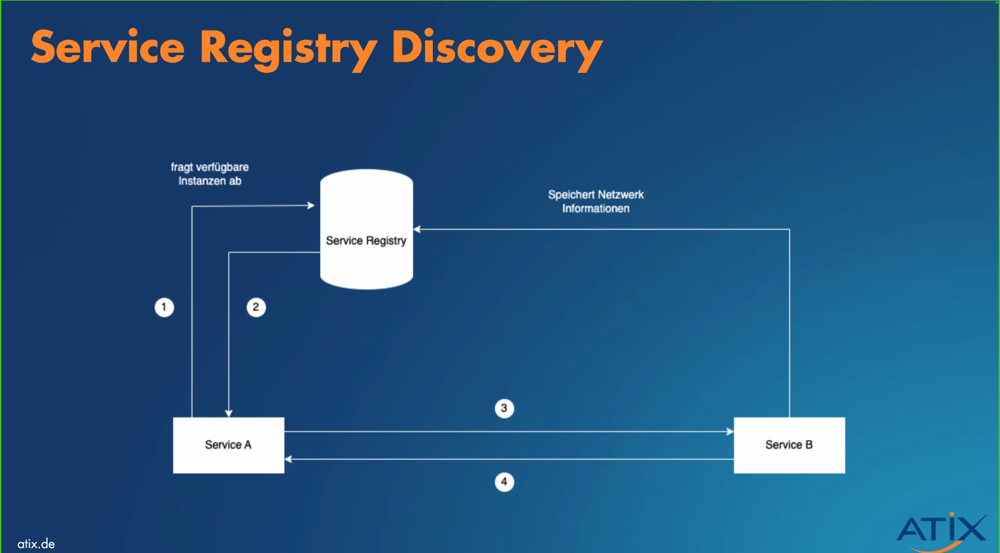
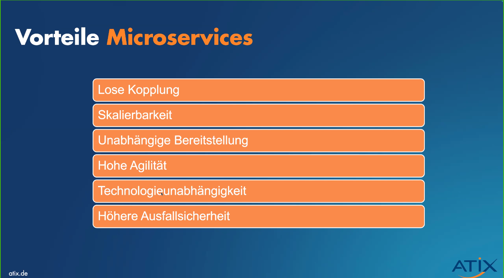

# 20240724 Einführung in Microservices: Ihr Weg zur modernen Softwarearchitektur

```
Hosted By
ATIX A.
Einführung in Microservices: Ihr Weg zur modernen Softwarearchitektur
Details

Webinar – Wie Microservices Ihre Entwicklungsarbeit verändern können

Einführung in die Grundlagen und Vorteile von Microservices.
Praxisnahe Tipps und Beispiele zur Implementierung.

Entdecken Sie die Welt der Microservices in unserem umfassenden Webinar. Erfahren Sie, wie diese moderne Architektur die Entwicklung und das Management von Anwendungen revolutionieren kann. Dieses Webinar ist ideal für Entwickler, Architekten und alle IT-Professionellen, die ihre Kenntnisse in der Microservices-Architektur vertiefen möchten.
```

## Notes
* geringere Komplexität - leichtere Einarbeitung








