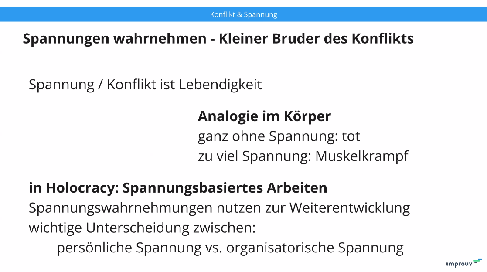
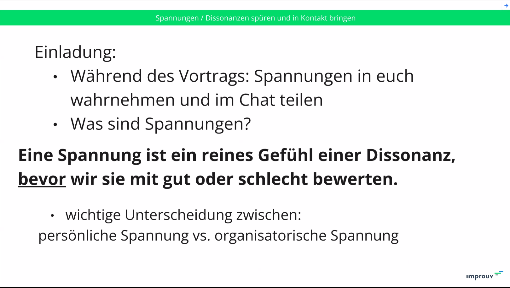
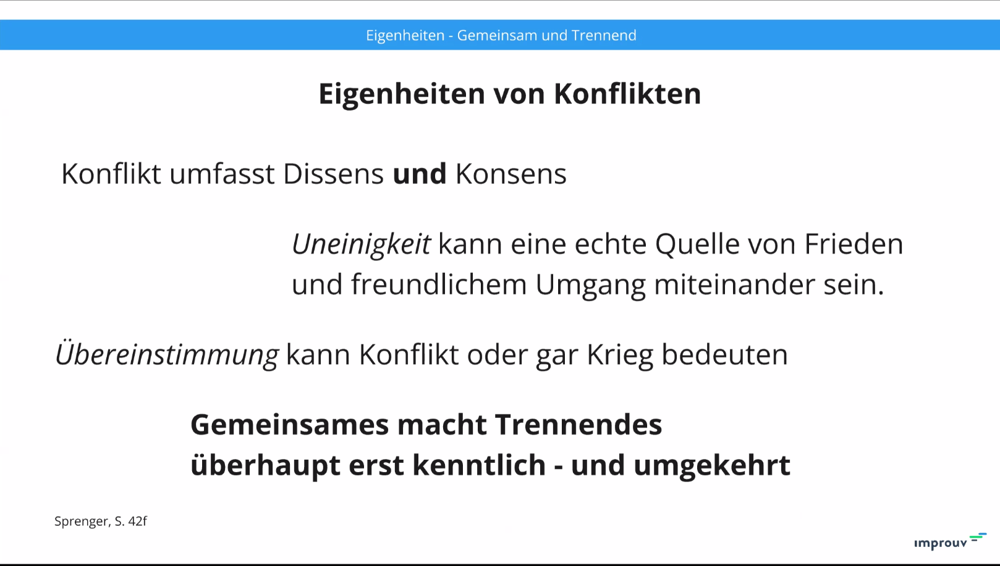
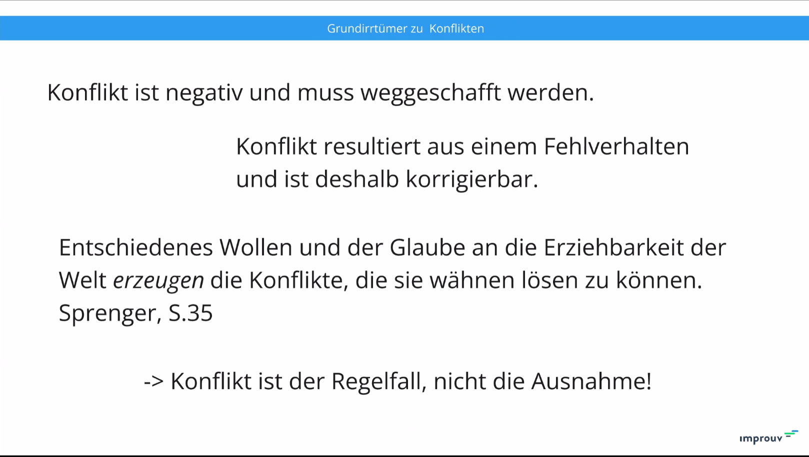
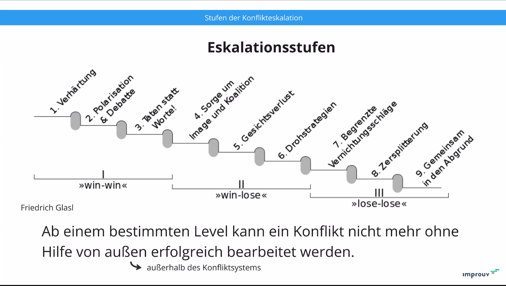
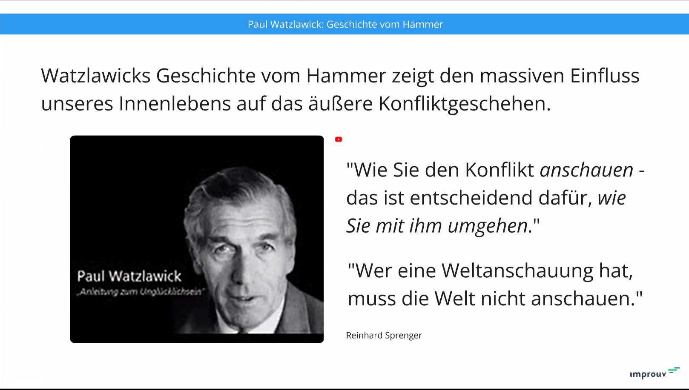
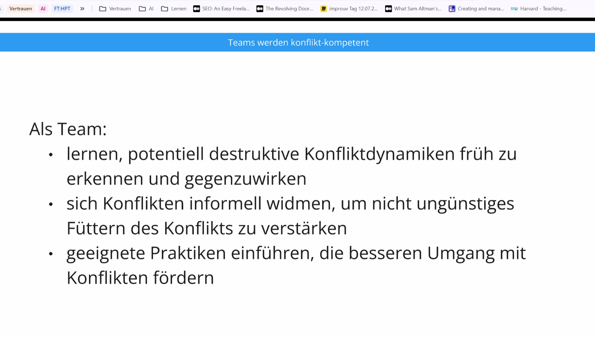
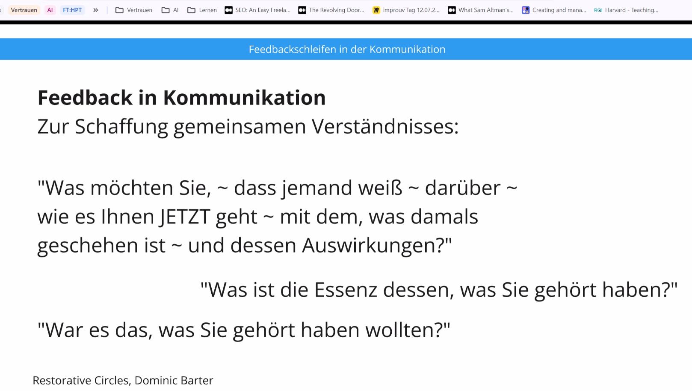
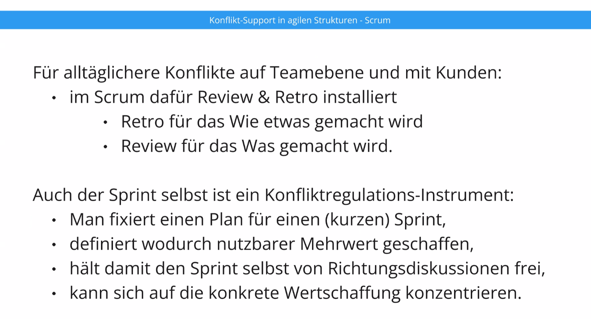

# 20240724 - Konflikte—Zeit gewinnen durch konstruktive Auseinandersetzung

20240724_Konflikte_Zeit_gewinnen_durch_konstruktive_Auseinandersetzung

---------------------

```
Wiederholung: Konflikte—Zeit gewinnen durch konstruktive Auseinandersetzung
Wiederholung: Konflikte—Zeit gewinnen durch konstruktive Auseinandersetzung
Details

Aufgrund des Durcheinanders mit dem Zoom-Link beim letzten Mal möchten wir euch noch einmal einladen, bei der Neuauflage dabei zu sein:

Konflikte werden gern vermieden. Oft mit dem Argument, keine Zeit in sinnlosen Diskussion verschwenden zu wollen.

Wenn es jedoch gelingt, sich zu strittigen Punkten geeignet auseinanderzusetzen, dann ist das der Schlüssel zu spannendem Austausch, mehr wertvollen Perspektiven, schnelleren Lösungsfindungen, weniger Taktieren und mehr Offenheit bei kritischen Problemen.
Zudem ist das (selbst-)verantwortliche Austragen von Konflikten die Quelle für schnelles Lernen, im Team wie für jeden Einzelnen. Doch wie kommt man da hin? Damit wollen wir uns in diesem Miniworkshop befassen und auch einige (Denk-)Werkzeuge beleuchten:

    Wie kann man Konflikten den Schrecken nehmen und die Konfliktfähigkeit im Team ausbauen?
    Wie lassen sich Konflikte konstruktiv austragen?
    Wie verwandelt man Konflikte zu Entscheidungen, die von allen Betroffenen mitgetragen werden?

Und warum sollten wir uns damit befassen? Wir haben doch keine Konflikte, oder?

Unser Coach Jan Klostermann befasst sich seit über 10 Jahre auch mit Wegen zur Konfliktbearbeitung, ist ausgebildeter Mediator und Faciltator für Restorative Circles.
```

--------------

* [..] 10 min später gekommen aufgrund anderem Meeting


* Spannung bedeutet Leben
* zu große Spannung führt zu Körperkrampf
* spannungsbasiertes Arbeiten
* Unterscheidung zwischen persönlicher Spannung und organisatorischer Spannung:


* "Konflikt wollen wir nicht haben und der muss weg"
* muss aber nicht Fehlverhalten als Ursache sein, kann auch "anderes" Verhalten sein
* Glaube an Erziehbarkeit der Welt ist eine Quelle für Konflikte
* Konflikte wie Konfliktlosigkeit können fruchtbar und furchtbar sein: schüren, wenn es notwendig ist, aber nicht stattfindet. Aber man muss ihn auch dämpfen können <-- check: "Aber man muss sie auch dämpfen können"
* Empfehlung:  "Klaus Eidenschink − Die Kunst des Konflikts" 29€; 978-3-8497-0502-2
* Konflikte führen, Strukturen schaffen und nutzen, um sie auszufüllen
* Toleranzpoker?
* persönliche Triggerpunkte treffen







