# 20251121: Tobias Mayr - Mutige Führungskräfte-Entwicklung: Wer sich an seine Persönlichkeit traut, wächst über sich hinaus!
* 90 min geplant

```
 ​LIVE-WORKSHOP (Online via Zoom)
​​Mutige Führungskräfte-Entwicklung: Wer sich an seine Persönlichkeit traut, wächst über sich hinaus!
​​💥 „Was war das für ein Feuerwerk?“
​​Das war eine der vielen Rückmeldungen aus unserem Live Workshop.
​​Nach dem großen Erfolg am 26.09. gehen wir in die zweite Runde.
​​Falls du ihn beim letzten Mal verpasst hast, könnten diese 90 Minuten ein echter Gamechanger für deine Führung sein.
​​❗ Das Problem:
​​Führung wird optimiert, trainiert, mit Tools ausgestattet und trotzdem bleiben viele Führungskräfte erschöpft, Teams orientierungslos und Kulturen oberflächlich.
​​🔍 Warum?
​​Weil echte Führung nicht bei neuen Techniken beginnt, sondern bei der inneren Haltung. Solange wir nur im Außen nach Lösungen suchen, fehlt die Tiefe, die Menschen wirklich verbindet und Orientierung gibt.
​​
​📊 Was du wissen musst:
​​Laut Gallup 2025 sind nur 21 % der Mitarbeitenden weltweit emotional engagiert. Der Rest hat Luft nach oben.
​​👉 Führung entscheidet also nicht nur über Ergebnisse, ​sondern darüber, ob Menschen sich gesehen, verbunden und inspiriert fühlen.
​​
​✅ Unsere Lösung:
​​Inspiring Leadership! Eine neue Haltung für Führungskräfte.
​Kein weiterer Methodenkoffer, sondern ein Entwicklungsweg.
​​
​💬 Was dich erwartet:
​​Du erlebst, wie inspirierende Führung in einer komplexen Welt wirkt:
​​👉  Klarheit schaffen inmitten von Unsicherheit
​👉  Vertrauen kultivieren – in dich selbst und andere
​👉  Verantwortung übernehmen – mit innerer Stabilität statt äußerem Aktionismus
​👉  Kulturveränderung anstoßen – aus Haltung statt aus Druck
​​
​​📘 Du lernst:
​​Warum klassische Führungsmodelle oft nicht mehr tragen
​​Was vertikale Entwicklung für deine Wirkung und Präsenz bedeutet
​​Wie du durch bewusstes Atmen dein Nervensystem regulierst, Stress reduzierst und echten Flow entwickelst
​​Wie du Kulturveränderung aus deiner Haltung heraus anstößt
​​
​​📅 Workshop-Infos:
​​🗓️ Freitag, 24. Oktober 2025
​​🕘 09:30–11:00 Uhr (online via Zoom)
​​🎟️ Kostenfrei & live
​​
​​💥 Stimmen vom ersten Termin (26.09.2025):
​​„Was war das für ein Feuerwerk?“
​​„Großartiger Workshop zum Freitag. Danke!“
​​„Vielen herzlichen Dank – das war sehr aufschlussreich und inspirierend!“
​​„Mir hat es super gefallen! Viele Anregungen für den Alltag und mein größtes Learning: Mehr atmen 🙂“
​​„Inspirierend! Ich nehme einige Impulse und Übungen für mein Team und Organisation mit. Vielen Dank!“
​​„Besten Dank – der Flow im Arbeitsalltag. Das probiere ich intensiver aus“
​​„Der Workshop hat mir sehr gut gefallen. Man merkt so noch mehr, wie viel man von außen gesteuert ist.“
​​„Der Workshop hat mir mega gut gefallen!“
​​„Ich spüre mehr Erdung und Verbindung mit mir selbst.“
​​
​​🧭 Für wen ist dieser Workshop?
​​Für Geschäftsführer, Gründer, HR/People/Culture Leads und Führungskräfte, die 2026 nicht nur etwas verändern wollen, sondern den Wandel bei sich selbst beginnen.
​​
​​Wir freuen uns auf dich.
​​Tobias & das tbut Team
```

-----

## Inspiring Leadership – Mutige Führungskräfte-Entwicklung
* Gefühl: Nach Programmen – es greift nicht
* Was wird man heute lernen? Mit ganz viel Klarheit innerlich zu führen
* Beginnt bei innerer Führung
* Drei Sachen ganz konkret: innere Reife und Haltung; wie kann man das in Organisationen bringen; und wie in Orgs bringen? <-- check: Wiederholung? Vorschlag: „… und wie man das in Organisationen verankert“
* tbut.org als Domain, auch LinkedIn
* Verena Jordan unterstützt ihn – Lindau, 2-jährige Tochter, Schnee heute; Projektleiterin für Führungskräfte; Wirtschaftsingenieurin und Psychologin – beide Seiten des Backgrounds
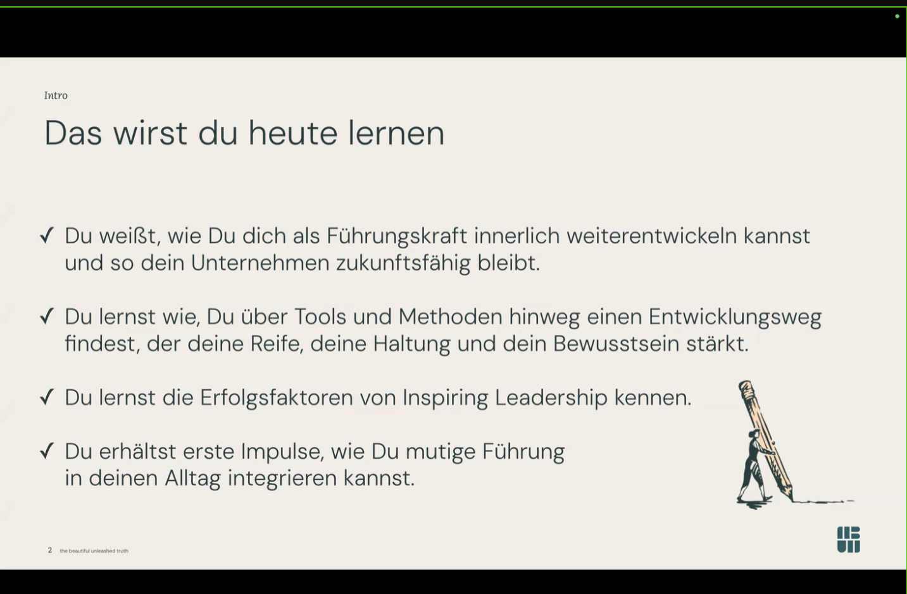
* Was fanden andere gut an guten Führungskräften:
  * Gutes Spiel zwischen Eskalation und Deeskalation, Mitarbeiter in Zukunft projiziert, Vertrauen und Freiraum, wertschätzend, ausgeglichen, starker innerer Wertekontext <-- check: „Wertekompass“?
* Innen ankommen, nach außen wirken
* Kindheit als Startpunkt Mary Ainsworth: Secure Base – Basis entwickelt sich innerlich
* Welche entscheidend ist, ob man aus Anspannung oder aus der Ruhe auf Impulse reagiert
* Verantwortung für Muster übernehmen
* Emmy Atkinson <-- check: „Ammy Atkinson?“ → „Emmy Atkinson“ ist unklar
* Er hat eine sichere Basis; innere Ruhe
* Für mich: Was sind intuitiv meine Stärken? Selbstständigkeit, Eigenorganisation
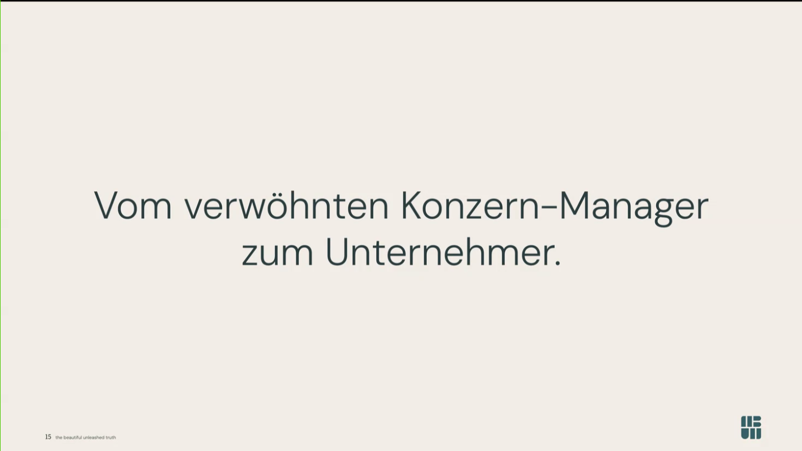
* Tobias Mayer <-- check: „Mayr“? → Info prüfen: zu früh im Lead – Eltern hatten sich getrennt; „Pass auf deinen kleinen Bruder auf“ … fürsorglich gedacht, aber überfordert: „tragen, funktionieren, nicht hinterfragen“ – er selber hinterfragt das. Professioneller Weg
  * Echte Co-Creation bei Mercedes
  * Ultra im Außen unterwegs: Status wichtig, jetzt seinem Ruf gefolgt
  * Kultur muss man dauerhaft hochhalten – sonst reißt es ein
  * **Vom verwöhnten Konzern-Manager zum Unternehmer** – sein Weg
* Entwicklung durch Ausprobieren, selbst wachsen, aber auch andere Sachen erfahren, um zu sehen wie sie wirken; 2019 gegründet; 0 auf 12 Mitarbeitende; innerlich überlastet; emotional abgeschnitten, implodiert
* Der größte Hebel in Veränderungsprojekten ist der Mensch: Führungskräfte sind im Lead dafür
* Ich kann niemanden halten, wenn ich mich selbst nicht halten kann
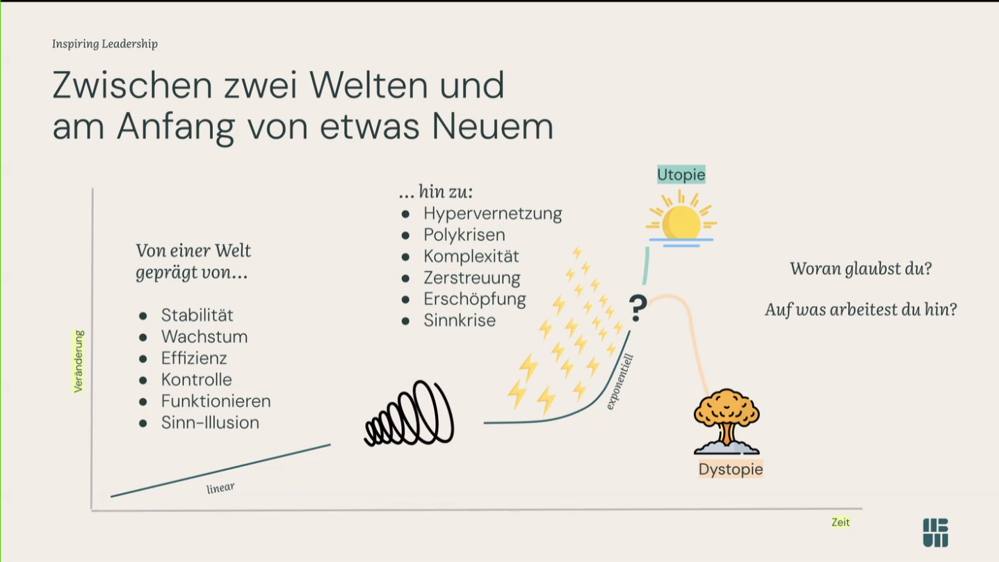
* Eisbaden, bewusst atmen; verkleinert, geschärft zurückkehren
* Wir sind hier, um Räume zu schaffen, in denen Menschen sich selbst begegnen
* Zwischen zwei Welten und am Anfang von etwas Neuem: Erste Welt geprägt von Stabilität, Wachstum, Effizienz → zu: Hypervernetzung, Polykrisen, Komplexität, Zerstreuung, Erschöpfung, Sinnkrise
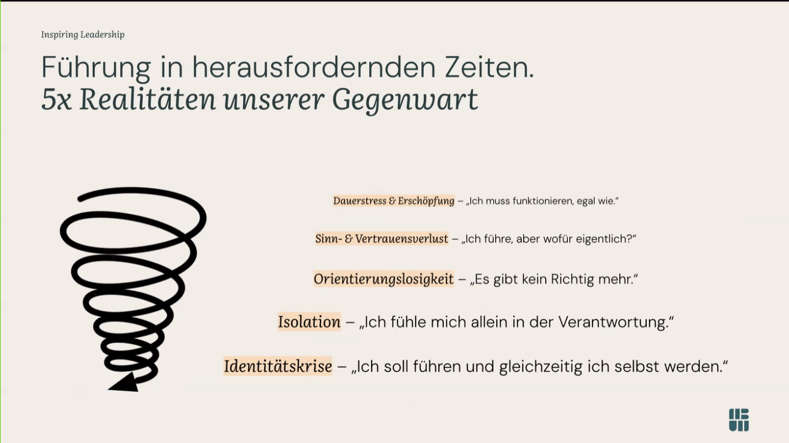
* Man kann entscheiden: Angstkultur und dystopische Weltbilder? Wohin ist man unterwegs?
* Führung in herausfordernden Zeiten:
  * Dauerstress
  * Sinn- und Vertrauensverlust
  * Orientierungslosigkeit
  * Isolation
  * Identitätskrise
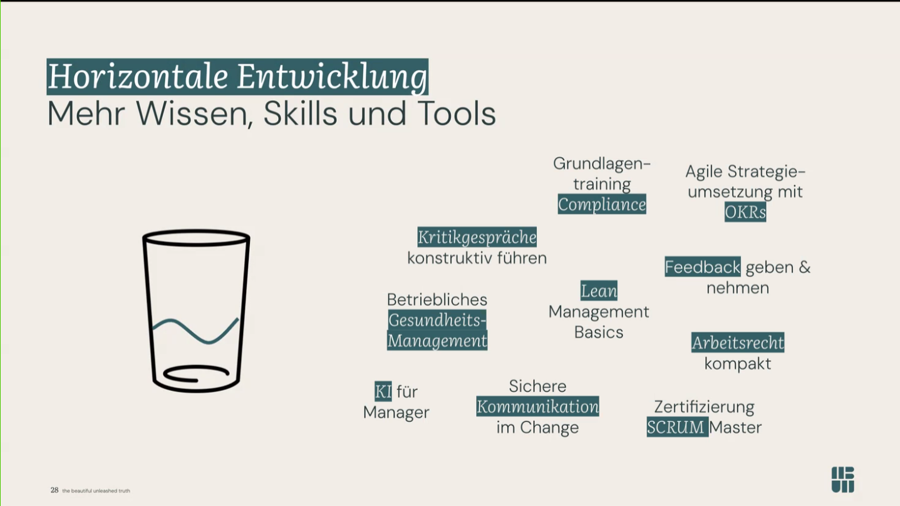
* Du willst:
  * mehr Klarheit
  * bessere Ergebnisse
  * Entscheidungen, die sich lohnen
  * echte Beziehungen
  * gesunde Höchstleistungen
  * besser schlafen, klarer denken
  * Routinen etablieren
  * Veränderung leben und andere mitnehmen
* Warum fällt es uns so schwer, all das zu entwickeln? Trotz unzähliger Programme und Trainings?
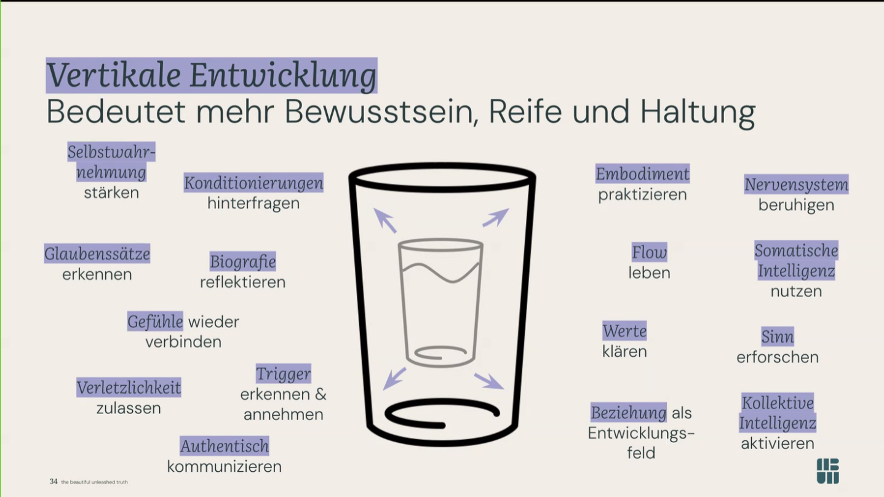
* Horizontale Entwicklung: mehr Wissen, Skills und Tools
  * Gefäß als Wasserlevel: Kritikgespräche, Gesundheitsmanagement, agile, OKRs <-- check: „agile Methoden“?
  * Braucht man alles: aber irgendwann ist das Glas voll
  * Gefühl, dass man mit neuen Tools und Herausforderungen nicht umgehen kann – weil das Gefäß zu voll oder zu klein ist
  * Die Frage ist: Wie machen wir das Gefäß größer?
  * „Gestern war ich klug und wollte die Welt verändern. Heute bin ich weise, deshalb verändere ich mich selbst.“
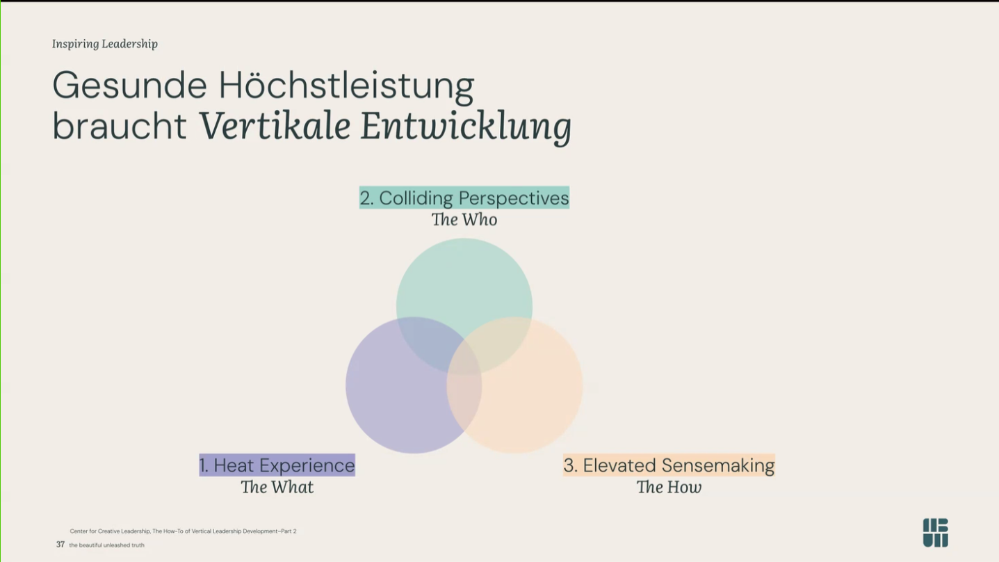
* Daher auf vertikale Entwicklung setzen: Konditionierung hinterfragen, Trigger erkennen und annehmen, authentisch kommunizieren, Beziehungen als Entwicklungsfeld, Werte klären, kollektive Intelligenz aktivieren, Embodiment praktizieren
  * Wie geht es mir heute? „Gut, etwas Neues gestartet“ ← mit hoher Wahrscheinlichkeit kein Gefühl
  * Er selbst hat Aufregung vor Workshops: daher 10 min auf dem Boden gelegen. Jetzt Flow
* Vertikale Entwicklung unterstützt mich dabei im Job
* Was braucht gesunde Höchstleistung?
* 1. Heat Experience: the what? Es braucht den Moment, wo das gewohnte Denken erschüttert wird. „Damit kann ich nicht umgehen“; Colliding Perspective (the who); Elevated Sensemaking (the how)
  * Wo alles zusammenkommt, hat man den Vertical Sweet Spot
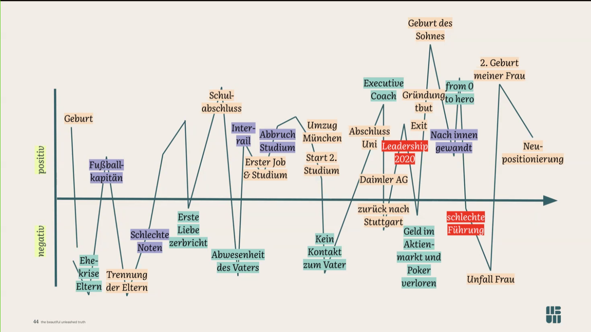
* Vier Ebenen für ganzheitliches Wachstum: 
  * Verstand (Hirn)
  * Herz (Empathie, Resonanzfähigkeit); aus Emotion ein Gefühl ableiten – warum triggert mich mein Sohn mit vier Jahren so stark?
  * Körper
  * Spirit: Was ist mein Fußabdruck, welchen ich hinterlassen möchte? Warum wacht man jeden Morgen auf? Was ist die Vision für dein Leben? Welche Werte leiten dich? – großer Motivationsfaktor
* Acht Qualitäten für gesunde Höchstleistung und ihre Wirkung
  * mindful awareness: bewusste Selbstwahrnehmung und Präsenz
  * inner belonging: innere Sicherheit und emotionale Erdung
  * radical ownership: radikale Eigenverantwortung für Wirkung und Verhalten
  * self transcendence: Verbindung mit Sinn, Werten und dem größeren Ganzen
  * purposeful focus: Klarheit im Innen, Ausrichtung im Außen
  * flow mastery: Präsenz, Energie und Wirksamkeit im natürlichen Rhythmus: auf Endorphinen aufbauender Zyklus: absolute Hochs und Tiefs – dann kann man ganz anders arbeiten: 90 min Arbeit, 20 min Pause. Lebensnotwendig
  * collective growth: ko-kreative Entwicklung von Menschen & Teams
  * regenerativer Impact
* Mein Inspiring Leadership Journal folgt dem 8x4x3-Prinzip?
  * homecoming, unfolding, transforming
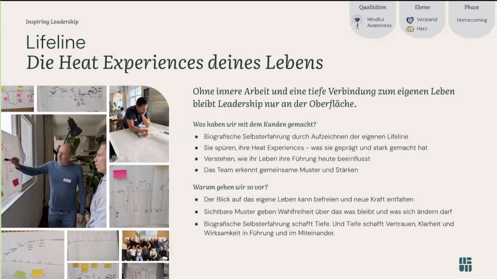
* Lifeline: die Heat Experience deines Lebens
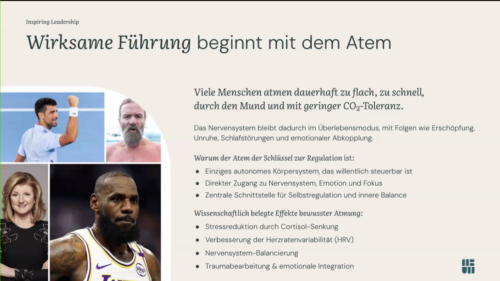
* Biografische Selbsterfahrung durch Zeichnen der Lebenslinie; Aha-Momente, tiefe Dankbarkeit für mein eigenes Leben, Überwältigung durch Öffnung; Teamentwicklungen
* Vertiefung von Selbsterkenntnis und Klarheit
* TODO: selbst die eigene Lebenslinie zeichnen – reflektieren – wo fällt es leicht, sie zu zeichnen?; teilen mit Menschen; was waren Schlüsselmomente, wo besonders mutig?

## Wirksame Führung beginnt mit dem Atem
* Zu flach, zu schnell, durch den Mund atmen
* LSD: light, slow, deep
* Einziges autonomes Körpersystem, das wir steuern können
* Wim-Hof-Atmung?
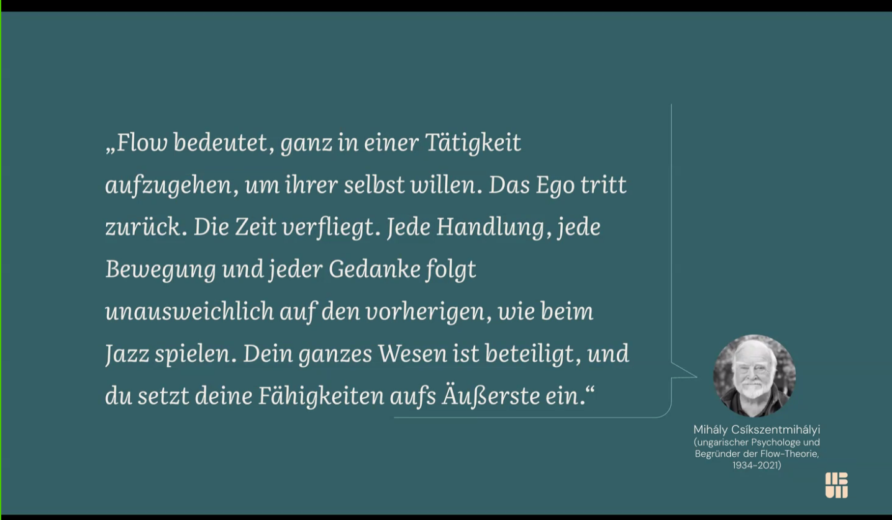
* Atmung nicht absichtlich ignoriert, aber viel zu unbewusst verwendet
* BOLT-Score: einfacher Test, um Atmung zu checken: Luft anhalten; nicht speziell vorbereitet; auf Kommando die Luft anhalten, bei Bluthochdruck lieber nicht
  * Nase zuhalten: zärtlich zuhalten
  * Für mich: 19 s (nicht viel, oder?) – 45 s wäre Topliga, Ausdauersportler – geringe Toleranz; 20–30 s gute CO₂-Toleranz; ugh
  * Kann man gern auch noch selbst machen
  * Je niedriger die Toleranz, desto schneller gerät der Körper in Alarmzustand
  * You can't lead others from a brain on fire
* Atempause: breath holds, regenerative journeys, 5-min Atemreise
* [..]
* 5 min von 24 h – diese Übung kann auf unterschiedlicher Ebene Unterschiede erzeugen
* Im Körper Heilungsprozesse lostreten
  * Wie möchte man in Zukunft atmen?
* Kleines Geschenk: Breathwork Journey ← check: „Journey=?“ → vielleicht „Journey = sich in Flow arbeiten“?
* Alpha-Wellen und Theta-Zustand
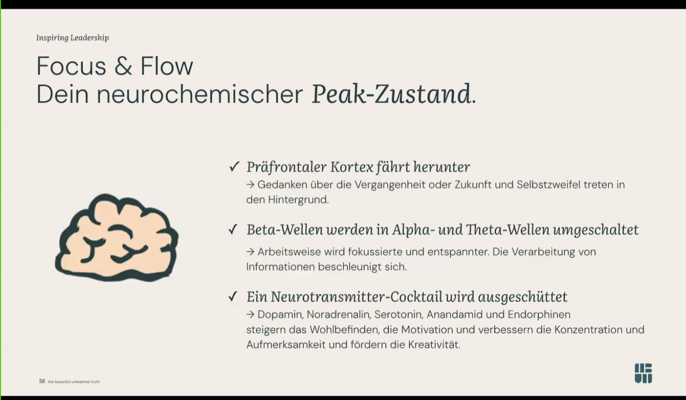
* Flow: aktiv hinziehen lassen und mit Tätigkeit verschmelzen
* Focus and Flow: neurochemischer Peak-Zustand

* Neurotransmitter-Cocktail wird ausgeschüttet
  * 30 km Mammutmarsch! schreibt eine Dame
* Deep Work – Ken Newport <-- check: „Cal Newport“
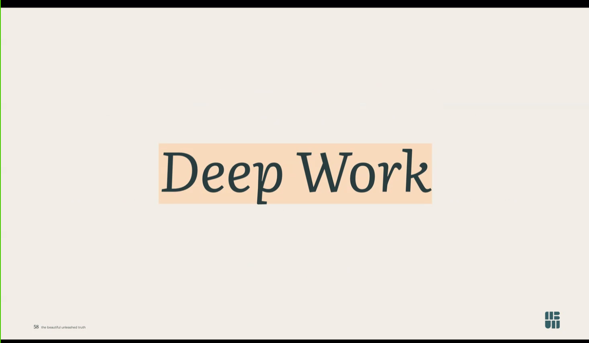
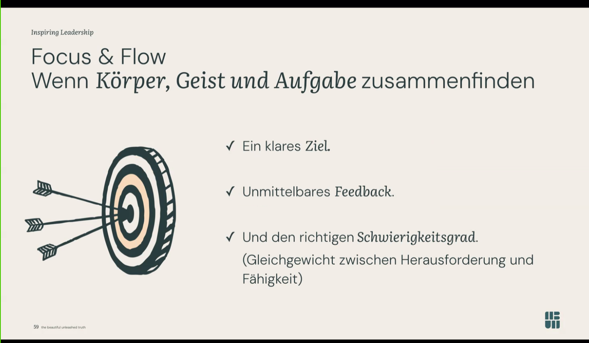
* Körper und Geist finden zusammen: struggle; dann release; 3. flow; 4. recovery
* Fokus ist kein Zufall; Flow kein Glück; beides entsteht durch klare Prioritäten
* Mein Fokus, mein Flow; neue Wochenstruktur
* Mehr Selbstwahrnehmung und Präsenz
* Kalender sortieren und blockieren; markiere und blockiere Fokusblöcke im Kalender
* Plane aktive Pausen: Bewegung, Frischluft, Körperwahrnehmung, digitale Pausen
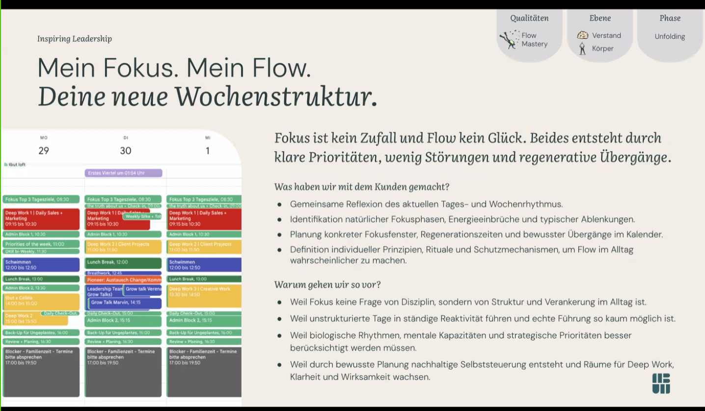
* Expertenbegleitung
* Pulse Checks, KI-Coaching, Journaling, 1:1 Coachings, Purpose & Vision Labs
* Expertenbegleiter vielleicht? Digitale Lernplattformen? Jahrtausende alte Weisheiten, Best of Neurowissenschaft, Flow & Embodiment Practice
* Führungskraft & Organisation
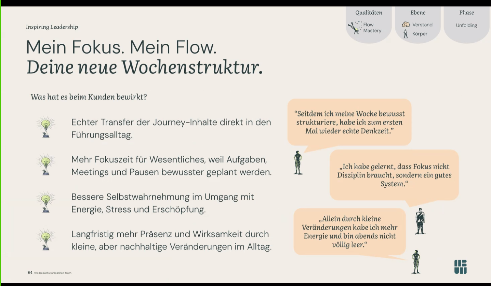
* tbut: große Lernplattform – das ist wohl der Selling Point; mit Smartphone

## Wie hat der Workshop gefallen? Größtes Learning
* Selbsterkenntnis, geringe Stressresilienz. Den Messpunkt aus der Atemübung könnte man jetzt wegerklären, aber es ist ein Indikator, woran ich arbeiten kann  
  Learning: proaktiver Kalender gestalten
* In der Präsenz sind die größten Fortschritte erzielbar! (Masterclass)

-----------------------------
* Werte als Führungsinstrument – um dezentrale Führung möglich zu machen
-----------------------------

* TODO: gather the screenshots
