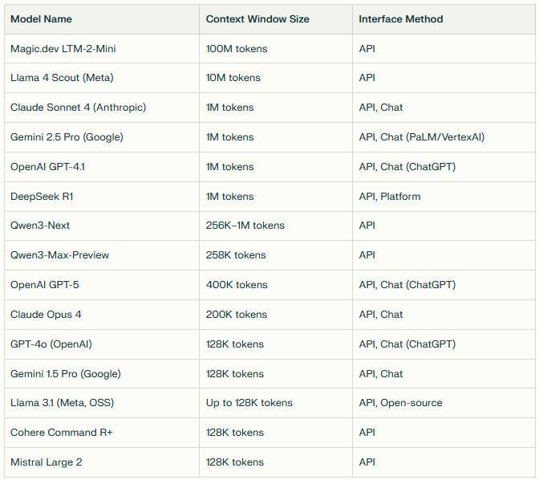

# 20251124: mucpp - Crafting the Code You Don't Write: Sculpting Software in an AI World

```
Crafting the Code You Don't Write: Sculpting Software in an AI World

Veranstaltet von Andreas W. und 2 weitere
Photo of MUC++ group
MUC++
4.6
3.197 Bewertungen
Details

Sponsor: Brainlab (http://brainlab.com)

Streaming Link: https://www.twitch.tv/mucplusplus
Stream starts around 19:00 CET.

******
This month we have the big pleasure to welcome Daisy Hollman to our user group. Daisy is a distinguished software engineer and programming language expert, known for her impactful contributions to the C++ standards committee since 2016. She has worked on C++ language and library design at Google, and more recently joined Anthropic, where she explores the intersection of programming languages and AI systems.

******
Abstract
It’s shockingly uncontroversial to say that the fields of developer experience and developer productivity have changed more in the past six months than in the 25 years before that.

As part of the Claude Code team at Anthropic, I’ve had the privilege of witnessing the evolution of agentic coding from proof-of-concept experiments to nearly autonomous software engineers in just six months. In this keynote, I’ll share some of my experiences and learnings from that journey, talk about how LLMs work more generally, attempt some live demonstrations of the latest functionality, explore the future of agentic programming, and tie all of this back to what it means for your workflow as a software engineer.
​
When I agreed to give this talk earlier this year, there was some portion of the narrative that involved “why you should be using agents to accelerate your development process.” Since then, the world of software engineering has evolved such that the interesting question is no longer “why” but “how.” Like sculptors facing the invention of power tools, or painters around the invention of photography, we now live in a world where vast quantities of rough-draft code can be generated with a very low barrier to entry. How does the role of a software engineer evolve when AI can autonomously implement features from requirements? How do we build safety features into the power tools we’re chiseling away at our codebases with? What aspects of software craftsmanship become more important, not less, in an age of abundant code generation? And critically for the C++ community: how do we leverage these tools where correctness and performance are non-negotiable? The future isn’t about AI replacing programmers, but about a fundamental shift in how we think about software creation. And surprisingly, you might not miss the old way of doing things.

******
Schedule
18:00 -- Dinner @ Brainlab
19:00 -- Welcome by Brainlab/MUC++
19:05 -- "Crafting the Code You Don't Write" (Daisy Hollman)
21:30 -- Official End
C & C++
Programming Languages
Computer Programming
Software Development

Brainlab AG

Olof-Palme-Straße 9 · München, BY
```

## talk
* Dr. Daisy Hollman - daisyh.dev/talks/muc-meetup - from Anthropic 
* Maybe 80 people in the audience
* Long-time C++ committee member
* Also former CppCon program chair: one of the C++ people
* Joined Anthropic in 2025, working on Claude Code; has an office in Munich now as well

## goals:
* Understand LLMs and coding agents at a high level, especially the parts which are relevant and how to use them to write code
* Learn to think about coding agents as a tool
* Improve your mental model for how and why LLMs make mistakes
  * And learn how to anticipate and avoid mistakes
* Learn how to learn: to use coding agents more efficiently
* Geek out about the future of C++ and where coding agents fit in that picture

## how do LLMs work?
* 2017 transformers -> 2018 early pre-trained models -> 2019 scale -> 2022 alignment -> 2023 tool use -> 2024 reasoning -> 2025 agents
* Architecture: embedding layers turn tokens into vectors, context window (fixed at training time); embedding dimension
* The context window is the max context the model can think about at a given time
* Transformers build connections between related tokens that may be far from each other in the input
  * Abstraction as connection of tokens in different layers
* Output of the model is a probability distribution of possible next tokens
* The model chooses the next token based on this distribution; the temperature controls how random the sampling is
* LLM pretraining: start with random weights; then look at some tokens; look at the probability distribution of the next tokens, then compare them
* 2019: push towards larger scales; GPT-2: 1.9 billion parameters
* Pretraining is a compression of the training parameters, lossy compression
* Emergent behaviours and unreasonable effectiveness of scale: completions for return values ... randomness or understanding?
  * C++ is about living with our bad decisions
  * 4.5 haiku had a 100% prediction rate
  * Why do more sophisticated models get this worse?
  * Compression through conceptual generalization is a useful metaphor for understanding how pre-trained models store context
* Problem with pretrained models: glorified auto-complete?
* Training LLMs: reinforcement learning
* Comparison of pull requests: run experiments of pull requests, then rate them
* Use older model to rate results; not humans anymore; use a "preference model"
* Competing agents: games; winning agent can set up the reward; no reward hacking
* Acquire a defunct startup — get hands on their data and source code; open source repositories
* Also sometimes handwritten cases and rating them helped for Claude Code
* Tool use: we are in the era of agentic tooling; we haven't even invented `vi` yet
* Most LLMs use XML-based syntax for tool invocation for now
* If the `old_string` is wrong, then the tool call fails; if there are multiple `old_strings`, then it fails as well
* XML is a bit better to train on than JSON
* TODO: add the URL for the antML
* Anthropic does everything on Slack: problem with tool calls inside the answer
* Context window sizes over time: GPT-1 512 tokens; GPT-4 32k tokens; Claude 3 (2024): 200k tokens; Gemini 1.5 million tokens
  * Sweet spot for 200k to 1 million tokens
  * There is something fundamental for the transformer architecture: a way is needed to put more relevant information into the context window in order to make the output better
  * Automatic injection of "let me think this step by step" improves output quality by just injecting those strings into the sequence
* Metric: agent task length grows over time — up to 30 hours
* Agents: code search tool — how do agents understand 1M+ line codebases with only a few hundred thousand tokens of context?
* How do humans do this?
* Search code through key entry points; check what is called by those types and data structures
* Claude Code explores Clang and how and where to implement something in the code ...
* Doom debugger? UI? Wrap Claude Code? "When was the second zombie killed in this playthrough?" — has source code and the traces?
  * So Claude Code steps through the traces and then tells when the second thing was killed
* Her AGI pill moment: improve a tool before even getting introduced to the code base
* "A coding agent is like a junior engineer who has read the whole internet"
  * Struggles often with large-scale tasks; struggles with lots of stakeholders
  * LLMs overperform on highly arcane tasks; pretty good with build systems, know compiler intrinsics

* Modes of operation:
  * Rapid prototyping
  * Side quests ..
* Planning and brainstorming; helping with writer's block
* Modernization, cross-translation works well; refactoring not
* You write the core logic; the AI writes everything else
  * Your focus: core algorithm, architecture and code structure, design and strategy, security logic
  * AI's work: build system configuration, benchmarking harnesses, error-handling boilerplate

## best practices: don't be surprising
* If the LLM is guessing the effects of your function incorrectly, maybe it needs a better name
* Avoid clever operator overloading
* Don't mix owning and non-owning semantics of the same types
* Avoid macros
* Avoid argument-dependent lookup
* Use regular types wherever possible
* Create, document, and maintain rigorous invariants at encapsulation boundaries
* Comment your code: comments are more important for agents than they are for humans!
* Frequent verbose comments can act like extended thinking
* Redundancy is useful!
* Agents are very good at generating and maintaining comments
* Add a CI step that asks an agent to verify all of the comments related to changes in your pull request

## beyond interactive use
* Interactive use of agents quickly becomes bottlenecked by the human in the loop
* This mode of use will always produce the most productivity per token
* Humans don't scale well
* Parallel subagents: PR review toolkit as plugin (all of this is free, except the used tokens)
* Claude Code plugins: allow installing collections of slash commands, skills, subagents, hooks, etc.
* Detach yourself from being in the loop: look ahead, not just do

-----------------

Since I was interested in the current context-window sizes after Dr. Daisy hollman's talk last ngiht for #mucpp - here is an overview:


