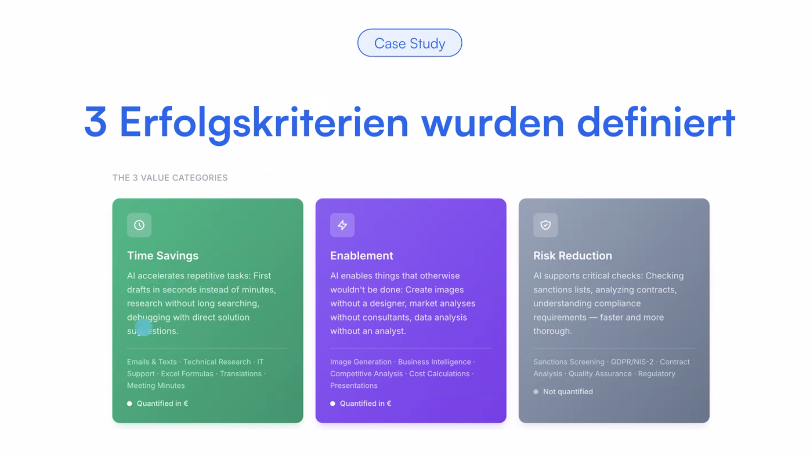
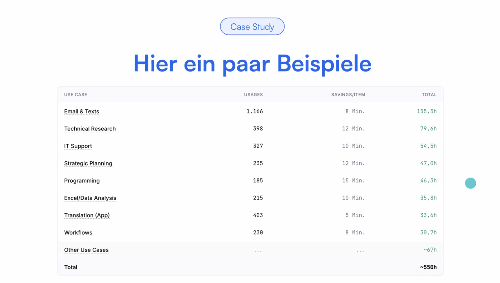
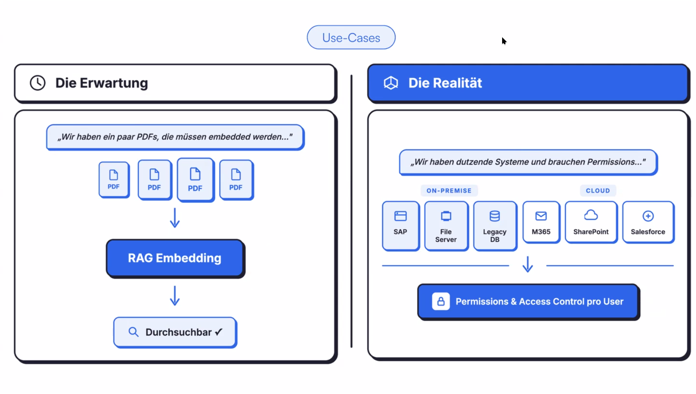
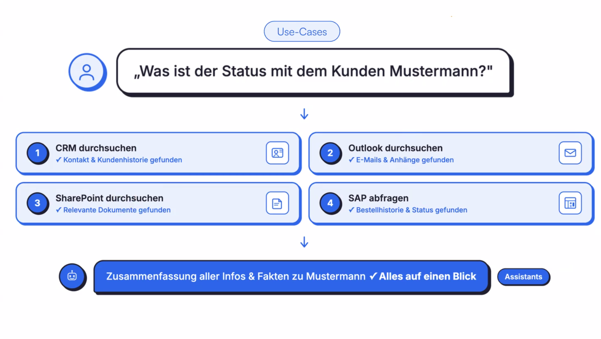
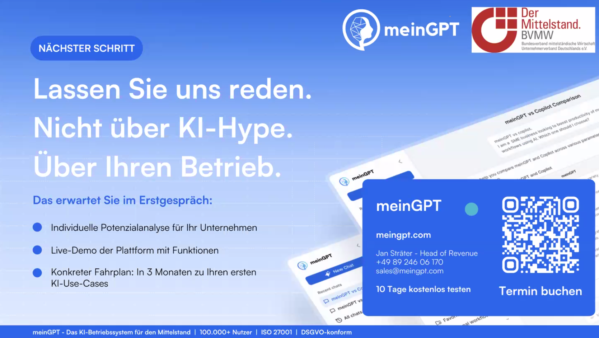

# 20260323 - Was wir aus 100+ KI-Rollouts gelernt haben (meinGPT)

```
Was wir aus 100+ KI-Rollouts gelernt haben
Unsere Erfahrungen wie man KI in Unternehmen erfolgreich etabliert
Montag, 23. März 2026 von 11:30 - 12:15 Uhr
Zoom
Ingrid Janssen
E-Mail: ingrid.janssen@bvmw.de

Online-Veranstaltung per Zoom

Die meisten KI-Initiativen scheitern. Nicht an der Technologie, sondern an mangelnder Adoption und fehlenden Mehrwert. Nach über 100 erfolgreichen KI-Rollouts haben unsere Referenten von meinGPT ein Framework entwickelt, das funktioniert.

In diesem Webinar teilt der CEO, Florian Baader, die entscheidenden Learnings, die bei seinen Kunden wie LAUDA zu 86% täglicher KI-Nutzung und 2,3 Millionen Euro jährlicher Einsparung geführt haben.

Wir zeigen Ihnen nicht nur, was möglich ist, sondern wie Sie es erreichen.

In diesem Webinar lernen Sie:

    Das KI-Rollout Framework: Unser bewährtes 4-Säulen-Modell (AI Strategy, AI Platform, Go Broad, Go Deep), das den Erfolg sichert.
    Fundament 1: Strategie & Rollout: Warum ein Champion-Programm und ein klarer Rollout-Plan wichtiger sind als die Wahl des LLMs.
    Fundament 2: KI-Plattform als Betriebssystem: Wie Sie mit meinGPT, KI als zentrales Nervensystem etablieren – mit tiefen Integrationen (RAG, MCP) in Ihre bestehenden Systeme (SAP, Dokumenten-Server etc.).
    Go Broad - Alle Mitarbeiter erreichen: Die exakten Methoden (Workshops, People Enablement), um Ihre gesamte Belegschaft zu befähigen und für KI zu begeistern.
    Go Deep - Praxisbeispiele: Konkrete Use-Cases von Kunden wie der ROI in der Praxis erzielt wird.

Für wen ist dieses Webinar?
Für Geschäftsführer, C-Level, IT-Leiter, Digitalisierungs- und HR-Verantwortliche, die KI nicht nur als Experiment, sondern als echten Wettbewerbsvorteil etablieren wollen.

Erfahren Sie, wie Sie KI zu einem festen Bestandteil Ihres Unternehmenserfolgs machen.

Referent: Florian Baader
```
* Vortragende: Marc Thormann, Jan Sträger as well <-- check: ebenfalls?
* meinGPT: Wer sind sie; 32 Mitarbeiter; 2 neue <-- check: zwei neue Mitarbeiter?
* seit 2023 ausschließlich GenAI
  * Outreach-Algorithmus aufgebaut etc. - was ist meinGPT?
  * sieht nicht anders aus als ChatGPT - komplett ISO-zertifiziert, DSGVO-konform, ermöglicht alle Tools zu nutzen - alle möglichen KI-Modelle
  * auch sämtliche Integrationen darin - und auch eigene MCP - mehr als eine KI-Plattform
  * auch Adoption und Training mit Fokus auf Mittelstand; KI-Workshops, Rollout-Pläne, Use Cases bauen

## Was genau bringt KI?
* abseits von Buzzwords - wie messbar?
* dies mit einem Pilotkunden geprüft: 170 Pilotnutzer über 30d - 4.250 Chats - 1.870 App-Usages; über den ersten Monat, wie meinGPT genutzt wurde
* Case Study: Klassifizierung der Chats gemacht (AI-Analyse, Use-Case-Komplexität, Erfolg)
* 3 Erfolgskriterien wurden definiert: **Time Savings, Enablement, Risk Reduction**
  * Enablement: was kann man erledigen, was man vorher nicht konnte - Demokratisierung
  * Risikoreduzierung: nicht quantifiziert in €; Double-Check by KI - gibt es besondere Punkte, was ist unstimmig? Compliance-Themen abbilden

* 12 Use-Case-Kategorien: Writing, Business Intelligence, Technical Engineering, IT-Support, ...
* Komplexität der Use Cases ist sehr variabel: ein Viertel komplex, 50% mittel, einfache ca. 35% <-- check: Prozentangaben summieren sich nicht; größter Mehrwert bei mittel und komplex
* Case Study: ein paar Beispiele

* ROI-Berechnung: erster Monat 550h Zeitersparnis (dort mit 50€/h) -> 27k Time Savings, 13k Enablement -> quantifizierter monatlicher Wert von 40k€
* einfaches RAG ist nicht ausreichend - viele Systeme mit komplexen Permissions

* CRM durchsuchen, SharePoint durchsuchen, Outlook durchsuchen, SAP abfragen .. aus vier Quellen die Daten heraussuchen -> dies dann alles zusammenfassen

  * Microsoft Cloud und Tools angebunden; Wissensdatenbank, On-Premise-Connectoren, Data Warehouses as well (SAP, DBS <-- check: DBs?, DWH-Integrationen)
* Workflows (Beispiel Kunde LAUDA):
  * Protokolle wurden noch händisch ausgefüllt und gemanagt - wie das per KI lösen?
  * Foto aus Protokoll -> Upload SharePoint, meinGPT, OCR, Assistent, Supervisor enthält E-Mail <-- check: Supervisor sendet E-Mail?

### AI-Apps - Supply Chain bei IFM
* Lovable, Replit ..
* eine Idee: alle Informationen vom ERP-System finden und eingehende Mails -> KI erstellt Vorschläge
  * Dashboard mit Vorschlägen ..
* wichtig: Vibe Coding <-- check: Schreibweise? ist ein Problem im Unternehmen - Zugriffsberechtigungen; oder OAuth als Sicherheitslayer davor geschaltet

### Wie bringe ich jeden dazu, KI zu nutzen?
* Adoption: Menschen bringen sich KI bei; KI nutzen, um KI zu lernen
* interne Championsrunde aufbauen (wie bei Pilotgruppe); begleitet und geschult
* Use-Case-Support bereitstellen
* FAQ-Runden machen
* Trainings: Basis, Plattform, Deep Dive
* Prompting-Feedback: die KI warnt bei schlechten Prompts und gibt Feedback dazu, welche Inhalte fehlen
* Use Case Voice Agent: der Sprachassistent befragt die Mitarbeiter und erstellt passende Assistenten (noch nicht ausgerollt bei meinGPT)

### Fazit
* KI braucht ein Betriebssystem für alle Use Cases; was ist erlaubt und gern gesehen; nicht hinter jedem Tool hinterherhecheln
* internes Champion-Team und klare Verantwortlichkeiten (Owner)
* Basic Chat ist super wertvoll, aber dort nicht stehen bleiben
* echter Mehrwert entsteht durch die tiefe Integration mit allen Systemen

* GO BROAD, GO DEEP

* meinGPT kann 10 Tage kostenlos genutzt werden

* bei Enterprise-Use auch "Bring Your Own Key" möglich

```
Vielen Dank für die Präsentation!

Das war ein wirklich guter Überblick darüber, was alles möglich ist, um den Einsatz von KI im Unternehmen weiter voranzubringen. Sehr spannend und inspirierend – vor allem die konkreten Ansätze.

Hat definitiv Lust auf mehr gemacht!
```

```
Hallo,

ich möchte mich gerne gezielt vernetzen: Wir haben heute beide die BVMW-Veranstaltung „100 KI-Rollouts“ besucht, und ich sehe einige gemeinsame Interessen.

Ich freue mich auf den Austausch!
```


### TODO check for myself
* langdock und n8n?


