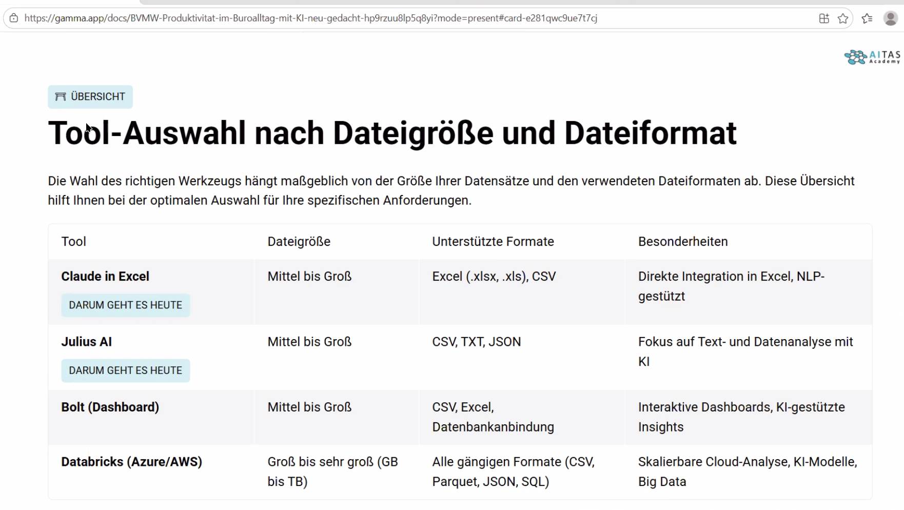
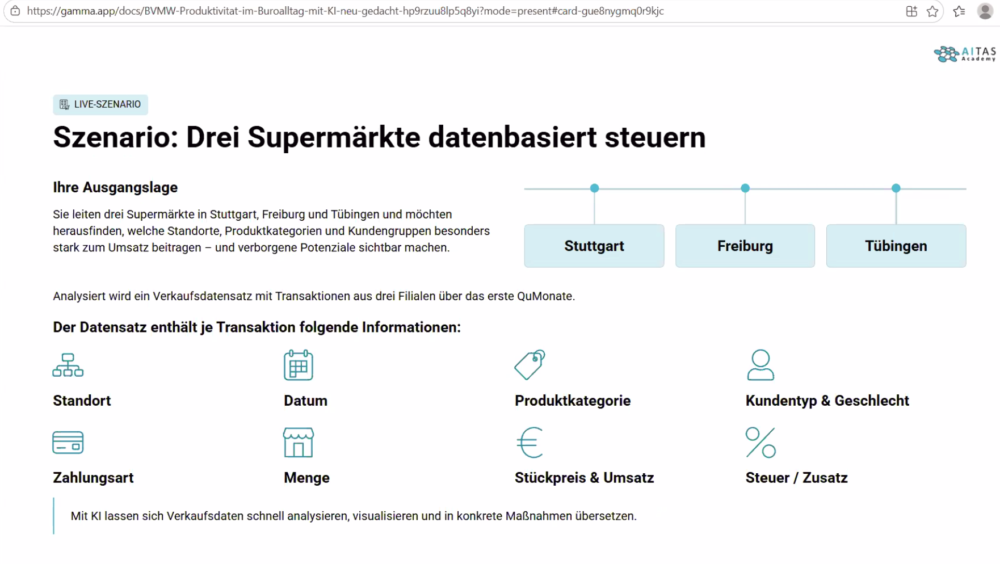

# 20260413 - BVMW - Produktivität im Büroalltag mit KI neu gedacht

```
Guten Morgen,

Sie haben sich für diese interessante Online-Veranstaltung angemeldet. Gerne erinnere ich mit diesem Zoom-Link:

Produktivität im Büroalltag mit KI neu gedacht
11:30 - 12:15 Uhr

An Zoom-Meeting teilnehmen
https://us02web.zoom.us/j/87832272052

Meeting-ID: 878 3227 2052
```

* Vortragende: Jannik Wiessler, AITAS Technologies
* chatgpt: 1 mio user ongeboardet

* KI-gestützte DAtenanalyse im Bueroalltag it KI
* weniger manuelle Auswertung, schneller zu Entscheidungen, weniger Zeitverlust in Reporting und Präsentationen
* Daten schneller verstehen
* reports schneller erstellen
* Entscheidungsgrundlagen schneller vorbereiten
* Präsentationen und visuelle Inhalte schneller aufbereiten

## Herausforderungen und Tipps
* Datenschutz und Compliance
* Datenqualität entscheidet
* !Kontinuierliche Weiterbildung

* KI ersetzt kein Urteilsvermögen

## Tools
* Julias AI - Sprachmodell mit zusätzlicher Logik für Datenanalyse
* Claude in Excel - weil in kleinen bis mittelständischen Firmen das Tool der Wahl ist
* Bolt (Dashboard)
* Databricks - Azure/AWS
 - TODO

* auf eigenem Computer - on-prem

* Dummydatensatz: mit KI generiert
 - TODO

* er führt ein Beispiel mit den Fakedaten durch: https://julius.ai/
  * Daten werden transformiert und dann dargestellt

* Daten sehen recht gut strukturiert aus - aber wie daraus einen Report erstellen
  * diesen über den Report-Button nutzen

* Claude in Excel - auch gut; Transformationen mit Python (kann auch auf "pur Excel-Formeln verwenden")

* Zusammenfassung: Zeitgewinn, bessere Entscheidungen, kreativer Freiraum, Zukunftsfähigkeit
* Daten werden objektiviert aufbereitet
* AITAS Academy: bietet Schulungen und Workshops, etc.

* prozessbezoegenen Daten schützen: privacy guard as anonymizer (und de-anaonymizer afterwards)


