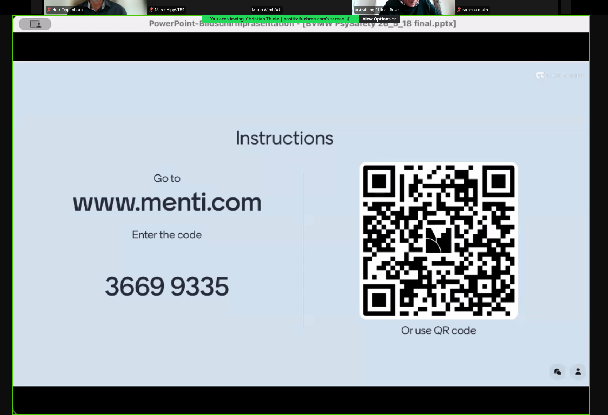
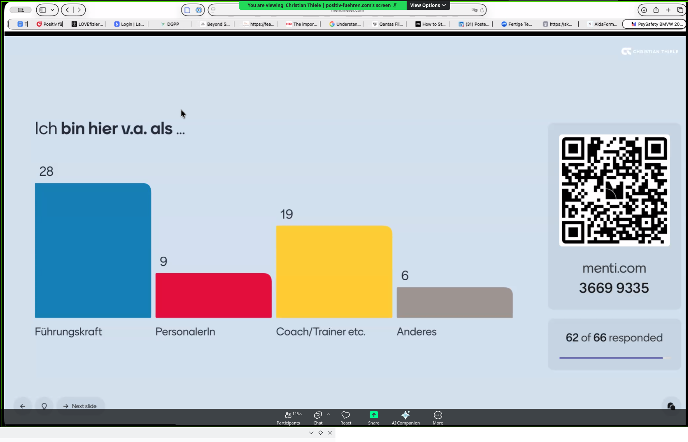
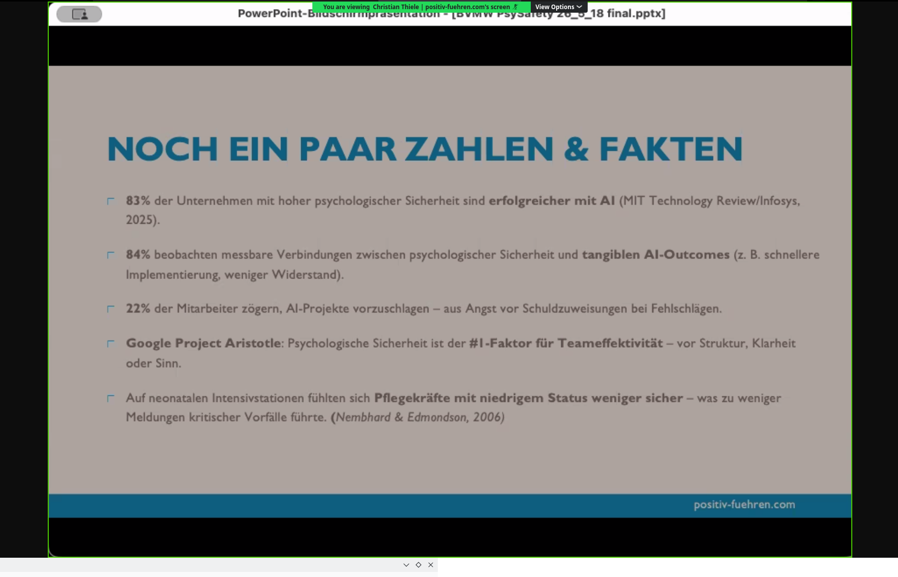
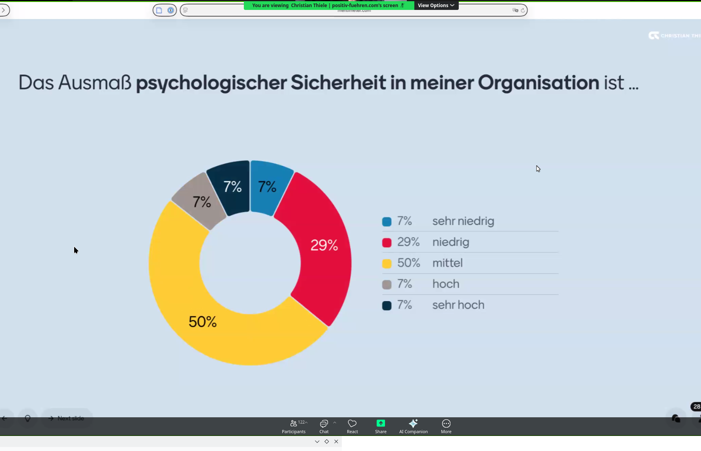
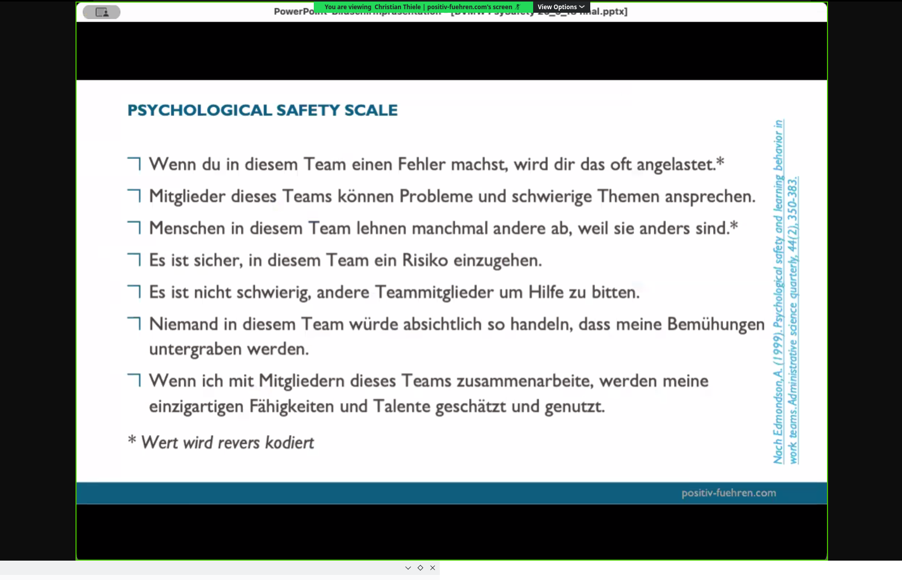
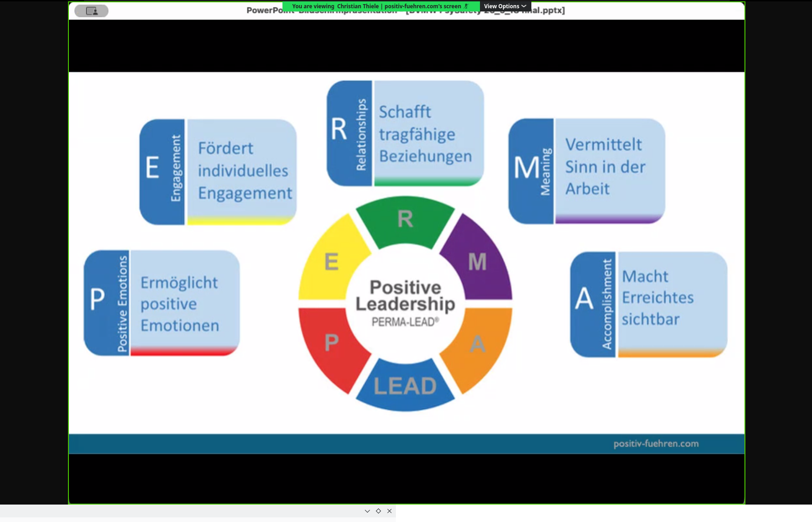
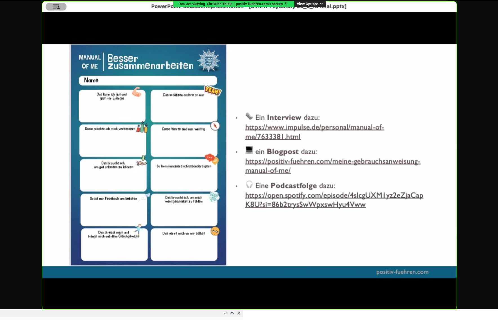

# 20260518 Positiv führen: Weniger Angst, mehr Klarheit

```
 Positiv führen: Weniger Angst, mehr Klarheit
Psychologische Sicherheit als Führungsbooster in Zeiten von Krisen, Konflikten und KI
Montag, 18. Mai 2026 von 11:30 - 12:15 Uhr
Zoom
Ingrid Janssen
E-Mail: ingrid.janssen@bvmw.de

Salesforce campaign ID
701Tr00000Di2bJIAR

Veranstaltung auf BVMW Website veröffentlichen?
Ja

Online-Veranstaltung per Zoom

Auf eines können wir uns in diesen Zeiten verlassen: Dass wir uns auf so gut wie nichts verlassen können. Geschäftsmodelle, geopolitische Gegebenheiten, Gewissheiten, alles verändert sich. Permanent. Rasant. Tiefgreifend. 

Wie finde ich und wie fördere ich als Führungskraft in diesen Zeiten Innovationsgeist statt Verteidigungshaltung? Was wissen wir aus der Forschung über psychologische Sicherheit, ihre Vorbedingungen, ihre Effekte?

Und wie können Führungskräfte und Teams psychologische Sicherheit ganz konkret fördern und verstärken? Darum geht es in diesem kompakten, interaktiven Vortrag von Christian Thiele.

Referent: Christian Thiele

Christian Thiele ist Experte für Positive Psychologie und Positive Leadership. Er arbeite international als Keynote Speaker, Hochschuldozent und Leadership-Coach, ist unter anderem Vorstandsmitglied im Deutschsprachigen Dachverband für Positive Psychologie (Dach-PP). Sein Podcast „Positiv Führen“ ist auf diversen Plattformen. Weitere Informationen unter positiv-fuehren.com

Nach einem interessanten Referat von 30 Minuten steht Ihnen der Referent weitere 15 Minuten für Ihre Fragen zur Verfügung.

Dieser Online-Impuls ist kostenfrei und richtet sich an alle Interessierten. Die Teilnahme ist per Webbrowser, Zoom-App oder telefonisch möglich. Melden Sie sich gerne an - der Zoom-Link wird Ihnen automatisch per E-Mail zugeschickt.

Hier finden Sie alle Veranstaltungen aus dieser Serie: https://www.bvmw.de/de/kontakt/ingrid-janssen
```

----------

* Vortragende: Christian Thiele

* Wie erstellt man ein innovationsförderndes Klima?
* Lerntheorie mit 90° – L wie Lernwinkel – wir sind nie ganz leer
* Nutzung von Mentimeter


* 28 % als Führungskraft dabei; viel Bescheidenheit im Raum
* WHY?
  * Ed Pearson, Boeing; Juli 2018 Mail: “Change of culture at Boeing”; geschrieben vor den Flügen JT610 und EA302 (beide Abstürze)
  * Mail hatte prophetische Züge, weil er genau auf die Punkte hingewiesen hat, die zu den Abstürzen geführt haben
  * Kam aus einer militärischen Kultur; bemerkte, dass Finger-Pointing immer häufiger wurde
* Studien legen nahe: Performance steigt auf individueller, Team- und Organisationsebene
* Lernen steigert auch das Wohlbefinden
* Forschungsergebnisse auf Gruppen-/Organisationsebene ebenfalls: Han et al., 2017
* Citizenship Behaviour: Organ 1988; wahrscheinlicher bei höherer psychologischer Sicherheit
  * Erweist sich als sinnvoll auf Firmenebene
* „Weak signals“ feststellen, die sinnvoll wären nachzuverfolgen
* Unternehmen mit hoher psychologischer Sicherheit erfolgreicher mit AI (2025)
* 84 % messbare Verbindung zwischen psychologischer Sicherheit und greifbaren AI-Outcomes (schnellere Implementierung, weniger Widerstand)
* 22 % der Mitarbeitenden zögerten, AI-Projekte vorzuschlagen, aus Angst vor Schuldzuweisungen
* Was wünscht man sich aber in Zeiten von Unsicherheit? Mehr Klarheit und Führung; deutsches Spezifikum; seit 1872 steht „Angst“ im Merriam-Webster aus dem Deutschen übernommen
* Diffuse Angst und Passivität
* Freier Ideen äußern und auch diskutieren
* Amy Edmondson; Professorin for Leadership, Harvard Business School
  * Psychologische Sicherheit als Group-Level-Faktor: “The belief that the workplace is safe for interpersonal risk-taking and that mistakes or errors will not be held against you”
  * Psychologische Sicherheit NICHT: Alle haben sich permanent unter allen Umständen lieb; individuelles Erleben; das Gleiche wie zwischenmenschliches Vertrauen; Bro Culture
  * Heißt stattdessen: mehr gesunder Dissens; organisationales Thema; steuerbar
* Menti: Ausmaß an psychologischer Sicherheit in eigener Organisation: 49 % sagen niedrig; einige mittel, wenige hoch



* Was sind Themen, die hilfreich sein könnten und welche nicht?
  * - Narzissmus
  * + Feedbackkultur
  * + Gleichbehandlung
  * + Transparenz
  * - Arbeitsbelastung
  * + Stimmige Kommunikation
  * + Gute Check-ins
* Psychological Safety Scale: Wird es dir angelastet oder nicht?
* Je höher man in der Hierarchie sitzt, desto stärker ist die erlebte psychologische Sicherheit (muss aber nicht der Realität entsprechen; wird weiter unten oft anders erlebt)

* Positive Leadership: PERMA – Positive Emotion, Engagement, Relationships, Meaning, Accomplishment
* Loneliness cuts psychological safety nearly in half
  * Epidemie der Einsamkeit, gerade in hybriden Kontexten
* Manual of Me: Gebrauchsanweisung für mich; Variante „Für mich“; von Polizei Mittelhessen

* Im Team sich nicht nur als Personalnummern sehen: höhere Chance, dass psychologische Sicherheit erlebt wird
* Reißleine ziehen: Als Erstes bei der Person bedanken; es gibt immer einen guten Grund – dem Teammitglied danken
  * “I am Concerned; I am Uncomfortable; This is a Safety issue” → CUS → Stop the line
* Chefs hire lots of mini-mes
* Diverse teams are safer teams: cross-functional; with highly diverse expertise

* Annahmen transparent machen
* Wie kann man im Mittleren Management aktives Mitdenken fördern, auch wenn es nicht Unternehmenskultur entspricht? Organisationeller Rahmen wichtig; als Menschen sich wieder näherkommen; für Austausch sorgen; Konfliktkompetenz gegeneinander erträglich machen im Ringen; Leute durch Mentimeter auch befragen
* Welche Hebel haben Mitarbeiter, auch wenn Führungskraft nicht Klima des Austausches fördert? Auch aussprechen, was man denkt und nicht auf die Zunge beissen; andere ermutigen auch auszusprechen, was man denkt
* gefährlich: Techno-Optimismus unterschätzt die kulturelle Komponente von Fortschritt und Organisation
