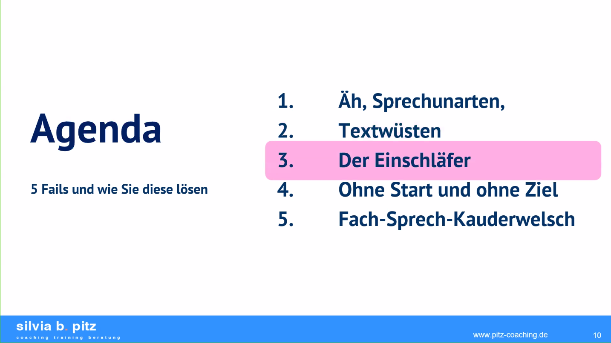
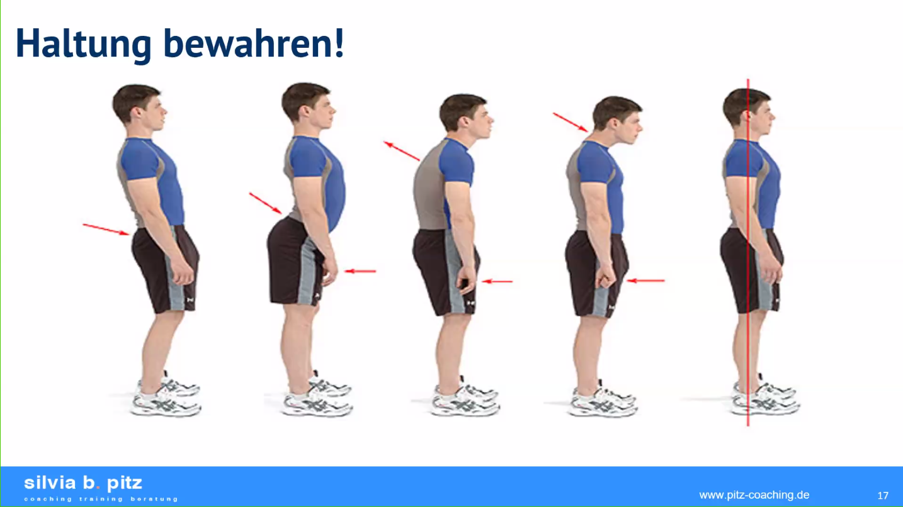
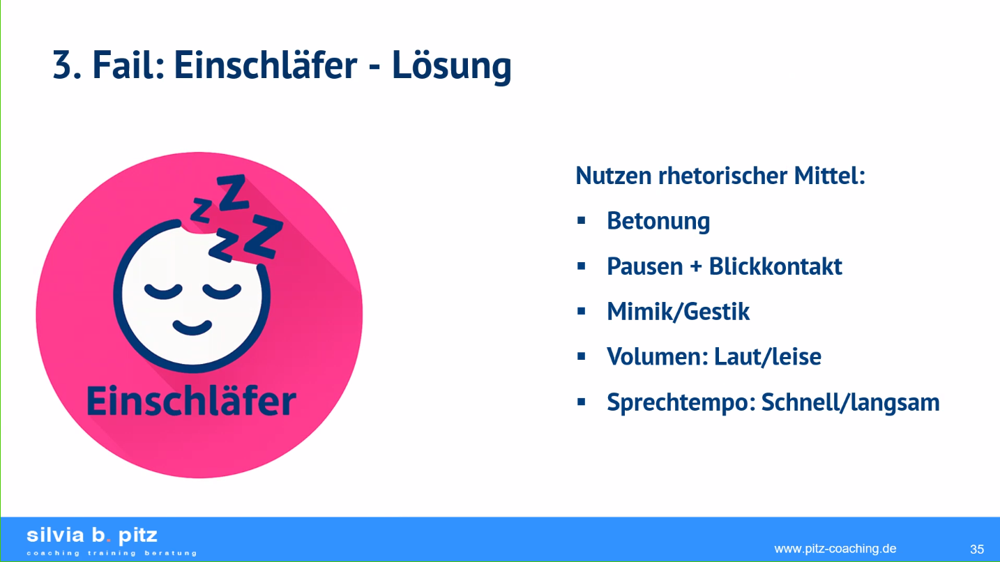

# 20260624 Präsentieren wie ein Profi - Silvia Pitz - BVMW

```text
Präsentieren wie ein Profi
Gute Ideen haben viele - überzeugend präsentieren können deutlich weniger
Mittwoch, 24. Juni 2026 von 11:30 - 12:15 Uhr
Zoom
Ingrid Janssen
E-Mail: ingrid.janssen@bvmw.de

Salesforce campaign ID
701Tr00000OxboxIAB

Veranstaltung auf BVMW Website veröffentlichen?
Ja

Online-Veranstaltung per Zoom

Ob im Meeting, beim Pitch vor Kunden oder auf einer Konferenz – wer präsentiert, steht im Rampenlicht. Und genau dort entscheiden oft wenige Minuten darüber, ob eine Botschaft wirklich ankommt oder einfach verpufft.

Viele Präsentationen scheitern dabei nicht am Inhalt, sondern an typischen Fehlern: zu viele Folien, zu viel Text, zu wenig Struktur – und am Ende bleibt beim Publikum vor allem eines zurück: Erleichterung, dass es vorbei ist.

Die gute Nachricht: Diese Präsentations-Fails lassen sich leicht vermeiden – wenn man weiß, worauf es wirklich ankommt.

Vielleicht haben Sie solche Situationen schon beobachtet:

    Präsentationen, bei denen nach wenigen Minuten die ersten Blicke aufs Smartphone wandern
    Folien voller Text, die niemand wirklich erfassen kann
    Vorträge, die eigentlich interessant wären – aber leider völlig überladen sind
    Nervosität, die die Wirkung der Botschaft schwächt
    Ein Ende ohne Pointe, bei dem niemand so recht weiß, ob jetzt Applaus angebracht wäre

In diesem Online-Impuls erfahren Sie:

    wie Sie Ihre Präsentationen klarer, strukturierter und wirkungsvoller gestalten
    wie Sie Ihr Publikum vom ersten Moment an gewinnen
    wie Sie komplexe Inhalte verständlich und überzeugend vermitteln
    wie Sie typische Präsentationsfallen elegant vermeiden
    und wie Sie Ihre Botschaft so platzieren, dass sie wirklich im Kopf bleibt

Für wen ist dieses Webinar gedacht?

Dieses Webinar richtet sich an Unternehmer:innen, Geschäftsführer:innen, Führungskräfte und Entscheider:innen, die regelmäßig präsentieren – und dabei nicht nur informieren, sondern wirklich überzeugen wollen.

Denn eines ist sicher: Eine gute Präsentation informiert. Eine starke Präsentation bewegt Menschen.


Referentin: Silvia B. Pitz

Silvia B. Pitz ist Speaker-Trainerin, Management-Coach und Expertin für überzeugende Auftritte in anspruchsvollen Business-Situationen. Seit über 25 Jahren unterstützt sie Führungskräfte und Entscheider:innen dabei, ihre Botschaften klar, souverän und wirkungsvoll zu vermitteln. Mit über 5000 Stunden Erfahrung auf Bühne, vor Kamera und Mikrofon verbindet sie strategische Kommunikationsarbeit mit praxisnaher Umsetzung.

In ihren Trainings und Coachings arbeitet sie direkt an klaren Botschaften, starker Präsenz und am Abbau von Blockaden wie Lampenfieber, sodass Teilnehmende ihre Wirkung im beruflichen Alltag sofort verbessern können.

Nach einem interessanten Impuls von 30 Minuten steht Ihnen die Referentin weitere 15 Minuten für Ihre Fragen zur Verfügung. 
```

-----

* Silvia Pitz als Vortragende
* Wie viele Vorträge sind stimulierend? Von 70 % bis 10 % ...
* Agenda: Sprechunarten, Textwüsten, Einschläfer, ohne Start und Ziel, Fachsprechkauderwelsch

* Silvia seit 25 Jahren im Job, mehr als 6.000 Stunden vor der Kamera – auch mit Podcast, 73. Folge; professionelle Kommunikation in Krisenzeiten

## Einen positiven ersten Eindruck schaffen
* Haltung bewahren!
  * Unterwürfig und dominant; Kopf gerade heißt dominant, schräg ist unterwürfig! Ich biete die Halsschlagader an, du kannst mich unterwerfen; daher gerade Haltung!
* In einer Leaderfunktion sein
* Nicht hinter Pult oder Laptop verstecken, Techniker freundlich wegen eines Monitors fragen


## 1. Fail – Sprechunarten
* Häufige Ähs und Ems, Modewörter, Lieblingswörter wie „sozusagen“, „tatsächlich“, „letztendlich“ – auch ablenkend, weil die Leute sich darauf fokussieren, die Botschaft geht verloren
  * Gnadenlos abschaffen
* Sich selbst aufnehmen, wenn man einen Vortrag hält; bewusst machen, sich selbst aufnehmen, Feedback von Freund:innen und Kolleg:innen einholen, nur wenn man eine Feedbackkultur etabliert hat
  * Schnell lösbar mit Coach

## 2. Fail – Textwüsten
* Viel zu viel Text auf Folien, unübersichtliche Folien; Leute schauen aufs Handy
* Folien radikal vereinfachen
* Bilder & Icons statt Text
* Extra-Handouts
* Storytelling
* Weiterbilden, auch bei LinkedIn Learning: interessante Kurse zum Thema PowerPoint

## 3. Fail – Einschläfer
* Monotone Stimme, kaum Energie, kaum Körpersprache
  * Erstklässler aus dem Lesebuch
* Betonung, Pausen + Blickkontakt, Mimik & Gestik, Volumen, Sprechtempo
* Eröffnung: überraschende Aussagen/Hook, gute Frage, Statistik, Storytelling
* Lampenfieber ade
  * Gehirn überlisten: Power Posing: Hände in die Luft, Stift in den Mund halten – Gehirn denkt, wir lächeln
* Eröffnung und Abschluss bleiben in Erinnerung


## Fachsprechkauderwelsch
* Zu viel Bla Bla, was die Menschen nicht verstehen
* Keine Erklärung dazu
* Zu lange Sätze
* Leute schalten ab
