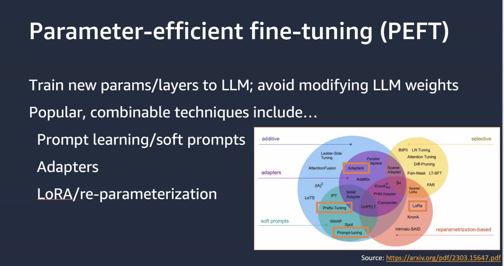
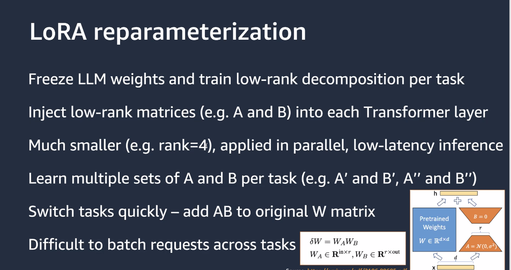
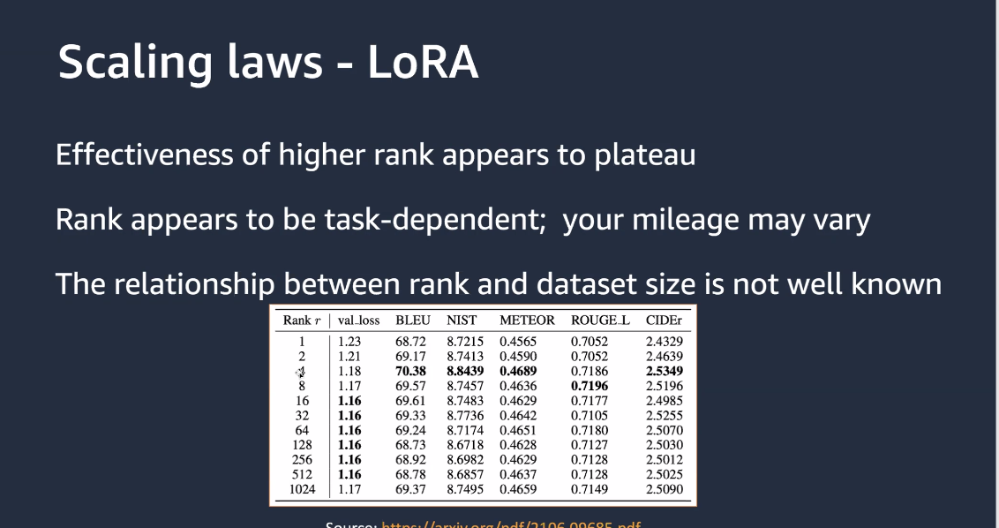
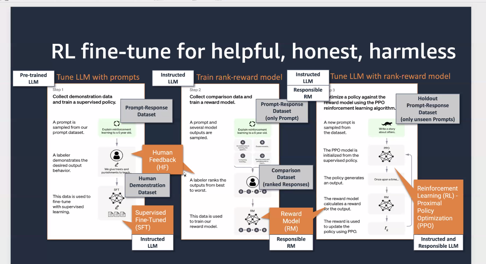

# 20230515 Data Science on AWS: Generative AI: PEFT & RLHF, Intelligent Doc Processing, RL with Ray & SageMaker

* O'Reilly Book: https://www.amazon.com/dp/1492079391/
* Website: https://datascienceonaws.com
* GitHub Repo: https://github.com/data-science-on-aws/
* YouTube: https://youtube.datascienceonaws.com
* Slideshare: https://slideshare.datascienceonaws.com

* Antje and Chris wanted to live-stream this to youtube, but obviously there was a challenge, so they just blew it off: quite interesting decision-making process
* Generative AI Parameter Fine Tuning (PEFT), Priompt Tuning and Reinforcement Learning with Humand Feedback

```
Talk #0: Introductions and Meetup Announcements
By Chris Fregly and Antje Barth, Principal Developer Advocates, AI and machine learning @ AWS

5min Lightning Talk:
Generative AI Parameter Efficient Fine Tuning (PEFT), Prompt Tuning, and Reinforcement Learning with Human Feedback (RLHF) workflows
By Chris Fregly

Talk #1: Amazon Intelligent Document Processing (IDP) with AI Services and Generative AI

By Sonali Sahu, Principal Solutions Architect AI Services, Anjan Biswas, Sr. Specialist Solutions Architect AI Services

Intelligent Document Processing (IDP) is an increasingly popular use case across many industry verticals such as BFSI, healthcare and life sciences, legal, public sector, Ed tech and more. In this session, you will learn about Amazon’s IDP value proposition, the AWS AI services involved, and how Generative AI can augment IDP workflows to modernize your document processing needs.

Talk #2: Portfolio optimization through multidimensional action optimization using Reinforcement Learning with Ray and Amazon SageMaker
By Dilshad Raihan Akkam Veettil, Data Scientist @ AWS

Learn how to perform multi-dimensional action masking and train a reinforcement learning agent for portfolio optimization with Ray and Amazon SageMaker. Action masking enables one to efficiently train RL agents while enforcing inadmissibility constraints on the action space.

https://aws.amazon.com/blogs/machine-learning/portfolio-optimization-through-multidimensional-action-optimization-using-amazon-sagemaker-rl/
```

TODO find grammar checker for FF ...

#0: PEFT
* LLMs are pretrained and will be fine-tuned with own inscrutctions and completions
* Performance efficient fine-tuning is currently on the rise: can be done with a single GPU (everything steill requires a GPU, CPU too slow)
* 1 GB == !B param @ 8 bit (1 byte) int8 - quantization matters; with full 32 bit you need 4 GB of GPU RAM for 1 B params
* PEFT: common implementation is LoRA/re-parameterization (others are prompt tuning or prefix tuning)

* LoRA parameterization: freeze LLM weights and train low-rank decomposition per task



