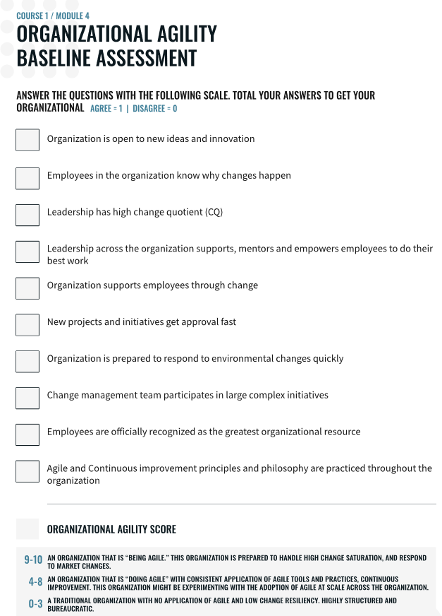

# Coursera course: Agile Leadership: Introduction to Change
* hosted by: University of Colorado System

## Question 1
What are two key differences between an agile organization and a traditional organization?

An agile organization is characterized by its flexibility, adaptability, and a focus on innovation and continuous improvement, whereas a traditional organization tends to be more hierarchical, bureaucratic, and focused on stability and predictability. Two key differences between these two types of organizations are:

    Organizational Structure: An agile organization is typically organized into small, cross-functional teams that are empowered to make decisions and collaborate with other teams to deliver value to customers. In contrast, a traditional organization tends to be more hierarchical with a rigid structure and a clear chain of command. Decisions are made at the top and passed down through the ranks, which can slow down the decision-making process and limit innovation.

    Approach to Change: An agile organization embraces change as a constant and seeks to continually adapt to new market conditions and customer needs. The focus is on delivering value quickly and continuously improving processes and products. In contrast, a traditional organization tends to be resistant to change, preferring to maintain the status quo and stick to established processes and procedures. Change is seen as a disruption to stability, and it may take a long time to implement new ideas or initiatives.

## What is a high change quotient?
The term "Change Quotient" (CQ) is a measure of an individual or organization's ability to adapt to and thrive in a constantly changing environment. A high change quotient means that an individual or organization has a high level of adaptability, resilience, and flexibility when faced with change.

Individuals or organizations with a high change quotient are often able to anticipate and prepare for change, are comfortable with uncertainty and ambiguity, and are quick to learn and adapt to new situations. They are also able to identify and capitalize on opportunities presented by change, rather than being overwhelmed or paralyzed by it.

Developing a high change quotient is becoming increasingly important in today's fast-paced and rapidly evolving business environment, where change is constant and disruption is the norm. By cultivating a high change quotient, individuals and organizations can not only survive but also thrive in the face of change, and use it to their advantage.

## baseline agile organization assessment: 1 point

